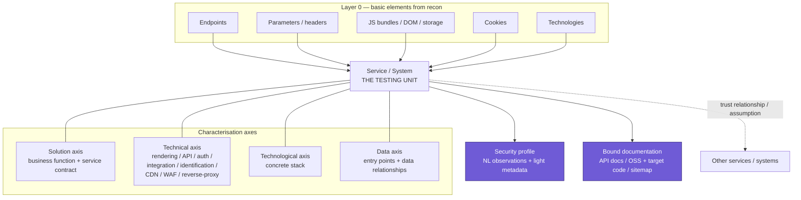

# Evolution Paradigm — Autonomous Vulnerability-Discovery Harness

*Status: base-context document (revision 2). Purpose: to be re-fed as grounding context for every subsequent design and implementation turn. It fixes the phase-1 → phase-2 evolution contract so that phase-1 decisions are made "with the orientation to be evolved to phase-2." It interlocks with the phase-2 design doc (`threat-modeling-system-design.md`) by cross-referencing its decision tags `DD-n`, open points `OP-n`, and risks `R-n`.*

*Revision 2 integrates the **service/system abstraction**: the testing-oriented representation that attack-surface analysis yields, and which is the true unit of test engineering in both phases. This supersedes the vaguer "attack-surface area" framing of revision 1.*

---

## 0. How to use this document

This is the **paradigm layer** above two other documents:

1. `threat-modeling-system-design.md` — the phase-2 target (recursive attack-chain DAG, anatomy abduction, verification pods).
2. The forthcoming **phase-1 domain-model + recon design** — concrete schema and pod design for the MVP.

The test for any phase-1 decision: *does this choice let the corresponding phase-2 component be recycled rather than rebuilt?* This document names the phase-2 successor of each phase-1 artifact so that test is answerable.

---

## 1. The two phases

Both phases are the **same product** at different levels of sophistication: an autonomous system that maps a deployed target's attack surface into a **service/system model** and produces validated findings. Phase-2's product is a **maintained threat model** (`DD-1`).

| | **Phase 1 — Checklist-grounded** | **Phase 2 — Threat-model-grounded** |
|---|---|---|
| Test-generation driver | A **pool of testing procedures (checklist)** *projected onto each service/system* — a "light threat model." | **Prior-guided anatomy abduction** — faults abduced from the service/system model's components, data flows, and trust boundaries (`DD-32`). The checklist is demoted to a *grounding / probe-materialisation aid* (`DD-6 amended`). |
| Reasoning shape | Flat projection: service/system → applicable procedures → instance-specific tests. | Recursive attack-chain DAG (`DD-7`): objective → technique → requirement-fault → symptom → … → legitimate action (`DD-13`). |
| Unit of testing | **A service or a system** (not a discrete resource). | The same service/system model, now the anatomy substrate a symptom references (`DD-12`). |
| Verification | Run the test, record the finding. | Encapsulated **verification pods** with a hypothesised/verified/infeasible lifecycle and OR/AND/budget roll-up (`DD-19`–`DD-23`). |

**The two systems are identical in the first two workflow stages and diverge in the latter two.** That is the point of the phasing: phase 1 gets the *service/system substrate* (stages 1–2) right and forward-compatible, then phase 2 replaces the *reasoning over it* (stages 3–4).

---

## 2. The invariant workflow

Four stages, **bi-directional**:

```
reconnaissance → attack-surface analysis → light threat model (test design, per service/system) → test execution
        ▲                    ▲                              ▲                                            │
        └────────────────────┴──────────────────────────────┴──────────────────────────────────────────┘
                    bi-directional back-edges: a stage lacking data re-triggers upstream jobs
```

**Stage 1 — Reconnaissance (identical across phases).** Maps the **basic attack-surface elements** and a high-level topology (webapp, APIs, distinct services such as SSH/Kubernetes). Critically, recon actively *uncovers hidden surface*: URL / parameter / method / header (content-type, user-agent) fuzzing, deep crawling, and JS analysis, plus end-to-end technology fingerprinting. Output = the descriptive graph (Layer 0).

**Stage 2 — Attack-surface analysis (identical across phases; the new, load-bearing stage).** Consumes the descriptive graph **and business context searched on the web** (fundamental for solution profiling), and **may re-trigger specific recon steps if the gathered data is insufficient for exhaustive analysis**. It produces three architectural illustrations — **solution**, **technical**, **technological** — plus the **data axis** (entry points + data relationships), then combines them to emit **service and system descriptions**. Each service/system **aggregates its relevant basic elements, data entry points, technical details, and technological details**, and is illustrated with its **trust relationships and trust assumptions** to other services/systems. Output = the service/system model (Layer 1).

**Stage 3 — Test design (diverges).**
- Phase 1 = the **light threat model**: project the checklist onto each service/system, selecting the relevant procedures and instantiating **service- and instance-specific tests**. Unit = service/system.
- Phase 2 = **backward-chaining expansion** of the attack-chain DAG (`DD-15`): abduced faults spawn symptoms and probing techniques recursively over the same service/system model.

**Stage 4 — Test execution (diverges in depth, shares the contract).**
- Phase 1 = run the tests; record `{verdict, evidence}` per test.
- Phase 2 = **execution oracle inside pods** (`§6` MVP): probes are executed and roll up to a verdict.

**Why bi-directionality is a first-class seam.** In phase 2, the back-edge *is* pod dispatch (a technique with an unmet requirement dispatches a verification pod; a downstream information-need re-activates recon). So the phase-1 back-edge (analysis re-triggering recon; design re-triggering analysis) must be a **typed "information-need → job" contract with block-and-reuse**, because that is exactly the shape phase-2 needs (`DD-15`, `DD-24`).

---

## 3. The evolution contract — what phase 1 must lay down

Three foundations, built *now*, even where phase 1 only uses a flat projection of them.

### Foundation 1 — Descriptive attack surface (Layer 0)

Assets and relationships, navigable in near-natural language. The source-recon-platform-style graph: Domain/Subdomain/IP/Port/Service/BaseURL/Endpoint/Parameter/Header/Certificate/Technology and the web/JS surface (DOM components, JS bundles, storage, cookies). This is the raw material the analysis stage aggregates.

### Foundation 2 — Service/System model (Layer 1) — the core of the paradigm

The **testing-oriented abstraction**: concrete assets lifted into **services and systems**, which are the unit of test engineering. This is the piece revision 1 under-specified. A **Service/System** node:

- **Aggregates** its basic elements, data entry points, technical details, technological details (Layer-0 → Layer-1 edges).
- Is **characterised across three architectural axes plus a data axis**:
  - **Solution axis** — the business function it serves ("customer-details-update service," "sales-analysis service," "authentication & authorization system"), and its **service contract** (the authorization model + data contract). Requires **business/solution profiling from the web**, not just technical recon.
  - **Technical axis** — client/server-side rendering, API paradigm (REST/GraphQL), authentication methods, and the cross-cutting **technical systems**: the **website map / sitemap** (DOM components, iframes, control-plane elements such as template identifiers); the **client-side JS rendering map** (framework, which data becomes rendering parameters, where data is stored — local/session storage); the **integration system** (CSP, CORS, 3rd-party cookies); the **identification system** (all end-application and CDN cookies); the **CDN** (its request identification-routing system); the **WAF**; and **reverse proxying** (e.g. authorization enforced only at this layer, non-existent-endpoint behaviour). This axis is *extensible* — "which additional discretely testable systems are there?" is a permanent open slot.
  - **Technological axis** — the concrete stack implementing the service (e.g. Springboot backend, Varnish reverse proxy, Datadome CDN, GCP infrastructure).
- Carries a **security profile** — natural-language observations/insights with light metadata (see Foundation 2b), which is *the* driver of a service's adversarial characterisation.
- Is enriched by **bound documentation** (Foundation 2b): API docs, OSS technology codebases, target codebase (white-box), and the built sitemap.
- Has **trust relationships → trust assumptions** to other services/systems (e.g. a client-side JS in the website system fetches sales data from the sales-analysis service, stores it in `sessionStorage`, and renders it in UI gadget "category X"; this yields the trust edges and assumptions a tester probes).

Cross-cutting, on a separate axis: the **data model** —
- **Data entry points**: URL query/body parameters, headers, reference links.
- **Data relationships**: functional dependencies between data items (e.g. `client_id = md5(email + id)`; a user's username reflected in that user's product comment). These are the invariants whose violation hides the trickiest faults.



> **Why this is the phase-2 foundation, precisely.** Phase-2 anatomy abduction (`DD-32`) generates faults from "the target's anatomy — its components, data flows, and trust boundaries." The service/system model *is* that anatomy: components (services/systems), data flows (data-entry-points + data-relationships + inter-service fetches), trust boundaries (trust relationships/assumptions). It is literally the "target input model schema — component/data-flow graph, versions, trust boundaries — the substrate the DAG roots in" (`OP-11`). A phase-2 symptom "a way a fault manifests in a specific attack-surface area or fashion" (`DD-12`) resolves cleanly to *a facet of a service/system*.

### Foundation 2b — The security profile & bound knowledge (natural-language, vector-backed)

Two content types that are **deliberately natural language**, not strictly typed, because they feed the **unsound-but-creative LLM planner** (`DD-3`), where NL is the right representation — this is what a human tester actually records:

- **Observations (the security profile).** Insights, *not* vulnerabilities: free-text notes with light metadata only (`severity`, `evidence`, `macro-kind`). They aggregate into a service/system's adversarial characterisation ("this REST API enforces authz only at the reverse-proxy layer; the origin trusts a gateway-injected identity header"). They are the analyst's read on where risk concentrates.
- **Bound documentation.** API docs (OpenAPI/Swagger), identified OSS technology codebases, the target codebase (when white-box access is granted), and the built sitemap — ingested and **bound to the asset/service nodes they describe**.

Both live in a **sparse vector store that underpins the graph**; graph nodes carry **reference attributes** into that store (node identity → observation/document handles). Retrieval during analysis and test design is by traversal-then-fetch and/or semantic match, keyed on **node identity, never on a descriptive-locator string**.

### Foundation 3 — Knowledge base with a pool of faults (the checklist)

Phase-1's "pool of testing procedures" *is* the checklist. Phase-2 keeps it but demotes it from generative driver to **grounding / probe-materialisation aid** (`DD-6/DD-32 amended`); phase-2 faults are **richer than CWEs** (`DD-32` property 2).

> **Forward-compat requirement:** author the checklist *now* as **fault → symptom(s) → probing-technique(s) → applies-if(service/system predicate)**, i.e. the phase-2 three-kind grammar (`DD-13`), even though phase 1 only consumes the flat projection "which procedures apply to this service/system, and in which instance." A flat list of Nuclei-style templates does **not** lay this foundation and would be re-authored for phase 2. This is the highest-leverage foundation decision.

---

## 4. Component reuse map

| Phase-1 component | Phase-2 successor | Forward-compat requirement |
|---|---|---|
| Descriptive graph (Layer 0) | Raw anatomy inputs | Carry the web/JS surface (DOM, storage, cookies), not only network assets |
| **Service/System model (Layer 1): 3 axes + data axis + trust relationships** | **Target anatomy substrate the DAG roots in (`OP-11`); the locus a symptom references (`DD-12`)** | First-class `Service`/`System` nodes with stable identity; trust edges explicit; the technical axis extensible |
| Security profile (NL observations + light metadata) | Planner context; **normalised evidence the planner consumes (`OP-12`)** | NL + `severity`/`evidence`/`macro-kind`; bound to node identity; **not** strictly typed, **not** a vulnerability |
| Bound documentation + sparse vector store | **Grounding / probe-materialisation aid (`DD-6/32`); white-box source for anatomy abduction** | Node-identity-bound; ingestion-agent-built sitemap; tiered extraction (see critique §5) |
| Data-relationships (functional dependencies between data items) | The **invariants** whose violation anatomy abduction hypothesises (`DD-32`) | Modelled as typed edges between data items with an NL rationale |
| **Light threat model** (checklist projected per service/system) | **Anatomy abduction** (fault-first generation) — the deliberate divergence | Same service/system substrate consumed; checklist re-used as grounding, not driver |
| Business/solution profiling (web OSINT) | The system-specific context that makes abduction "system-specific," not generic | Bound to the service's solution axis + service contract |
| Recon pod (config→audit→triage→curate, cyclic) | Verification pod (elicit→build→execute→elicit, `DD-21`) | Encapsulated single export `{verdict, emitted-object}` (`DD-17`) |
| Test-execution step (run tests) | Execution oracle = ground truth (`DD-3`, §6) | Return `{verdict, evidence}` per unit |
| Bi-directional info-need → job | Backward-chaining expansion + pod dispatch (`DD-15`); verification-in-progress reuse (`DD-24`) | Typed need; **block-and-reuse** |
| Job registry / orchestrator | Search/expansion governor + budget (`OP-4`) | Job state + budget hooks; identity-keyed dedup |
| Text-to-graph navigation | LLM perception of the graph (`DD-3`) | Read-side NL fine; **write-side typed/deterministic** |
| Postgres (projects/settings/jobs) | Same | — |

---

## 5. Design principles that enforce forward-compatibility

1. **Type the structure; keep the insight in natural language.** Structural seams — node/edge types, Layer-0→Layer-1 aggregation, trust edges, pod export, information-need requests, the checklist grammar — are **typed schemas**. Semantic/adversarial content — the **security profile** and **bound documentation** — is **natural language with light metadata**, stored in the vector layer. This is not a contradiction: it mirrors the phase-2 soundness split (`DD-3`) — the symbolic layer reasons over typed structure, the creative LLM planner consumes NL. *(This corrects revision 1's over-broad "typed contracts everywhere.")*
2. **Bind knowledge to node identity, never to a locator string.** Observations and documents reference `Service`/`System`/asset **identity**, not `baseURL`/`domain` strings. Rationale: string-keyed binding drifts and silently degrades the graph (`OP-2`, `R-5`); identity-binding gives the graph traversal for free and survives re-hosting.
3. **Services/systems are the unit; do not test bare resources in isolation.** Test engineering selects procedures and probes trust boundaries at the service/system level, projecting to instance-specific tests. Rationale: the benefits — correct checklist subset, less token waste and noise, no duplicate tests across semantically-identical endpoints of one service, and probing the trickiest trust boundaries where faults hide — are the whole reason for Layer 1 and the direct answer to phase-2's token-minimisation goal (`DD-4`).
4. **Provenance is mandatory.** Every node, enrichment, observation, and ingested document records its source (job/tool/URL/commit) and time. Rationale: evidence→capability mapping and noise analysis (`DD-17`); change-driven re-test via revival keys (`DD-26`).
5. **Encapsulated pods with a single export.** Rationale: token-minimisation (`DD-4`, `DD-17`) and cross-branch correlation at the capability level (`DD-20`); a leaky recon pod cannot become a verification pod.
6. **Identity before dedup; idempotent MERGE writes.** Rationale: mandatory for the graph now; wrong identity degrades the DAG into a duplicate tree in phase 2 (`OP-2`, `R-5`); non-idempotent writes duplicate under bi-directional top-ups and phase-2 change-driven re-tests.
7. **One parameterized pod template, not N bespoke graphs.** Rationale: this is the recursion mechanism a phase-2 pod needs to spawn nested pods (`DD-19`).
8. **Deterministic guardrails for anything touching the live target.** Scope/RoE is code at the pod→tool boundary. Rationale: safety; phase-2 runs more aggressive live actions.
9. **Budget accounting hooks from the start.** Rationale: budget is the phase-2 termination oracle (`DD-4`, `OP-4`, `DD-23`).

---

## 6. Build-iteration roadmap and the MVP boundary

Phase 1 is itself built in iterations. The **current MVP (iteration 1) is reconnaissance only**. Layer 1 (services/systems) and stages 3–4 remain the agreed direction (sections above) but are **deferred** to later iterations; Layer-1 typing is deliberately left grey until iteration 2.

- **Iteration 1 — Recon MVP (current).** Stage 1 only: the autonomous recon pipeline that builds the **Layer-0 descriptive graph** (single project, `admin:admin`), attaches **NL Observation nodes** to broad basic elements, and supports **operator-initiated documentation ingestion** into a vector store. Specified in `recon-mvp-design.md`.
- **Iteration 2 — Analysis + Layer 1.** Stage 2: derive the **service/system model** (Foundation 2) from Layer-0 + observations + ingested docs + business OSINT; add trust edges and the three axes.
- **Iteration 3 — Light threat model + execution.** Stages 3–4 (flat projection): the checklist (Foundation 3) projected per service/system into instance-specific tests, run by an oracle.
- **Phase 2.** Swap stages 3–4 for the recursive attack-chain DAG and anatomy abduction over the same substrate.

Explicitly **not** inherited at any phase-1 iteration: anatomy abduction, verification-pod roll-up, assumption-promotion (`DD-27`/`OP-6`), dissemination (`DD-25`/`OP-7`), judge-LLM validation (`DD-31`), the expansion governor (`OP-4`), the pentest-realism wrapper (`DD-2`), manual configuration/triggering and phase-approval orchestration, and the web frontend.

The line to hold across iterations: each delivers a **forward-compatible substrate** — structural seams typed, adversarial content in natural language — so the next iteration, and ultimately phase 2, swaps *reasoning* without rebuilding *substrate*.
