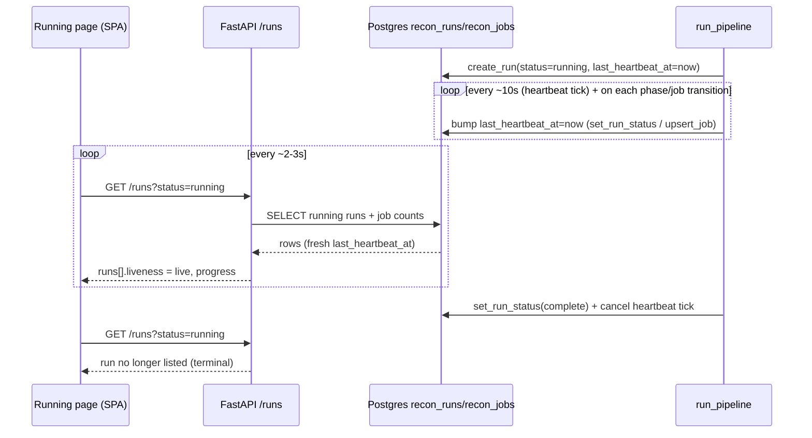
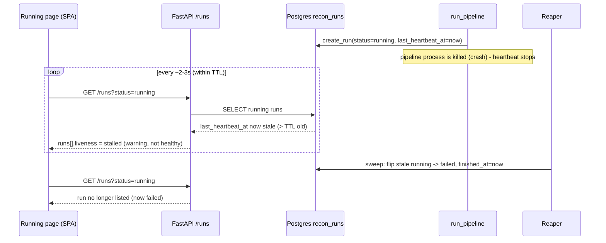

# Frontend BFF MVP design

Status: design, ready for an implementation plan.
Scope: a deliberately minimal read-only frontend for the polymerhus recon system.
Stream: Stream 2 (frontend BFF).

This doc describes a small Vite React single-page app plus three thin read endpoints on the existing FastAPI agent.
It uses only a force-graph render for the attack-surface view.
It has no Prisma, no separate Postgres schema, no next-auth, no user-scoping, no SSE, and no server-rendered `page.tsx`.

## 1. Goals and non-goals

Goals.

- Let an operator pick a project, see its attack-surface graph, and see which recon runs are currently live.
- Guarantee that the running-runs view updates fast and reliably, and never shows a crashed run as healthy.
- Keep the whole thing simple: one SPA, three endpoints, no new datastore, no auth tier.

Non-goals.

- No writes from the frontend (no launching runs, no editing settings) in this MVP.
- No authentication or multi-tenancy (trusted network; projects are global).
- No Server-Sent Events or websockets.
- No Langfuse dependency (kept only as an optional future per-run deep-link).

## 2. Architecture at a glance

The FastAPI agent owns all data access.
It already owns the Neo4j write path (`agent/recon/curator.py`, `agent/app/clients/neo4j_client.py`) and the Postgres registry (`agent/app/clients/pg.py`).
We add three read endpoints to the agent and colocate the graph-read Cypher next to the code that already writes the graph, so a single module owns the label contract.

The frontend is a static Vite React SPA that talks to the agent over `fetch`.
No database credentials ever live in the JS tier.

```
Browser (Vite React SPA)
    |  fetch (JSON over HTTP)
    v
FastAPI agent  (agent/app/routes.py)
    |                         |
    v                         v
Postgres registry        Neo4j graph
(projects, recon_runs,   (project_id-keyed
 recon_jobs)              attack surface)
```

## 3. Where the frontend lives

A new top-level `frontend/` directory in the polymerhus repo.

- `frontend/` is a standalone Vite React + TypeScript project (its own `package.json`, `vite.config.ts`, `tsconfig.json`).
- It has no server routes and no build-time coupling to the agent.
- In production it is built to static assets; how those are served (agent static mount vs a separate static host) is left to the implementation plan.
- The agent base URL is read from a single env var (for example `VITE_AGENT_BASE_URL`) so the SPA can point at the FastAPI service without code changes.

## 4. The three pages

All three pages are read-only and get every byte of data from the FastAPI endpoints in section 5.

| Route | Purpose | Data source |
|---|---|---|
| `/` | Project-select landing: list projects, click through to one | `GET /projects` |
| `/p/:id` | Project graph: render the attack-surface graph for the project | `GET /projects/{id}/graph` |
| `/p/:id/runs` | Running list: show currently-live recon runs with progress and liveness | `GET /runs?status=running` (polled) |

Navigation is trivial: the landing page links each project to `/p/:id`, and the project page links to `/p/:id/runs`.
There is no global layout beyond a thin header with a back-to-projects link.

## 5. The three FastAPI endpoints

These are added to `agent/app/routes.py`.
All are synchronous reads against Postgres, except the graph endpoint which reads Neo4j.
None require auth.

### 5.1 `GET /projects`

List all projects (global, no user-scoping).

Query: none.

Response `200`:

```json
{
  "projects": [
    { "project_id": "d3f...", "name": "acme-external", "created_at": "2026-07-01T10:00:00Z" }
  ]
}
```

Backing query: `SELECT project_id, name, created_at FROM projects ORDER BY created_at DESC`.

### 5.2 `GET /projects/{project_id}/graph`

Return the attack-surface graph for a project as `{ nodes, links }`, already shaped for the force-graph render.

Query: none.
`404` if the project does not exist (reuse `pg.project_exists`).

Response `200`:

```json
{
  "project_id": "d3f...",
  "nodes": [
    { "id": "123", "name": "acme.com", "type": "Domain", "properties": { "name": "acme.com", "first_seen": "..." } }
  ],
  "links": [
    { "source": "123", "target": "456", "type": "HAS_SUBDOMAIN" }
  ]
}
```

The node/link shape is fixed so the render consumes it unchanged (see section 6).

Backing Cypher lives in a new read helper colocated with the graph owner (proposed `agent/app/clients/neo4j_client.py` read function, or a small `agent/recon/graph_read.py` that imports the driver; the implementation plan picks one).
Polymerhus needs only the generic project-scoped pattern, which already captures the full label set (`Domain`, `Subdomain`, `IP`, `Port`, `Service`, `DNSRecord`, `BaseURL`, `Endpoint`, `Parameter`, `Header`, `Certificate`, `Technology`, `Secret`, `Traceroute`, `ExternalDomain`) plus `Observation` via `HAS_OBSERVATION`:

```cypher
MATCH (n)-[r]->(m)
WHERE n.project_id = $project_id
RETURN n, r, m
```

Node/link formatting: node `id` is the Neo4j internal id as a string, `type` is the first label, `name` is derived per-label, and integer wrapper objects are unwrapped.
The Python read helper returns the already-formatted `{ nodes, links }` so the render adapter stays tiny.

### 5.3 `GET /runs?status=running`

Return currently-running recon runs with derived liveness and progress.
This is the endpoint the running page polls (section 7).

Query: `status` (only `running` is supported in this MVP; other values may 400 or return empty).

Response `200`:

```json
{
  "runs": [
    {
      "run_id": "9ab...",
      "project_id": "d3f...",
      "project_name": "acme-external",
      "status": "running",
      "liveness": "live",
      "current_phase": 2,
      "started_at": "2026-07-07T09:00:00Z",
      "last_heartbeat_at": "2026-07-07T09:03:12Z",
      "jobs": { "total": 7, "in_progress": 2, "success": 4, "degraded": 1, "skipped": 0, "failed": 0 }
    }
  ],
  "liveness_ttl_seconds": 30
}
```

`liveness` is derived server-side (section 6.3), never stored.
`jobs` is a per-status count aggregated from `recon_jobs` for the run.

Backing query (runs plus a grouped job count):

```sql
SELECT r.run_id, r.project_id, p.name AS project_name, r.status,
       r.current_phase, r.started_at, r.last_heartbeat_at
FROM recon_runs r
JOIN projects p ON p.project_id = r.project_id
WHERE r.status = 'running'
ORDER BY r.started_at DESC;
```

Job counts come from a second grouped query over `recon_jobs` keyed by `run_id`, folded into each run row in Python.
The `WHERE r.status = 'running'` predicate is cheap; an index on `recon_runs(status)` is added with the schema delta (section 6.1).

## 6. Live-run tracking: the interaction model

This is the part the operator wants designed carefully.
The requirement is fast and reliable updates, and a crashed pipeline must never linger as a healthy running run.

### 6.1 The gap in today's schema

Today `recon_runs` has no liveness signal.
`pg.create_run` inserts `status = 'running'`, and status only flips to `complete` or `failed` at the terminus (`agent/app/clients/pg.py:57-86`).
`recon_jobs` upserts per job transition, but a run whose process is killed mid-phase leaves `status = 'running'` forever with no way to tell it apart from a genuinely active run.
So a crash produces a zombie that shows as healthy-running indefinitely.

Schema delta on `recon_runs`:

```sql
ALTER TABLE recon_runs ADD COLUMN last_heartbeat_at TIMESTAMPTZ;
CREATE INDEX IF NOT EXISTS recon_runs_status_idx ON recon_runs (status);
```

`last_heartbeat_at` is the freshness signal.
The status index keeps the polled `WHERE status = 'running'` query cheap.

### 6.2 Heartbeat write-points

`last_heartbeat_at` is bumped to `now()` at every point where the pipeline proves it is still alive.
All write-points live in `agent/app/clients/pg.py` and `agent/recon/pipeline.py`.

- At run creation: `pg.create_run` sets `last_heartbeat_at = now()` alongside `status = 'running'`.
- At each phase barrier: `pg.set_run_status(run_id, "running", current_phase=...)` bumps it.
  The pipeline already calls this once per phase (`pipeline.py:168`).
- At every job transition: `pg.upsert_job` bumps the parent run's `last_heartbeat_at`.
  The pipeline calls `upsert_job` on every job state change (`in_progress`, `success`, `degraded`, `skipped`, `failed`).
- Periodic tick: `run_pipeline` starts a lightweight async heartbeat task that bumps `last_heartbeat_at` every ~10s for the life of the run, then is cancelled at the terminal `set_run_status`.
  This guarantees freshness even during a single long-running job that produces no intermediate registry writes (for example a slow crawl phase).

The periodic tick is the load-bearing addition: phase-barrier and job-transition bumps alone can go quiet for minutes inside one slow job, which would falsely read as stalled without the tick.

### 6.3 Liveness derivation

Liveness is computed at read time in `GET /runs`, never persisted.

- LIVE: `status = 'running' AND last_heartbeat_at > now() - LIVENESS_TTL`.
- STALLED: `status = 'running' AND last_heartbeat_at <= now() - LIVENESS_TTL` (or `last_heartbeat_at IS NULL`).
- Terminal runs (`complete`, `failed`) are simply not returned by `status=running`.

`LIVENESS_TTL` defaults to 30s.
The frontend surfaces STALLED distinctly (for example a warning badge), and never renders a stalled run as healthy-running.
STALLED means the run is probably dead but has not yet been reaped; the reaper (section 6.4) converts it to `failed` shortly after.

The TTL (30s) is deliberately much larger than both the periodic heartbeat tick (~10s) and the frontend poll interval (~2-3s), so a healthy run never flickers to stalled between ticks, and a real crash is still detected within one TTL window.

### 6.4 Self-healing reaper

Stalled runs must not accumulate.
A reaper flips long-stale running rows to `failed` so the registry self-heals.

- On agent startup: sweep once, flipping every `status = 'running' AND last_heartbeat_at <= now() - REAP_TTL` (or NULL heartbeat) to `failed` with a terminal `finished_at = now()`.
  Startup sweep catches zombies left by a previous process that was killed.
- Periodic light sweep: run the same flip on a slow interval (for example every 60s) while the agent is up.

```sql
UPDATE recon_runs
SET status = 'failed', finished_at = now()
WHERE status = 'running'
  AND (last_heartbeat_at IS NULL OR last_heartbeat_at <= now() - INTERVAL '<REAP_TTL>');
```

`REAP_TTL` is set at or above `LIVENESS_TTL` (for example equal to it, 30s, or a small multiple).
Keeping `REAP_TTL >= LIVENESS_TTL` means a run is shown as STALLED before it is reaped, so the operator sees the degraded state rather than a run silently vanishing.
The exact value and whether reaper and liveness share one TTL is left to the implementation plan.

### 6.5 Frontend cadence

The running page polls `GET /runs?status=running` every ~2-3s.
No SSE, no websockets.
The query is a cheap indexed lookup plus a grouped job count, so a short poll interval is affordable.

Because `LIVENESS_TTL` (30s) is much greater than the poll interval (~2-3s):

- A normal state transition (a run finishing, a new run starting) shows within one poll (~2-3s).
- A crash is detected within one TTL (~30s): the heartbeat stops, the next reads mark the run STALLED, and the reaper then flips it to `failed`, at which point it drops out of the `status=running` list.

### 6.6 Sequence: healthy progress



### 6.7 Sequence: crash detection



## 7. Graph render and the data adapter

The render layer lives under `frontend/src/graph/**`:

- `components/GraphCanvas/**` (the react-force-graph 2D/3D canvas; `GraphCanvas` takes `{ nodes, links }` plus callbacks as props).
- `hooks/useGraphData.ts` fetches `GET /projects/{id}/graph`; the ETag machinery can be kept or dropped, implementation plan decides.
- `config/**` (`colors.ts`, `sizes.ts`) for the node colour and size mapping.
- The node/link formatting is done server-side (section 5.2), so the render layer consumes it directly without its own formatting step.

Our project page is a thin new shell that renders `GraphCanvas` with data from our endpoint - no GVM, github-hunt, trufflehog, Kali terminal, AI assistant, RedZone tables, SSE hooks, or user-scoped `ProjectProvider`.

The data adapter is small because the shape is fixed end to end.

- The `{ nodes: [{ id, name, type, properties }], links: [{ source, target, type }] }` shape is used consistently server-to-client.
- `getNodeName` special-cases our labels (`Domain`, `Subdomain`, `BaseURL`, `Endpoint`, `Parameter`, `Port`, `Service`, `Technology`, `Header`, `DNSRecord`), so names render correctly out of the box.
- The one addition is an `Observation` case: give it a colour in the `NODE_COLORS` map and, if desired, a name derived from `macro_kind`/`severity`.

`config/colors.ts` only needs entries for the labels polymerhus actually has; unused label mappings can be trimmed.

## 8. What is explicitly out of scope

- Prisma and any separate Postgres schema for graph/tool config: irrelevant to polymerhus's four-table registry.
- next-auth, sessions, middleware, user-scoping: no auth in this MVP.
- SSE and websockets: replaced by cheap polling.
- Any feature web beyond the graph view (GVM, trufflehog, github-hunt, Kali terminal, AI assistant, RedZone tables).
- Langfuse as a data source: the running list comes from Postgres, not traces.

## 9. Open for the implementation plan

- Static-serving strategy for the built SPA (agent static mount vs separate host) and CORS configuration for `fetch`.
- Exact home for the graph-read Cypher helper: extend `neo4j_client.py` vs a new `agent/recon/graph_read.py`.
- Whether `useGraphData`'s ETag/caching layer is kept or simplified away.
- Concrete values and sharing of `LIVENESS_TTL` and `REAP_TTL`, the periodic heartbeat tick interval, and the reaper sweep interval; and where these are configured (`agent/app/config.py`).
- Exact async mechanism for the periodic heartbeat tick inside `run_pipeline` (task lifecycle, cancellation at terminus, best-effort failure handling consistent with the pipeline's design).
- Where `GET /runs` job-count aggregation runs (single grouped query vs per-run), and the precise 400 vs empty behaviour for unsupported `status` values.
- Migration mechanics for the `recon_runs` schema delta (the repo uses `db/postgres/init.sql`; whether a forward migration file or an idempotent `ALTER` is preferred).
- Minimal visual design of the three pages (this doc fixes data and behaviour, not pixels).
