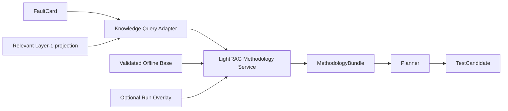

# LightRAG Methodology Service — Codex Implementation Brief

**Status:** MVP runtime path implemented on branch `lightrag`; WSTG base and
writeup overlay stores are available as pre-indexed local snapshots as of
2026-08-04.
**Audience:** Codex or a developer planning the implementation  
**Primary rule:** build the smallest end-to-end slice first. Do not add infrastructure or abstractions unless the current repository already needs them.

---

## 1. Goal

Add a lightweight LightRAG-based **methodology knowledge service** for the penetration-testing Planner.

The service retrieves reusable offensive methodology. It does **not** store the current target model, choose the final test, or execute attacks.

Canonical application flow:

```text
FaultCard + relevant Layer-1 context
        ↓
KnowledgeQuery
        ↓
LightRAG methodology retrieval
        ↓
MethodologyBundle with evidence
        ↓
Planner creates or updates TestCandidate
```

For the fuller Stage 3 component and data-lifecycle view, including
`IndexCard <match with> FaultCard`, the Query Agent, LightRAG retrieval, and the
Test Engineer Agent handoff to Stage 4, see
`docs/design/lightrag/stage-3-test-design-flow.md`.

For the current implementation details, strict structured-output behavior,
benchmark runner, HTTP contract test, and pre-indexed storage policy, see
`docs/design/lightrag/methodology_bundle_runtime.md`.

### Success condition

Given a fault hypothesis and a small target-context projection, the Planner receives a structured, evidence-grounded set of relevant techniques, prerequisites, defenses, bypasses, and knowledge gaps.

---

## 2. Hard boundaries

### In scope

- A minimal methodology ontology for LightRAG ingestion and retrieval.
- A structured Planner-to-LightRAG query contract.
- Offline ingestion of approved documents.
- Three query patterns: `target_state`, `bypass`, and `chaining`.
- Evidence and source provenance in every returned candidate.
- Persistence of the retrieval result as a per-run artifact for auditability.
- A later runtime-ingestion overlay, isolated from the validated base knowledge.

### Out of scope

- Storing Layer 0 or Layer 1 inside the methodology knowledge base.
- Generating the final `TestCandidate` inside LightRAG.
- Executing tools, payloads, or attacks.
- Building a second custom graph database beside LightRAG.
- Duplicating LightRAG graph relationships into PostgreSQL or YAML as another source of truth.
- Complex workflow engines, event buses, distributed queues, or microservices unless already required by the repository.
- Automatic semantic merging of uncertain nodes in the MVP.

---

## 3. Core architecture



### Separation rule

- **Target knowledge:** Layer 0, Layer 1, run memory, observations.
- **Methodology knowledge:** vulnerability classes, conditions, techniques, defenses, bypasses, and chains.

The query adapter sends only the minimum target facts needed for the current decision.

---

## 4. Methodology ontology

The methodology ontology has exactly ten entity types.

| Entity type | Meaning |
|---|---|
| `PreconditionEnvironment` | Target or environment condition that must be true for a technique to apply. |
| `TechnologyStack` | Technology, product, framework, protocol, or component present in the target and relevant to the attack. |
| `DefensiveControl` | Target mechanism intended to prevent, limit, or detect an attack. |
| `VulnerabilityClass` | Technical, logic, or configuration weakness class in the target. |
| `AttackGoal` | Strategic result the attacker wants to achieve through one or more techniques. |
| `AttackerCapability` | Access, control, or operational ability the attacker already has and can use in later steps. |
| `AttackTechnique` | Concrete action performed by the attacker to obtain a result. |
| `PayloadPattern` | Reusable, parameterized structure of malicious input used to perform a technique. |
| `Artifact` | Concrete object obtained or produced during an attack and reusable in later steps. |
| `ObservableSignal` | Observable evidence indicating relevant behavior or possible technique success. |

Every entity may also contain:

```yaml
description: "Short methodology-oriented summary"
source_refs: []
confidence: high | medium | low
```

The ontology does not define relation types, directions, hierarchies, subtypes,
or compatibility aliases. LightRAG extracts source-grounded relationships during
indexing. Titles, authors, URLs, document hierarchy, and page references remain
provenance metadata.

---

## 5. Planner query contract

Use the repository's existing validation/model conventions. The shapes below are conceptual and should be mapped to current project types rather than copied blindly.

### Request: `KnowledgeQuery`

```yaml
query_id: "q-123"
pattern: target_state | bypass | chaining
objective: "Natural-language decision the Planner is trying to make"

fault_context:
  vulnerability_hypothesis: null
  observed_conditions: []
  defenses_present: []
  available_capabilities: []
  blocked_technique: null
  desired_condition: null

constraints:
  scope: []
  authentication_state: unknown
  safety_level: non_destructive
  excluded_techniques: []

retrieval:
  mode: hybrid
  max_candidates: 5
```

Only fields needed by the selected pattern should be required.

### Response: `MethodologyBundle`

```yaml
query_id: "q-123"
summary: "Short evidence-grounded answer"

candidates:
  - technique:
      canonical_name: "Technique name"
      aliases: []

    relevance:
      relation_path: []
      rationale: "Why the candidate matches the current target state"

    applicability:
      satisfied_conditions: []
      missing_conditions: []
      conflicting_conditions: []

    expected_effect:
      produces_condition: null
      enables_next_action: null

    confidence: high | medium | low
    evidence_refs: []

knowledge_gaps: []
source_chunks: []
```

### Response rules

- Separate retrieved facts from Planner-facing rationale.
- Never hide a missing prerequisite.
- Never return a technique without evidence references.
- Never instruct execution.
- Return an empty candidate list plus `knowledge_gaps` when evidence is insufficient.
- Cap candidates at three.
- Keep text fields compact.
- Do not return raw LightRAG prose or native LightRAG response wrappers to
  attack-engineering agents.

---

## 6. The three supported query patterns

### 6.1 `target_state`

Purpose: retrieve techniques applicable to the current fault hypothesis, conditions, capabilities, and defenses.

Required context:

- `vulnerability_hypothesis`
- one or more `observed_conditions`

Useful optional context:

- `defenses_present`
- `available_capabilities`

### 6.2 `bypass`

Purpose: find an alternative technique when a previous technique was blocked or detected by a known defense.

Required context:

- `blocked_technique`
- one or more `defenses_present`

The returned candidate should preserve the original objective and expose its additional prerequisites.

### 6.3 `chaining`

Purpose: find an intermediate technique that establishes the condition or capability needed by the next action.

Required context:

- `desired_condition`
- current `available_capabilities` or `observed_conditions`

The response should make the chain explicit:

```text
current state -> intermediate technique -> produced condition -> next action
```

---

## 7. Offline ingestion — MVP first

The first working version should ingest a small set of approved methodology documents. Runtime web ingestion is not required to prove the core architecture.

### Minimal pipeline


### Source metadata

```yaml
source_id: "stable-id"
source_type: standard | vendor | research | methodology
source_authority: high | medium | low
document_title: "..."
heading_path: []
page_or_section_ref: "..."
retrieved_at: "..."
```

### Chunking rule

Prefer, in order:

1. heading and subsection boundaries;
2. one technique or control per unit;
3. one prerequisite or bypass sequence per unit;
4. tables and code blocks kept with their explanation;
5. token-size limit only as a safety fallback.

Do not build an advanced semantic chunking engine before the simple heading-aware pipeline is evaluated.

### Extraction rule

The ingestion model must:

- use only the ten entity types listed above;
- omit entities that do not fit one of those types;
- let LightRAG extract source-grounded relationship keywords from the source;
- normalize canonical names while preserving source wording in evidence;
- extract only supported claims;
- attach applicability, limitations, evidence span, and provenance;
- preserve negative evidence and failed techniques;
- avoid unsupported relationships rather than guessing.

Use:

```yaml
claim_status: explicit | strongly_supported | inferred
```

Only `explicit` and bounded `strongly_supported` claims enter the validated base automatically. `inferred` claims are logged but not inserted.

---

## 8. Merge and deduplication — MVP rule

### Entity key

```text
normalized(entity_type + canonical_name)
```

Merge only when:

1. the canonical key matches; or
2. LightRAG's own indexing deduplicates the entity from source-grounded context.

Do not automatically merge two nodes only because embeddings are similar.

### Relation key

```text
source_entity + relationship_keyword + target_entity + applicability_fingerprint
```

When the relation already exists, append evidence records. Do not overwrite existing evidence.

Any uncertain merge should remain separate and be logged. Do not build a review workflow for the MVP.

---

## 9. Runtime ingestion — later priority

Runtime ingestion adds target-relevant writeups, blogs, and aggregator-discovered sources to a **run-scoped overlay**.

Rules:

- The validated offline base remains unchanged.
- Every overlay entry carries `run_id` and provenance.
- Prefer original sources over mirrors or aggregators.
- Uncertain extraction is not inserted.
- The overlay can be discarded or archived after the run.
- Promotion from overlay to base requires an explicit later review step.

Use the simplest repository-compatible isolation mechanism. Do not introduce a new database solely for the overlay.

### Current implementation state

The static base currently targets OWASP WSTG first. Raw WSTG Markdown is
preprocessed into scenario-scoped methodology documents before LightRAG sees it;
the operational details and commands live in
`docs/design/lightrag/preprocessing_pipeline.md`.

Current WSTG preprocessing behavior:

- one LightRAG Markdown input per WSTG testing scenario;
- source provenance and non-ingestion context kept in `.manifest.json`;
- merged placeholders, reference-only fragments, tool lists, and generic source
  boilerplate filtered before ingestion;
- ontology query anchors generated for WSTG scenarios that are important to
  Phase 2 web-app abstractions, including API, GraphQL, client-side storage,
  CORS, postMessage, upload, SSRF, session, and input-validation cases;
- canonical relation anchors generated to link `TechnologyStack`,
  `PreconditionEnvironment`, `VulnerabilityClass`, `AttackTechnique`,
  `PayloadPattern`, `Artifact`, `ObservableSignal`, and `DefensiveControl`
  terms back to WSTG scenario IDs;
- relation briefs generated from source-grounded operational fragments;
- stale generated WSTG methodology files removed during full regeneration.

The regenerated corpus contains 119 WSTG methodology Markdown files. The local
WSTG preprocessing run on 2026-07-30 produced 119 methodology files from 4,489
source fragments and 1,078 relation brief candidates. Static corpus QA passed;
the only current warning is that `wstg-inpv-05-methodology.md` is large enough
to increase extraction timeout risk. `WSTG-ATHN-01` is skipped because it is a
merged placeholder, and `WSTG-INPV-13` / "Testing for Buffer Overflow" is
skipped because the current source body is only `This content has been
removed`.

The local LightRAG store under `data/lightrag/rag_storage` contains the WSTG
base. The writeup overlay store under `data/lightrag/writeups_rag_storage`
contains the isolated `writeups_0xdf` workspace. Both stores are mounted by the
`lightrag` compose profile and are intended to be versioned on the `lightrag`
branch so developers can query without rebuilding both indexes first.

The preferred benchmark template after rebuild is `ontology_feature_to_wstg`.
It projects Phase 2 target facts into ontology buckets and asks LightRAG to map
from observed features to vulnerability classes, techniques, payloads,
defenses, artifacts, signals, and finally WSTG scenario anchors. Production
queries should not pass benchmark-only `expected_wstg_ids`.

Future ingestion work should treat WSTG as a validated static base. Rebuilds
should use staged loading with `--normalize-types`, graph gate, blocking query
gate, and the WSTG plus writeup benchmark before replacing the committed store
snapshot. Normal development should query the existing base rather than
reloading it.

Writeups remain a run-scoped or review-overlay source. They should not be
inserted into the validated WSTG base until their relation briefs have been
reviewed for reusable methodology content and promoted explicitly.

---

## 10. Minimal service capabilities

Names and transport must follow the current repository conventions. Conceptually, the system needs only:

1. **Health/readiness** — confirm the methodology service and indexes are available.
2. **Offline ingestion** — ingest or update approved sources incrementally.
3. **Methodology query** — accept `KnowledgeQuery` and return `MethodologyBundle`.
4. **Artifact persistence** — save the request, response, source references, model/config version, and run correlation.

Do not create additional endpoints until a concrete caller requires them.

---

## 11. Priority order

### P0 — end-to-end methodology retrieval

1. Map the design to existing repository types and boundaries.
2. Define the minimal `KnowledgeQuery` and `MethodologyBundle` contracts.
3. Add the smallest LightRAG gateway/service boundary compatible with the repository.
4. Ingest one or two approved offline fixtures.
5. Support all three query patterns through one generic query path.
6. Persist one retrieval artifact per query/run.
7. Add focused contract and end-to-end tests.

### P1 — ingestion quality

1. Add source allowlisting and provenance validation.
2. Add heading-aware document preprocessing.
3. Add canonical-key and alias deduplication.
4. Evaluate retrieval quality using a small fixed question set.

### P2 — runtime overlay

1. Add run-scoped source ingestion.
2. Add source cleaning and semantic filtering.
3. Add overlay/base isolation.
4. Add explicit promotion or archive behavior only when needed.

### Not planned until evidence requires it

- automatic semantic node merging;
- custom graph traversal engine beside LightRAG;
- distributed ingestion workers;
- asynchronous orchestration;
- generalized plugin systems;
- elaborate ontology registries.

---

## 12. MVP acceptance criteria

The MVP is complete when:

1. The current Planner can create a valid `KnowledgeQuery` from a `FaultCard` and relevant Layer-1 context.
2. The methodology service can ingest at least one approved document incrementally.
3. Each of the three query patterns returns a valid `MethodologyBundle`.
4. Every returned technique includes evidence references and explicit applicability information.
5. Missing prerequisites appear in `missing_conditions` or `knowledge_gaps`.
6. LightRAG does not create the final `TestCandidate` and does not execute tools.
7. The request and response are persisted as a per-run retrieval artifact.
8. Tests cover contract validation, empty/no-evidence behavior, and one end-to-end retrieval fixture.

---

## 13. Implementation discipline for Codex

- Inspect and reuse current repository abstractions before adding new ones.
- Do not invent file paths, services, or models without repo evidence.
- Prefer one generic query pipeline over three separate implementations.
- Prefer one simple offline ingestion path before runtime scraping.
- Prefer plain functions and existing repository patterns over new frameworks.
- Do not add an abstraction unless it removes current duplication or defines a real boundary.
- Keep changes small, testable, and independently reviewable.
- At every step, state what is deliberately deferred.
