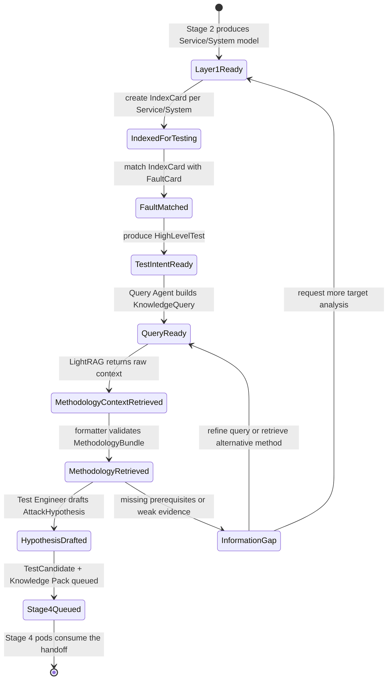

# Stage 3 Test Design - LightRAG Methodology Flow

Status: design plus implemented retrieval contract. Runtime details are tracked
in `docs/design/lightrag/methodology_bundle_runtime.md`.

Purpose: describe how Stage 3 turns the Layer-1 service/system model into
evidence-grounded high-level tests and attack hypotheses, using LightRAG as a
methodology retrieval service.

Stage 3 does not execute live probes. It produces test intent, methodology
context, and attack hypotheses that Stage 4 will implement through specialized
agents or pods.

## Component And Data Flow

```mermaid
flowchart LR
    subgraph Target["Target knowledge lifecycle"]
        L0["Layer 0 graph<br/>assets, endpoints, params,<br/>headers, technologies"]
        L1["Layer 1 service/system model<br/>systems, services, trust edges,<br/>data relationships"]
        IC["IndexCard<br/>service/system testing summary"]
        FC["FaultCard<br/>candidate fault / checklist item"]
        HT["HighLevelTest<br/>test objective scoped to<br/>one service/system"]
    end

    subgraph Methodology["Methodology knowledge lifecycle"]
        WSTG["High-level methodology sources<br/>OWASP WSTG, standards,<br/>approved guides"]
        WRITEUPS["Low-level methodology sources<br/>machine writeups, exploit notes,<br/>technology-specific bypasses"]
        PRE["Preprocessing<br/>source fragments, relation briefs,<br/>scenario methodology docs"]
        BASE["Validated LightRAG base KB"]
        OVER["Run or review overlay<br/>lower-confidence / recent material"]
        LR["LightRAG methodology retrieval<br/>hybrid semantic + graph retrieval"]
        FMT["Methodology formatter<br/>schema-bound compact extraction"]
    end

    subgraph Agents["Stage 3 agents"]
        QA["Query Agent<br/>builds structured + natural-language<br/>KnowledgeQuery"]
        TE["Test Engineer Agent<br/>turns methodology into<br/>attack hypotheses"]
    end

    subgraph Stage4["Stage 4 handoff"]
        AH["AttackHypothesis / TestCandidate<br/>objective, prerequisites,<br/>expected signal, safety bounds"]
        KP["Execution Knowledge Pack<br/>methodology evidence,<br/>required checks, constraints"]
        PODS["Specialized agents / pods<br/>implement and run the test"]
    end

    L0 -->|produces / aggregates into| L1
    L1 -->|produces| IC
    FC <-->|matched with| IC
    IC -->|produces scoped objective| HT
    FC -->|produces fault objective| HT

    WSTG -->|consumed by| PRE
    WRITEUPS -->|consumed by| PRE
    PRE -->|produces curated methodology docs| BASE
    PRE -->|produces optional run/review docs| OVER
    BASE -->|consumed by| LR
    OVER -->|consumed by| LR

    HT -->|consumed by| QA
    IC -->|consumed by| QA
    FC -->|consumed by| QA
    L1 -->|minimal target projection consumed by| QA

    QA -->|produces KnowledgeQuery<br/>symptom + fault_context +<br/>objective + target_context| LR
    LR -->|retrieves context only<br/>only_need_context=true| FMT
    FMT -->|produces validated<br/>MethodologyBundle| TE
    HT -->|consumed by| TE
    IC -->|consumed by| TE
    FC -->|consumed by| TE

    TE -->|produces| AH
    TE -->|produces| KP
    AH -->|consumed by| PODS
    KP -->|consumed by| PODS
```



## Artifact Lifecycle



## Data Contracts

| Artifact | Produced by | Consumed by | Role |
|---|---|---|---|
| `Service/System` | Stage 2 attack-surface analysis | Stage 3 index-card builder, Query Agent, Test Engineer Agent | Testing unit and target substrate. |
| `IndexCard` | Stage 3 index-card builder | Fault matcher, Query Agent, Test Engineer Agent | Compact service/system testing profile. |
| `FaultCard` | Checklist/fault pool projection | Fault matcher, Query Agent, Test Engineer Agent | Candidate fault or test family to evaluate against the service/system. |
| `HighLevelTest` | `IndexCard <match with> FaultCard` | Query Agent, Test Engineer Agent | Test objective before methodology retrieval. |
| `KnowledgeQuery` | Query Agent | LightRAG retrieval service | Symptom-first structured plus natural-language request for methodology. |
| `MethodologyBundle` | LightRAG retrieval service | Test Engineer Agent, audit artifact store | Evidence-grounded methodology response. |
| `AttackHypothesis` / `TestCandidate` | Test Engineer Agent | Stage 4 specialized agents/pods | Concrete hypothesis to implement later. |
| `Execution Knowledge Pack` | Test Engineer Agent | Stage 4 specialized agents/pods | Evidence, constraints, prerequisite checks, and technique notes needed to execute safely. |

## Symptom-First Retrieval Boundary

`KnowledgeQuery` treats observed fault symptoms as first-class retrieval
anchors. The Query Agent should phrase methodology requests as:

```text
Given Symptom / Fault Context
+ Target TechnologyStack / PreconditionEnvironment
+ VulnerabilityClass and taxonomy tags
-> retrieve AttackTechnique, PayloadPattern, ObservableSignal,
   TestingStrategy, and Mitigation guidance
```

The default `retrieve_methodology()` path uses `RoutedMethodologyRetriever`.
LightRAG is queried with `only_need_context=true`; a dedicated formatter then
turns the retrieved context into a validated `MethodologyBundle`. The native
LightRAG `/query` response is not the agent-facing methodology contract.

`RoutedMethodologyRetriever` queries the validated WSTG base KB first and only
consults the writeup overlay when one of the routing gates fires:

- symptom or taxonomy concepts match overlay markers such as JWT, SQLi, SSRF,
  Active Directory, Git exposure, or deserialization;
- an execution/planning agent asks for bypass, chaining, or escalation
  techniques;
- the base KB returns fewer candidates than the configured minimum.

Merged results preserve base precedence. Base-derived candidates are tagged
`source_tier=validated_base`; overlay-derived candidates are tagged
`source_tier=review_overlay` and must be treated as review material until
promoted.

## Attack Engineer Consumption Contract

The Test Engineer or Attack Engineer agent should consume a validated
`MethodologyBundle` with at most three candidate techniques, evidence
references, condition separation, mitigation checks, observables, and explicit
knowledge gaps. It should not parse conversational prose from LightRAG.

The pending HTTP boundary is:

```text
POST /methodology/query
request: {"run_id": "...", "query": KnowledgeQuery}
response: MethodologyBundle
```

`tests/lightrag/test_methodology_http_contract.py` captures this contract and
is marked `xfail(strict=True)` until the route is wired. The route implementation
should call `agent.lightrag.service.retrieve_methodology()` and return the
validated bundle directly.

## Boundary Rules

- Layer 0 and Layer 1 remain target knowledge; they are not inserted into the
  methodology KB.
- LightRAG stores reusable methodology, not the current target model.
- WSTG and similar standards populate the validated base KB.
- Writeups and machine-specific material should enter an overlay or reviewed
  ingestion path before promotion to the validated base.
- Overlay routing is conditional. General WSTG methodology queries should stay
  base-only unless the symptom, taxonomy, or candidate-count gate justifies
  querying lower-confidence material.
- The Query Agent retrieves methodology; it does not choose the final attack.
- The Test Engineer Agent produces attack hypotheses and execution knowledge;
  it does not execute them.
- Specialized agents or pods execute only in Stage 4, under scope and safety
  constraints.
