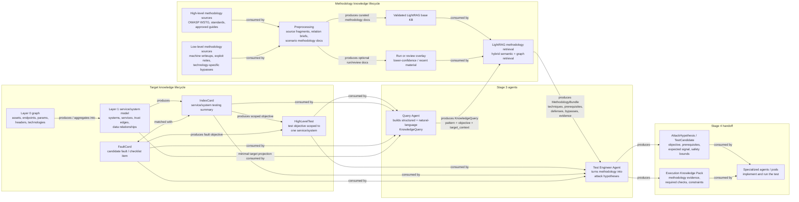
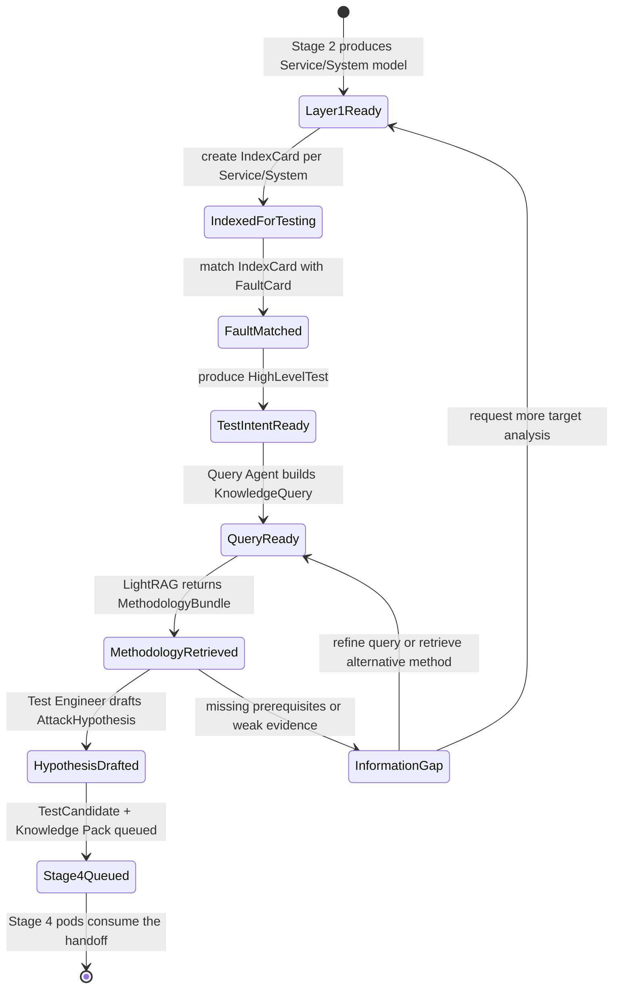

# Stage 3 Test Design - LightRAG Methodology Flow

Status: design diagram.

Purpose: describe how Stage 3 turns the Layer-1 service/system model into
evidence-grounded high-level tests and attack hypotheses, using LightRAG as a
methodology retrieval service.

Stage 3 does not execute live probes. It produces test intent, methodology
context, and attack hypotheses that Stage 4 will implement through specialized
agents or pods.

## Component And Data Flow

## Artifact Lifecycle

## Data Contracts

| Artifact | Produced by | Consumed by | Role |
|---|---|---|---|
| `Service/System` | Stage 2 attack-surface analysis | Stage 3 index-card builder, Query Agent, Test Engineer Agent | Testing unit and target substrate. |
| `IndexCard` | Stage 3 index-card builder | Fault matcher, Query Agent, Test Engineer Agent | Compact service/system testing profile. |
| `FaultCard` | Checklist/fault pool projection | Fault matcher, Query Agent, Test Engineer Agent | Candidate fault or test family to evaluate against the service/system. |
| `HighLevelTest` | `IndexCard <match with> FaultCard` | Query Agent, Test Engineer Agent | Test objective before methodology retrieval. |
| `KnowledgeQuery` | Query Agent | LightRAG retrieval service | Structured plus natural-language request for methodology. |
| `MethodologyBundle` | LightRAG retrieval service | Test Engineer Agent, audit artifact store | Evidence-grounded methodology response. |
| `AttackHypothesis` / `TestCandidate` | Test Engineer Agent | Stage 4 specialized agents/pods | Concrete hypothesis to implement later. |
| `Execution Knowledge Pack` | Test Engineer Agent | Stage 4 specialized agents/pods | Evidence, constraints, prerequisite checks, and technique notes needed to execute safely. |

## Boundary Rules

- Layer 0 and Layer 1 remain target knowledge; they are not inserted into the
  methodology KB.
- LightRAG stores reusable methodology, not the current target model.
- WSTG and similar standards populate the validated base KB.
- Writeups and machine-specific material should enter an overlay or reviewed
  ingestion path before promotion to the validated base.
- The Query Agent retrieves methodology; it does not choose the final attack.
- The Test Engineer Agent produces attack hypotheses and execution knowledge;
  it does not execute them.
- Specialized agents or pods execute only in Stage 4, under scope and safety
  constraints.
