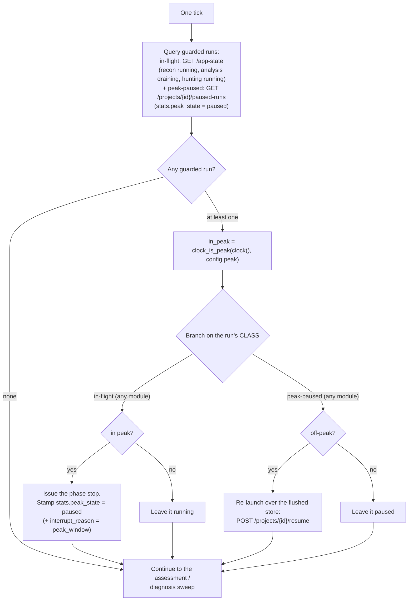
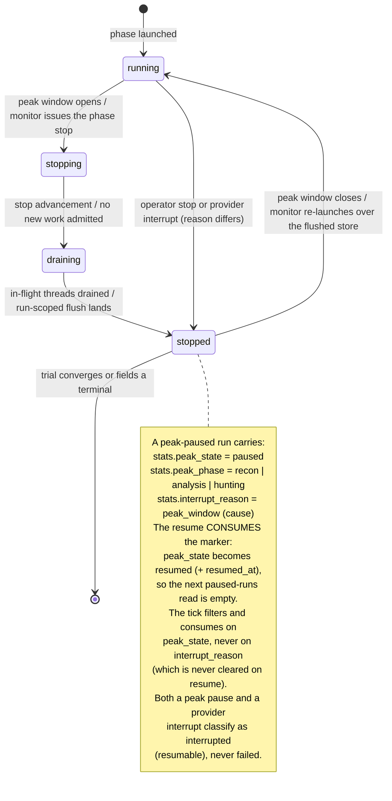
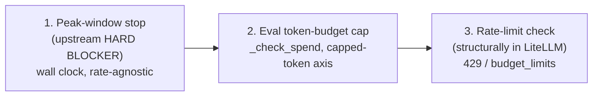

# ADR: a structural peak-window guard for the eval monitor

*Status: PROPOSED for operator green light (2026-10-09, revision 8 after the fourth adversarial review).
This record designs a structural peak-window guard.
It authorises no code change until the operator rules on the remaining open points.
It builds on the already-landed stop/drain/flush primitive and the #331 provider-interrupt taxonomy (`docs/design/hunting-331-provider-resume-adr.md`), and it does not reopen the deferred provider-429 resume policy.
This record changes no code and no existing decision by itself.
The three decision-record amendments it specifies (ADR D13, `src/polymerhus/app/CONTEXT.md`, `src/polymerhus/app/llm/sync_mapping.py`) land WITH the implementation in the same change, so no two contradicting decisions are left live on merge (the commit gate).*

## Revision note

Revision 1 proposed a new `POST /projects/{id}/peak-stop` endpoint and a new `interrupt_run` helper, and it branched the tick on the wall clock alone.
Both were wrong: the stop/drain/flush mechanism already exists, and the tick must branch on the run's own status.
Revision 2 corrected the tick, reused the real draining endpoints, and fixed the timezone and weekday rules.
Revision 3 folded in the operator's open-point answers and stated the rationale up front.
Revision 4 resolved the blocking cost-model residual point with provider evidence: the provider DOES publish a peak rate at `2x` the off-peak rate, the single off-peak rate in the cost guard is correct under the structural guard, and the prior "no off-peak rate" conclusion is corrected.
Revision 5 fixed the first review's two blocking defects and the minors:

- S1: the tick now names the exact per-module status vocabulary and maps any in-flight run into the STOP branch and any peak-paused run into the RE-LAUNCH branch.
- S2: a read surface enumerates peak-paused runs so the app can discover a pause without the monitor's memory.
- S3 to S6: status and citation corrections, the de-duplicated window statement, and the domain-model removal.
- P3: the trial's classification of a peak-paused `stopped` run.
- P4: a reachable weekend citation.

Revision 6 fixed the second review's blocking defect and the majors:

- CRITICAL: the resume CONSUMES the pause marker (`stats.peak_state` `paused` -> `resumed`), so `paused-runs` converges and the tick does not re-launch the same run every off-peak tick.
- MAJOR P3: the real trial mechanism (`_poll` returns a `PollResult`, `PhaseRecord` retains the terminal response) so `_peak_paused` has the `stats` it needs.
- STANDARDS: the impact map now amends ADR D13 and the `app/CONTEXT.md` conservatism entry, so no contradicting decision stays live.
- MINORS: multiple paused runs per project, analysis `run_id` vs `analysis_run_id`, and the deferred-scaffolding list.

Revision 7 fixed the third review's narrow FAIL:

- MAJOR: Diagram B and its reconciliation now name `stats.peak_state` as the tick's filter and the resume's consumed field, consistent with Diagram A and the authoritative sections.
- MINOR: `sync_mapping.py` is now in the impact map, and the "no production code is changed" claim is corrected (the comment fix is production source).
- MINORS: project enumeration, the hunting `_peak_paused` source, and the citation drifts.

Revision 8 (this one) fixes the fourth review's narrow FAIL:

- MAJOR: every statement of the STOP stamp now includes `stats.peak_state = "paused"`, so the authoritative tick step matches the `paused-runs` filter and the resume's consumption (the canonical list is in "Where the pause lives").
- MINOR: the `flush_run_scoped("hunting", ...)` citation is corrected to `runtime.py:852`.
- MINOR: the `_peak_paused` OR clause is dropped; it filters on `stats.peak_state` alone.
- STANDARDS: the PROPOSED / no-code / amendments-land-with-implementation framing is now explicit in the status block.

It does six things the operator asked for across revisions 3 and 4, plus the review fixes in revisions 5 to 8:

1. States the rationale explicitly up front: a tight LLM inference budget, the `opencode-go` provider, and the `deepseek-v4.1-flash` peak/off-peak cost.
2. Seeds the official `Europe/Paris` (CEST) windows as the default, replacing the placeholder windows.
3. Makes resume a re-launch over the flushed store, with a named project-scoped endpoint and its exact contract.
4. Draws the three-layer stop priority: the peak hard blocker, then the token budget, then the rate-limit stop.
5. Grounds the pause ledger on the existing run-row attribute and primitives, with the monitor's own state secondary.
6. Resolves the cost model: one effective (off-peak) rate plus the structural guard, recorded as an ADR section with sources.


## Why this guard exists: a tight inference budget

The peak guard exists because the inference budget is tight and must be spent where it buys the most.
LLM inference is the scarce resource the eval consumes, so an inference hour spent at the wrong time is an hour not spent on discovery.

The targeted provider is `opencode-go`, the eval's LLM lane.
Its model is `opencode-go/deepseek-v4.1-flash`, the role-agent model named in `eval/CONTEXT.md`.

The provider DOES publish a peak rate and an off-peak rate for this model, and the off-peak rate is half the peak rate.

- The opencode Go plan lists both rows for `DeepSeek V4.1 Flash`: Off-Peak input `$0.15`, output `$0.60`, cached read `$0.003` per 1M; Peak input `$0.30`, output `$1.20`, cached read `$0.006` per 1M (`https://opencode.ai/docs/go`).
- The upstream DeepSeek price card states the same rule: for `deepseek-flash` (DeepSeek-V4.1-Flash), off-peak cache-hit `$0.003`, cache-miss `$0.15`, output `$0.60`; peak cache-hit `$0.006`, cache-miss `$0.30`, output `$1.20` per 1M, with "off-peak rates are half of the peak rates" (`https://api-docs.deepseek.com/quick_start/pricing/`).
- Peak hours are 01:00-04:00 and 06:00-10:00 UTC, Monday through Friday, excluding Chinese public holidays (`https://api-docs.deepseek.com/quick_start/pricing/`).
  That is 03:00-06:00 and 08:00-12:00 CEST, the exact windows the operator seeded.
- The Go usage limit for `DeepSeek V4.1 Flash` is a dollar allowance: monthly `$60`, weekly `$30`, 5-hour `$12` (`https://opencode.ai/docs/go`, "5-hour - 20% of the monthly limit; weekly - 50%; and monthly - 100%").
  The repo's gateway caps (`$30`/7d and `$60`/30d, ADR D13) match the weekly and monthly rows.

So the mechanism is provider-defined time-of-day pricing, and the discount factor is known: off-peak is `0.5x` peak, a 50% discount.
The direction of the saving: a token billed off-peak costs half what it costs at peak, so the same work done in off-peak consumes the dollar-denominated weekly cap half as fast.
Equivalently, the guard buys up to twice the token volume for the same `$30` weekly quota.

The guard's real function is therefore to protect the tight weekly `$30` quota:
it keeps eval spend at the off-peak rate, so the quota stretches about twice as far and a mid-run provider 429 from quota exhaustion is much less likely.
The peak guard is rate-agnostic in implementation (it needs only the windows), but the saving it captures is a real, quantified `0.5x` factor.

### Correction to the prior record

The 2026-10-09 iteration-3 amendment (ADR D13, #330 / EV-34) concluded that "there is NO separate off-peak rate".
That conclusion is WRONG, and this record corrects it.
The iteration-3 forensics observed an off-peak-only window: its tokens priced at the off-peak record totalled `$29.83` against the `$30` weekly cap with "no peak/off-peak blend".
That evidence is consistent with the eval running off-peak, which it mostly does.
It does NOT show the absence of a peak rate.
The provider's own pages (cited above) publish a peak rate at `2x` the off-peak rate.

What iteration 3 got right, and this record keeps: the `~6x` "off-peak" haircut of iteration 2 was wrong.
The effective rate is the models.dev/off-peak record (`$0.15` / `$0.60` / `$0.003` per 1M), not a rate six times lower.
The correction is narrower than iteration 3 stated: the rate is right; the claim that no peak rate exists is wrong.

The cost-model consequence and the design decision that resolves it are in the ADR section below.

## Problem

The `opencode-go` pricing model bills peak periods at a higher rate.
Evals must never RUN through a peak period.
Nothing today detects a peak period or drives a run off it.
The monitor only moves a trial through assessment and diagnosis after a successful execution.
A run in flight during a peak period keeps spending at the peak rate.

The guard must be structural, not prompt persuasion:

1. Detect the peak window by the wall-clock timestamp.
2. Stop the affected runs with the already-built stop/drain/flush path, stamping the pause reason.
3. Re-launch the flushed runs once the timestamp is out of the window.
4. Keep the window in configuration.
5. Make a peak pause a first-class, resumable workflow state, never a failure.
6. Compose with the two existing spend bounds.
7. Guard EVERY in-flight project on every instance, with no single-project gating.

## The clock seam

The monitor gets ONE well-named clock seam.
The seam answers one question for one instant: in peak, or out of peak.

The seam is a new pure module `eval/orchestrator/peak_window.py`:

```python
@dataclass(frozen=True)
class TimeWindow:
    start: time              # wall clock, in the window's timezone
    end: time                # exclusive
    weekdays: frozenset[int] # 0=Mon .. 4=Fri; see the weekday rule below

@dataclass(frozen=True)
class PeakWindow:
    enabled: bool
    timezone: str            # an IANA name, e.g. "Europe/Paris"
    windows: tuple[TimeWindow, ...]

def clock_is_peak(now: datetime, window: PeakWindow) -> bool: ...
```

`clock_is_peak` is the seam.
The monitor takes an injected `clock: Callable[[], datetime]` that returns an aware UTC datetime.
The default is `lambda: datetime.now(timezone.utc)`.
One call site only: `in_peak = clock_is_peak(clock(), config.peak)` inside the tick, after the execution query.

### Timestamp source and timezone handling

The decision must be world-timezone agnostic: it must not depend on the host's local timezone, so a server anywhere decides identically.

- Source of truth: the host wall clock read as UTC via `datetime.now(timezone.utc)`.
  The seam never reads the host's local zone and never reads `time.localtime`.
- Window zone: an explicit IANA name, resolved with `zoneinfo.ZoneInfo`.
  The seam converts `now` with `now.astimezone(ZoneInfo(timezone))`, then compares the local `.timetz()` and `.weekday()`.
  Two hosts in two local zones with the same UTC instant and the same configured zone decide identically.
- The canonical config uses `"Europe/Paris"`.
  This zone observes DST, so the seam's DST handling is load-bearing, not merely permitted: a boundary instant shifts by one hour between CET (UTC+1, winter) and CEST (UTC+2, summer).
- `zoneinfo` resolves the DST fold deterministically.
  A spring-forward gap skips a boundary instant; a fall-back overlap repeats one.
  The seam states the rule and the resolved fold.
- A naive datetime or a fixed-offset string (for example `"+02:00"`) is rejected loudly at config load.
  A named region is required so DST is well defined.
- A window whose `end` is before `start` crosses midnight; the seam splits it into two intervals.
  A window with `start == end` is rejected at config load as ambiguous.

## The official windows (seeded default)

The zone is `Europe/Paris` (an IANA zone, so the rule is DST-correct and host-location-agnostic).

- Monday to Friday: Peak is 03:00-06:00 CEST and 08:00-12:00 CEST.
  Off-Peak is 12:00-03:00 the next morning and 06:00-08:00 CEST.
- Saturday and Sunday: Off-Peak all day (a hard rule).

These windows are the provider's own peak hours, converted to CEST.
The provider states them as 01:00-04:00 and 06:00-10:00 UTC, Monday through Friday (`https://api-docs.deepseek.com/quick_start/pricing/`; `https://opencode.ai/docs/go`).
CEST is UTC+2 in summer, so 01:00-04:00 UTC is 03:00-06:00 CEST and 06:00-10:00 UTC is 08:00-12:00 CEST.
The provider's primary pricing page states that all other hours are off-peak, including weekends in full (`https://api-docs.deepseek.com/quick_start/pricing/`), which matches the design's hard weekend rule.

One nuance the provider has and the design does not: Chinese public holidays are off-peak in full.
The design's strict weekday windows will treat a Chinese public holiday as peak, so the guard is over-conservative on those days.
That is safe (it stops more, never less) and is recorded as a possible future overlay, not a defect.

The peak windows are therefore the two weekday intervals 03:00-06:00 and 08:00-12:00; everything else is off-peak.
The config encodes only the two PEAK intervals, all on weekdays 0 through 4.
"The config schema" below holds the canonical YAML block.
These values replace the revision-2 placeholders (`01:00-04:00` and `06:00-10:00` in `UTC`).

## The weekday rule

Weekday selection is load-bearing, not optional.

- Saturday and Sunday are ALWAYS off-peak.
  After converting `now` to the window zone, `clock_is_peak` returns `False` whenever `weekday() >= 5`.
  This rule is a hard guard, independent of any configured `weekdays`.
- Only weekdays 0 (Monday) through 4 (Friday) can be peak.
  `PeakWindow` rejects any configured value outside `0..4` at load, so a Sat/Sun entry can never be authored.
- `weekdays` is required when the guard is enabled.
  It selects WHICH weekdays among Monday to Friday the window applies to, and it is the only weekday lever.
- The seam's order is: convert to the window zone; if the local weekday is Saturday or Sunday, return `False`; else test the configured weekday set and the time-of-day.

## The tick algorithm (corrected)

The tick is holistic: it makes one query, one clock read, and one branch per execution, and it branches on the run's status, never on the clock alone.

### The per-module status vocabulary

Each module has its own LIVE status and its own terminal set.
The guard classifies a run into the STOP branch by live status and into the RE-LAUNCH branch by the pause marker, never by a single shared word.

| Module | Live status | Terminal statuses | Source |
|---|---|---|---|
| recon | `running` | `complete`, `failed`, `stopped` | `running_runs`; `_TERMINAL_RUN_STATUSES` `src/polymerhus/app/clients/pg.py:28` |
| analysis | `draining` | `drained`, `withheld`, `stopped`, `interrupted` | `list_running_analysis_runs`; `_TERMINAL_ANALYSIS_STATUSES` `pg.py:76` |
| hunting | `running` | `complete`, `stopped`, `failed`, `interrupted` | `list_running_hunting_runs`; `_TERMINAL_HUNTING_STATUSES` `pg.py:107` |

Mapping:

- IN-FLIGHT (STOP branch): recon `running`, analysis `draining`, hunting `running`.
  Any run reported by `GET /app-state` is in this class (`src/polymerhus/project_management/repository.py:76-118`).
- PEAK-PAUSED (RE-LAUNCH branch): a run whose row carries `stats.peak_state == "paused"`.
  The peak stop writes `stopped` for all three modules (`pipeline.py:830-831` recon; `lifecycle.py:142-143` analysis; `src/polymerhus/attack/hunting/runtime.py:942-948` hunting) and stamps `stats.peak_state = "paused"`.
  So the peak-paused class is `stopped` plus the `peak_state = "paused"` marker.
  A `stopped` row WITHOUT the marker is a budget or operator stop and never enters the re-launch branch.
  The resume consumes the marker (`peak_state = "resumed"`), so a re-launched row leaves this class and the tick converges (see "The consumption").

Steps:

1. **Upstream check first, on TWO read surfaces.**
   Query the guarded executions from:
   - the in-flight surface: `GET /app-state` (recon `running`, analysis `draining`, hunting `running`);
   - the peak-paused surface: `GET /projects/{project_id}/paused-runs` (the read surface defined in "Where the pause lives").
   If NEITHER returns anything, exit the loop and go straight to the existing assessment/diagnosis sweep.
   If either returns anything, proceed.
2. **Then the timestamp check.**
   `in_peak = clock_is_peak(clock(), config.peak)`.
3. **Then branch on the run's CLASS, not on the clock alone.**
   - IN-FLIGHT (any module): only the "should we stop?" decision applies.
      In peak -> stop it and stamp the canonical pause: `stats.peak_state = "paused"`, `stats.interrupt_reason = "peak_window"`, `stats.peak_phase`, `stats.paused_at` (the canonical list is in "Where the pause lives").
     Off-peak -> leave it running.
     There is NO re-launch branching in this class.
   - PEAK-PAUSED (any module): only the "should we re-launch?" decision applies.
     Off-peak -> re-launch the phase over its flushed store (see the resume path).
     In peak -> leave it paused.
     There is NO stop branching in this class.
4. Continue to the existing assessment/diagnosis sweep.

The corrected tick never fans out into both a stop and a re-launch from the clock.
The clock is a condition inside a class-keyed branch.

The guard keeps a small persisted pause ledger so a monitor restart still re-launches correctly.
The APP-STATE attribute is the authority (the run row's `status` plus `stats.interrupt_reason`); the monitor's own ledger is secondary (see "Where the pause lives").

### Diagram A: the corrected tick (centrepiece)



## The stop mechanism (the real draining endpoints)

The guard does NOT add a `peak-stop` endpoint and does NOT add an `interrupt_run` helper.
It reuses the already-implemented per-phase stop endpoints and their drain mechanism exactly.

The stop is uniform across modules: the same mechanism and the same reason for recon, analysis, and hunting.
The mechanism is always the same three moves: stop advancement, let the current threads drain, flush the run in its terminated state.

### Recon

- Endpoint: `POST /projects/{project_id}/recon/{run_id}/stop` (`src/polymerhus/project_management/api.py:418`).
- The handler calls `runtime.cancel_run("recon", run_id)` (`api.py:438`), then flushes the project usage ledger (`api.py:442-444`).
- The cancellation unwinds the pipeline's `finally`, which flushes this run's threads via `flush_run_scoped("recon", run_id)` (`src/polymerhus/recon/control/pipeline.py:810-811`) and stamps the first-class `stopped` terminal at `pipeline.py:830-831`.
- Recon's terminal vocabulary currently has no `interrupted` (`_TERMINAL_RUN_STATUSES`, `src/polymerhus/app/clients/pg.py:28`).
  The peak pause reuses `stopped`.

### Analysis

- Endpoint: `POST /projects/{project_id}/analysis/{run_id}/stop` (`api.py:471`).
- The handler calls `stop_analysis(run_id)` (`src/polymerhus/analysis/lifecycle.py:184`).
- `stop_analysis` is the graceful drain: it sets the feed's stop event, lets the in-flight chunk finish, consumes no further, and PRESERVES the queue for a resume (`lifecycle.py:195-199`).
- The supervisor flushes this run's threads via `flush_run_scoped("analysis", run_id)` (`lifecycle.py:139-140`), then stamps `stopped` (`lifecycle.py:142-143`).
- The stop is keyed by the recon `run_id` for analysis (the phase's `stop_run_id`, recorded by the trial; `eval/orchestrator/surfer.py:652-658`).

### Hunting

- Endpoint: `POST /projects/{project_id}/hunting/{hunting_run_id}/stop` (`api.py:672`).
- The handler calls `hunting_runtime.stop_hunting(hunting_run_id)` (`src/polymerhus/attack/hunting/runtime.py:900`).
- `stop_hunting` performs the drain directly: `_cancel_run_sessions` cancels every session of the run (`src/polymerhus/attack/hunting/runtime.py:383-404`), `_wait_no_run_sessions` waits until no component session remains live (`src/polymerhus/attack/hunting/runtime.py:426-446`), the actor is reaped, and the row is stamped `stopped` (`src/polymerhus/attack/hunting/runtime.py:942-948`).
- The run-scoped flush already lands in `start_hunting`'s terminal path via `flush_run_scoped("hunting", hunting_run_id)` (`src/polymerhus/attack/hunting/runtime.py:852`).

### The reason and the phase

The run row carries the `running`/`stopped` status.
The guard records the pause reason `peak_window` and the phase that was running (`recon` | `analysis` | `hunting`) in the run row's `stats` when IT issues the stop.
Re-launch reads exactly those attributes.

Precise add (the one the operator asked to name): the existing stop endpoints carry no reason today, so the design adds an optional `reason` to the phase stop path (default `operator`).
The peak guard passes `reason=peak_window`, and the stop path stamps the canonical pause: `stats.peak_state = "paused"`, `stats.interrupt_reason = "peak_window"`, `stats.peak_phase`, `stats.paused_at`.
The run-row status is not the marker; the `stats.peak_state` field is what the read surface and the resume use (see "Where the pause lives").
No new stop endpoint is created; only the reason parameter is added to the existing primitive.

## The stopping-feature state machine (kept)

This is the diagram the operator marked SOLID in the first draft.
It is kept and reconciled with the corrected tick, the `stats.peak_state` marker, the per-module run statuses (not a single `running`/`stopped` pair), and the phase attribute.

### Diagram B: the stopping-feature state machine



Vocabulary reconciliation:

- Run status: the diagram's `running`/`draining`/`stopped` are the STOPPING FEATURE's phases, not the run-row statuses.
  The run-row statuses are per module: recon live `running`, analysis live `draining`, hunting live `running`; after the stop each module settles on its own terminal (`stopped` for the peak stop).
  The per-module vocabulary and the tick mapping are in "The tick algorithm".
- Pause marker and tick filter: the field the tick filters on and CONSUMES is `stats.peak_state` (`"paused"` at the stop, `"resumed"` after the re-launch plus `stats.resumed_at`).
  This is what makes the tick converge and never re-launch an already-resumed peak pause, and it never matches an operator or budget stop.
- Pause cause: `stats.interrupt_reason = "peak_window"` is the human-readable cause only.
  It is NOT the tick filter and is NEVER cleared on resume, so the empty `paused-runs` result is driven by `peak_state`, not by `interrupt_reason`.
- Phase: the phase that was running (`stats.peak_phase`), recorded at the pause.
  Re-launch re-enters exactly this phase.
- Resumability class: a peak pause and a provider failure both classify as `interrupted`, never `failed` (operator answer D.5).
  This is the trial/terminal class, distinct from the run's `running`/`stopped` status.

## The three-layer stop priority

The operator fixed the ordering of the stopping algorithm. The peak guard is the outermost layer.

1. **Peak-window stop (UPSTREAM HARD BLOCKER).**
   It is a wall-clock condition evaluated before any spend control.
   It blocks RESUMPTION while in peak, and it pre-empts the downstream stops.
   Nothing resumes into a peak window.
2. **Eval token-budget cap (downstream).**
   `eval/orchestrator/trial.py::_check_spend` (`trial.py:856`), the capped-token axis (generated output plus uncached input; `docs/design/eval-budget-axis-adr.md`).
   It stops the active run and terminates `stopped` when the trial's spend reaches the budget.
3. **Rate-limit check (lowest priority, structurally separated to LiteLLM).**
   The gateway cost guard (`src/polymerhus/app/llm/sync.py`, ADR D13) provisions LiteLLM `budget_limits` (7d/30d) and an optional `rpm_limit`; a budget-exceeded request is rejected 429, and `fail_closed_budget_enforcement` rejects 503 when spend is unverifiable.
   The currently-implemented eval logic stops the trial when agents terminate with a provider 429: the classifier (`src/polymerhus/app/llm/provider_failure.py`) turns it into `ProviderUnavailableError`, the run is stamped `interrupted` with `stats.interrupt_reason` / `provider_status=429` / `quota_exhausted` (`src/polymerhus/attack/hunting/runtime.py:164-180`), and the trial stops at that phase (the hunting start-phase stop is `eval/orchestrator/trial.py:588`; the cause is read by `_hunting_failure` at `trial.py:1115-1131`).

The token budget and the rate-limit check are loosely coupled with each other and with respect to the peak-window stop.
The peak guard is independent of both: it is proactive and rate-agnostic, and it needs only the windows.

### The layer ordering



Precedence rules:

- If the peak window begins before a bound trips, the peak guard stops first.
  No further spend accrues, so neither bound trips.
- If a bound trips first, that bound wins, downstream of the peak blocker.
  The peak guard then finds no live run to stop.
- Peak pre-empts the downstream stops: a stop decision is masked while a resume is blocked by peak.

How resume interacts with a still-tripped budget:

- On peak end the monitor re-launches by the clock, with no budget gate (operator answer 3).
- The budget is structurally preserved during the pause (the flushed store plus the carried spend baseline), so a re-launch cannot overrun.
- The risk of a stop/resume flap between a peak and a budget is accepted for now; see the open points.

## Cost-model design decision (ADR): one effective rate plus the structural guard

This section is the durable record of the cost-model choice.
It extends ADR D13 (`docs/design/llm-gateway-100-decisions.md`), whose 2026-10-09 iteration-3 amendment is corrected here.

### The decision

The gateway guard authors ONE effective rate for `opencode-go/deepseek-v4.1-flash`: the OFF-PEAK rate (`$0.15` / `$0.60` / `$0.003` per 1M, `PROVIDER_COST_OVERRIDES` at `src/polymerhus/app/llm/sync_mapping.py:437-443`).
The peak rate (`2x`) is NOT authored into LiteLLM.
The peak/off-peak factor is handled STRUCTURALLY by the peak-window guard, which admits no peak spend, not by a time-varying cost.

One rate is correct BECAUSE the guard admits no peak spend.
Because the peak guard holds every run out of the peak windows, the spend that the gateway counts is always off-peak spend, so the off-peak rate is the true rate for every admitted token.
The peak guard is the time-varying control; the cost table stays static.

### Why a single rate, and the history that produced it

- Iteration 1 (D13) priced the guard from the raw models.dev record.
  That record is the off-peak rate, so iteration 1 was rate-correct but peak-unaware.
- Iteration 2 (2026-10-06) applied a `~6x` "off-peak" haircut (`2.5e-08` / `1.0e-07` / `3e-09`) and set the conservatism factor `k = 0.5` to compensate a presumed `2x` peak.
  The `~6x` haircut was the error: the effective rate is the models.dev record, not six times lower.
  The guard under-counted USD by about `4.3x`, and the provider's weekly cap tripped before the guard did (the EV-34 outage).
- Iteration 3 (2026-10-09, EV-34) reverted the override to the models.dev/off-peak record, set `k = 1.0`, and retired the 5-hour window.
  It fixed the haircut correctly but wrongly concluded there is no peak rate, because it generalised from an off-peak-only observed window.
- This record: keeps the iteration-3 single off-peak rate, and corrects the premise.
  There IS a peak rate; the peak guard is why a single off-peak rate is safe.

### Why a time-varying rate was rejected

A peak/off-peak-aware LiteLLM cost would require one of two things, and both are worse than the structural guard:

1. Author the PEAK rate into `model_info`.
   LiteLLM then counts off-peak spend at `2x`, over-counting the ~80% of hours that are off-peak by `2x` and tripping the guard at half the real quota.
   That wastes budget, which is the exact opposite of the guard's purpose.
2. Re-author the cost on a clock schedule (peak rate during peak, off-peak otherwise).
   LiteLLM `budget_limits` are calendar-window budgets with a STATIC per-token cost; they cannot express a time-varying rate.
   A scheduled re-author would fight the C9 convergence diff (a moving target on every sync), and it would layer a second time model onto the already-accepted litellm-calendar vs provider-rolling window mismatch (D13 grey point 3).
   The complexity buys nothing the structural guard does not already give.

A single off-peak rate plus a structural fence is simpler, correct by construction, and testable: the cost table is static, and the guard's window logic is a pure function with unit tests.

### Residual risk and the escape hatch

If the peak guard is DISABLED or LEAKS a run into peak, the single off-peak rate under-counts peak spend by `2x`.
The provider's `$30` weekly cap would then trip before the guard, recreating a bounded version of EV-34 inside the leaked peak window.

The escape hatch already exists: the conservatism factor `k` (`LLM_GATEWAY_BUDGET_CONSERVATISM_FACTOR`).
`k = 0.5` makes the LiteLLM windows trip at half the dollar cap, so worst-case peak spend reaches the full provider cap without crossing it.
The recommendation is:

- Peak guard ON (the design): keep `k = 1.0`.
  The guard is the control; no under-count remains to compensate.
- Peak guard OFF (a deliberate choice to run at peak): set `k = 0.5`.
  This restores worst-case protection at the cost of tripping the guard at half the off-peak budget, which is the correct trade when peak spend is allowed.

Authoring the peak rate is never the right lever: it over-counts off-peak by `2x` and wastes budget.

### Follow-up required (not in this design-doc change)

This record corrects three live artifacts that still state no peak rate exists.
They must be amended in the same change, so no two contradicting decisions stay live (the ADR decision gate):

- `src/polymerhus/app/llm/sync_mapping.py:427-428`: the code comment states "there is NO separate off-peak rate".
- `docs/design/llm-gateway-100-decisions.md` (ADR D13), grey point 1 (`:210`) and the iteration-3 amendment: both state there is no separate off-peak/peak factor.
- `src/polymerhus/app/CONTEXT.md:62`: the `conservatism factor` entry says "the retired `0.5` compensated a presumed 2x peak that does not exist".

The correct model: the peak rate is real at `2x` the off-peak rate; a single off-peak rate and `k = 1.0` are correct ONLY under the structural peak guard.
Two of these are documentation amendments (ADR D13, `app/CONTEXT.md`); the `sync_mapping.py` comment fix is production source and lands in the implementation change.
This design record itself changes no code.

### Adjacent observation (verify separately)

The opencode Go page states a 5-hour allowance ("5-hour - 20% of the monthly limit"), which for `DeepSeek V4.1 Flash` is `$12`.
ADR D13's iteration-3 amendment says "there is NO 5h provider cap" and retired the `$12`/5h window.
These two disagree.
This is outside the peak-window guard's scope, but it touches the same cost guard and should be verified against the provider's live terms.

## The resume path: re-launch over the flushed store

Resume is owned ENTIRELY by the deterministic background loop (the monitor tick), fully in the symbolic layer.
No LLM is in the loop.

The pause does not keep a live run.
It settles the run to its terminal status and FLUSHES its store: the run-scoped checkpointer index (`flush_run_scoped`) plus the project usage ledger at the stop boundary.
That flushed state is the resume substrate.

On peak end the monitor RE-LAUNCHES the phase over the flushed store, rather than re-driving the exact live threads.
This is the operator's choice: resume = re-launch-over-store.

### The resume endpoint (NEW)

`POST /projects/{project_id}/resume`

- Contract: the path parameter `project_id` ONLY. No request body.
- The server resolves what to re-launch from the persisted state, not from the caller:
  - it runs the SAME query as `GET /projects/{project_id}/paused-runs`: the project's run rows with `stats.peak_state = "paused"` and the recorded `stats.peak_phase`;
  - it re-launches EVERY paused run in that array, not one: a project can hold more than one peak-paused run (a combined recon+analysis launch pauses both, and a re-launch can leave an older paused row beside a newer one).
    Each module's entry is re-launched over the store: recon via the recon launch entry, analysis via the analysis launch (the D7 resume over the preserved queue, `AnalysisLaunch{run_id}` keyed by the recon `run_id`), hunting via the hunting launch entry.
  - after each launch is ACCEPTED, it consumes that row's marker (`stats.peak_state = "resumed"`, `stats.resumed_at`, via `mark_peak_resumed`), so the next `paused-runs` read no longer returns it (see "The consumption").
- Peak guard: a resume while in peak is refused (`409 {resumed: false, reason: "peak_window"}`), so nothing resumes into a peak window.
- No-op and idempotency: a project with no `peak_state = "paused"` row returns `200 {resumed: false, reason: "nothing paused"}`.
  A second call after a successful resume finds no paused row and returns the same no-op, so a repeated off-peak tick never re-launches.
- Partial failure: if one paused run re-launches and another fails, the successful one's marker is consumed and the failed one stays `paused`; a later tick retries only the failed run.
- This endpoint is NEW.
  Revision 2 correctly rejected a fabricated `/resume` that had no contract and duplicated the stop mechanism.
  The operator now names the re-launch-over-store transition as a first-class state change and asks for its endpoint, so it is warranted, and here its contract is exact.

Identity note (recorded honestly): the phase launches take a body and, for recon and hunting, mint a NEW run id (`repository.open_run` uses a fresh `uuid4`, `src/polymerhus/project_management/repository.py:373-379`).
So a re-launch is a NEW run over the persisted store, not a continuation of the same run id.
Analysis is the exception whose resume is keyed by the SAME recon `run_id` (its `SessionAddress` is stable).
Whether hunting can re-enter its flushed threads under a new run identity is the same missing same-run checkpoint resume as `ESCALATED` item 2 in `docs/design/hunting-331-provider-resume-adr.md`.
Until it lands, hunting re-launches over the surviving store trail rather than resuming the exact flushed threads.

The orchestrator must know to do NOTHING in the peak-paused state.
When it is re-survived during a run and inspects the execution state, a peak-paused execution is not a failure and not a recovery target for it.
The monitor re-launches; the surfer defers.

## Where the pause lives: app-state is the authority, monitor state optional

The operator ruled: the pause ledger is BOTH, with app-state taking priority.
The design grounds the pause on the existing run-entity attribute and the existing primitives, and the resume consumes the marker in that attribute.
The monitor's own state is an OPTIONAL, DEFERRED cache (see "The monitor state").

### The app-state attribute (EXISTING, the authority)

The run entity already carries the pause semantic in its `stats` JSONB column:

- `recon_runs.stats` (`db/postgres/init.sql:94`).
- `analysis_runs.stats` (`db/postgres/init.sql:69`).
- `hunting_runs.stats` (`db/postgres/init.sql:82`).

The established cause key is `interrupt_reason`, joined by the machine-readable `provider_status`, `quota_exhausted`, and `retry_after_s` on a provider abort (`src/polymerhus/attack/hunting/runtime.py:164-180`; `src/polymerhus/app/CONTEXT.md`, the provider-failure entry).
The eval trial already reads it: `stats.get("interrupt_reason")` at `eval/orchestrator/trial.py:1128`.
This is the exact attribute the peak pause grounds on.

The peak pause writes (the canonical stamp; every other statement of the stop references this list):

- `stats.interrupt_reason = "peak_window"` (the reason marker).
- `stats.peak_phase = recon | analysis | hunting` (the phase to re-launch).
- `stats.peak_state = "paused"` (the CONSUMED marker; the read surface filters on this).
- `stats.paused_at = <ISO instant>` (when the guard paused it).

The run STATUS is the phase's own stop terminal: `stopped` on all three stop paths (`pipeline.py:830-831`; `lifecycle.py:142-143`; `src/polymerhus/attack/hunting/runtime.py:942-948`).
Because recon's terminal vocabulary has no `interrupted` (`_TERMINAL_RUN_STATUSES`, `pg.py:28`), `stopped` plus the `stats` marker is the correct encoding for recon; analysis and hunting also stop to `stopped` through their graceful stop paths.

### The read surface (NEW): `GET /projects/{project_id}/paused-runs`

The app-state attribute needs a READ surface, or a pause is undiscoverable without the monitor's memory.
`GET /app-state` cannot serve it: it selects only in-flight rows (`recon_runs.status='running'`, `analysis_runs.status='draining'`, `hunting_runs.status='running'`) and never returns a stopped run or its `stats` (`src/polymerhus/project_management/repository.py:76-118`, backed by `list_running_analysis_runs` and `list_running_hunting_runs`).
After a monitor-state loss the tick would find no paused run and exit, never re-launching.

The read surface is a NEW project-scoped endpoint:

- Route: `GET /projects/{project_id}/paused-runs`.
- Contract: path parameter `project_id` only.
  No body.
- Response `200`: `{"project_id": ..., "paused": [{"module": "recon|analysis|hunting", "run_id": ..., "phase": ..., "paused_at": ...}]}`.
  `run_id` is the module's own run key, and it is the key the resume re-issues the launch with:
  - recon: `recon_runs.run_id`;
  - hunting: `hunting_runs.hunting_run_id`;
  - analysis: the RECON-CORRELATION `analysis_runs.run_id`, NOT the surrogate primary key `analysis_run_id`, because the analysis stop and resume are keyed by the recon `run_id` (`trial.py:788-790`; `AnalysisLaunch{run_id}`).
    The read surface may also carry `analysis_run_id` for observability only.
- It selects the project's run rows whose `stats->>'peak_state' = 'paused'` across all three run tables (`recon_runs`, `analysis_runs`, `hunting_runs`).
  `phase` and `paused_at` come from the same `stats` (`stats.peak_phase`, `stats.paused_at`), never from a column.
- `404` when the project is unknown (`ProjectNotFound`, the same mapping `app_state` uses).
- Read-only: SELECTs only.

`POST /projects/{project_id}/resume` performs the SAME query server-side, so the read endpoint and the resume endpoint can never disagree.
The tick's step 1 reads `paused-runs` per project; the resume endpoint reads the rows directly.

### The consumption: how a pause is cleared (convergence)

The read query filters on `peak_state`, so a paused row MUST stop matching once it has been re-launched.
Otherwise `GET /paused-runs` returns the same row on every tick and the tick re-launches the same phase forever.

`POST /projects/{project_id}/resume` CONSUMES each paused row it re-launches:

- After the phase launch is ACCEPTED, the endpoint merges `stats.peak_state = "resumed"` and `stats.resumed_at = <ISO instant>` into that paused row.
  This is a stats merge on a stopped row, a NEW pg write helper `mark_peak_resumed(module, run_id)` (`UPDATE <table> SET stats = COALESCE(stats,'{}'::jsonb) || jsonb_build_object('peak_state','resumed','resumed_at', ...)`), the twin of the paused-runs read.
- If the phase launch FAILS, the row stays `peak_state = "paused"`, so the next off-peak tick retries.
  The marker is consumed only on success, so a failed re-launch is never silently dropped.
- After the write, `GET /paused-runs` no longer returns that row, so a SECOND off-peak tick finds nothing and does not re-launch.
  The tick converges: the paused set is empty until a new peak window pauses a new run.
- A second direct `POST /resume` also finds no `peak_state = "paused"` row and returns `{resumed: false, reason: "nothing paused"}`, so the endpoint is idempotent.

Because the marker is consumed in the app store, the app-state-first priority is now literally true: losing the monitor's memory loses only a polling shortcut, never the ability to discover or re-launch a peak pause (and never causes a double re-launch).

### The primitives (EXISTING, plus the two adds)

- The per-phase stop endpoints (recon `api.py:418`, analysis `api.py:471`, hunting `api.py:672`).
- The per-run in-memory hold: `RuntimeManager.hold_session` / `resume_session` (`src/polymerhus/app/runtime.py:102-114`, and the class methods at `src/polymerhus/app/runtime.py:461-485`).
- The module lifecycle verbs: `pause` / `resume` / `drain` (`src/polymerhus/app/runtime.py:94-118`; HTTP `src/polymerhus/project_management/api.py:1017-1077`).

Two precise adds for the peak pause:

1. The existing stop endpoints carry no reason, so the design adds an optional `reason` to the stop path (default `operator`).
   The guard then reuses the stop, and the row records `peak_window` plus `peak_state = "paused"`.
2. The `mark_peak_resumed` stats-merge writer (above), so the resume consumes the marker.

The in-memory `hold_session` is NOT the durable pause the guard needs: it dies with the process and is never persisted.
The durable pause is the `stats` marker plus the `stopped` row.

### The monitor state (OPTIONAL, DEFERRED)

The monitor needs NO persisted ledger for correctness: `GET /projects/{project_id}/paused-runs` plus the durable `peak_state` marker is the authority, and `POST /projects/{project_id}/resume` consumes the marker.
A monitor-local dedup cache (for efficient polling in a large multi-instance sweep) is an OPTIONAL optimization, DEFERRED from this design.
Losing it loses only a polling shortcut, never correctness.

## Scope, budget, and taxonomy

### Scope (answer 2)

Once this work is deployed to eval, ALL new trials must be guarded.
There is no single configured project id gating.
The guard covers every in-flight project on every instance, read from `GET /app-state` (in-flight runs) and `GET /projects/{id}/paused-runs` (peak-paused runs).
Project enumeration: the monitor gets the project list from `GET /app-state`'s `projects` array, which is built from `pg.list_projects()` and includes EVERY project (`src/polymerhus/project_management/repository.py:85-94`), even one whose only run is a peak-paused (hence not in-flight) run.
So a project with no in-flight run still appears in the sweep, and the monitor then queries `GET /projects/{id}/paused-runs` for it.
(The `GET /projects` route at `api.py:113` is the equivalent direct listing if a lighter call is wanted.)
The `peak_guard.project_id` field and the `--peak-project-id` argument are removed.

### Budget during the pause (answer 3)

The budget cannot be consumed meanwhile.
This is structurally prevented: a peak-paused run does no inference, and the assumption is that no one else uses the key and no multiple evals run concurrently.
So a re-launch needs no budget gate.
The carried spend baseline (`TrialConfig.spend_baseline`) keeps a re-launched trial counting from its true spend.

### Provider-interrupt taxonomy (answer 5)

Both the peak pause and the provider failure classify as `interrupted` (resumable), never `failed`.
The existing trial path collapses a provider-interrupted hunt to `terminal=failed` (`_terminal_of`, `eval/orchestrator/trial.py:1103-1112`, and the pinned test `test_an_interrupted_hunting_run_records_its_provider_cause`).
This change corrects that collapse for both reasons.

### How the trial tells a peak pause from a budget or natural stop (P3)

A peak-paused run is `stopped` plus `stats.peak_state == "paused"` (and `stats.interrupt_reason == "peak_window"`).
A budget stop or a natural recon/operator stop is ALSO `stopped`.
The trial must not read a peak pause as the success terminal `stopped`, so it distinguishes them by the reason marker on the run row.

The trial reads only the phase `status`, and it DISCARDS the status response:

- `_poll` returns a bare `str` (`eval/orchestrator/trial.py:824-844`), so the recon and analysis phases keep no response.
- `PhaseRecord` keeps only `status`/`run_id`/`stop_run_id`/`failure`, no `stats` (`trial.py:207-223`), and `_phase_recon`/`_phase_analysis` build it from the `str` alone (`trial.py:739-801`).
- Only hunting retains a response: `_poll_hunting` returns a `PollResult` whose `response` is the terminal row (`trial.py:226-233`, `trial.py:889-907`), and `_hunting_failure` reads `stats.interrupt_reason` from it, but ONLY for status `interrupted` (`trial.py:1115-1131`).

So at `trial.py:551-556` (recon) and `trial.py:573-576` (analysis) no response and no `stats` exists to inspect.
A peak-paused `stopped` run would be recorded as `stopped` (a success), which is wrong.
The P3 fix must give the phase its terminal `stats` first.

The mechanism (a trial-layer change):

1. Change `_poll` to return a `PollResult` (the type the hunting path already uses) instead of a bare `str`: `PollResult(status, response)` at a real terminal (`trial.py:834-836`), and `PollResult("stopped")` / `PollResult("timeout")` at the budget and deadline stops (`trial.py:839-843`).
2. Add `terminal_response: Mapping | None = None` to `PhaseRecord` (`trial.py:207-223`) and store `result.response` in all three builders: `_phase_recon` (`trial.py:750-773`), `_phase_analysis` (`trial.py:784-801`), and `_phase_hunting` (`trial.py:811-820`), which today carries the response only on the returned `PollResult` and must also set it on its `PhaseRecord`.
3. Add `_peak_paused(phase)`, True when `phase.terminal_response` carries `stats.peak_state == "paused"`.
   Filter on `peak_state` ALONE: `interrupt_reason` is NEVER cleared on resume, so an OR on `interrupt_reason` would misclassify a post-resume stop.
   The status payload already carries `stats` for all three modules: recon (`repository.recon_status`, `src/polymerhus/project_management/repository.py:394`), analysis (`pg.get_analysis_run`), hunting (`pg.get_hunting_run`).
4. Apply it at every `stopped` terminal:
   - recon (`trial.py:551-556`): if `_peak_paused(phase)`, set `terminal = "interrupted"` and do NOT chain; else keep `stopped`.
   - analysis (`trial.py:573-576`): if `_peak_paused(phase)`, set `terminal = "interrupted"` and do NOT chain; else keep the existing spend-stop/natural-chain behaviour.
   - hunting (`_terminal_of`, `trial.py:1103-1112`): if `cap is not None and cap.status == "stopped" and _peak_paused(phase)`, return `interrupted`; else keep `stopped`.
     The hunting phase's `terminal_response` is the same `result.response` the cap carries, so the helper reads it uniformly.

This keeps the peak pause resumable at the trial level and distinct from a budget or natural `stopped`, using the SAME `stats` marker the provider taxonomy already uses (`phase.terminal_response.stats`).

## App base URL and surfer precedence

### App base URL (answer 7, restated)

The question earlier was garbled.
Restated plainly: the monitor sweeps several instances, and each instance has its own `.env`.
Does the monitor use ONE app base URL for all instances, or one per instance resolved from that instance's `.env`?

Recommendation: one per instance, resolved from the instance's `.env`.
The monitor already knows the instance worktree path, and the app URL is instance-scoped, so a single shared URL would misroute a multi-instance sweep.
The baseline is a single `--api` for the single-instance case, with a per-instance override.
This is low-stakes and can be deferred.

### Surfer and monitor precedence (answer 8)

Confirmed: the monitor owns peak stop and re-launch.
The surfer only defers a peak-interrupted run while the window holds; it never re-launches one and never escalates it.

## The config schema

The source of truth is a new top-level `peak_guard` block in the EvalSetup YAML.
It is optional and defaults to disabled, so an existing setup loads unchanged.

```yaml
peak_guard:
  enabled: true
  timezone: "Europe/Paris"   # IANA name; required when enabled
  windows:
    - start: "03:00"
      end: "06:00"
      weekdays: [0, 1, 2, 3, 4]   # Mon-Fri; required when enabled; only 0..4 allowed
    - start: "08:00"
      end: "12:00"
      weekdays: [0, 1, 2, 3, 4]
```

`setup.py` parses the block into a `PeakGuardConfig` value object.
Every missing, mistyped, unknown, or ambiguous field fails loud with the field name, matching the existing EvalSetup discipline.
Sat/Sun in `weekdays` is a load-time error, mirroring the always-off-peak rule.

The EvalSetup YAML is the ONLY source of truth the guard needs now.
The monitor reads `peak_guard` from the setup it is already given (the `eval_monitor` tool takes the setup path), so no new CLI args or env vars are required for the first slice.

- DEFERRED: `EVAL_PEAK_ENABLED` / `EVAL_PEAK_TIMEZONE` / `EVAL_PEAK_WINDOWS` env overrides (a CI/single-host convenience) and the matching `--peak-enabled` / `--peak-timezone` / `--peak-window` monitor args (the `--api` base URL stays, see "App base URL").
  None is needed for correctness while the setup carries the block.

## Impact map

### App and API

| File | Reason | Direction |
|---|---|---|
| `src/polymerhus/project_management/api.py` | The per-phase stop endpoints already exist (`recon` at `:418`, `analysis` at `:471`, `hunting` at `:672`). | No new stop endpoint. Add an optional `reason` to the stop path so the peak guard stamps `peak_window` + `peak_state = "paused"`. Add the NEW `POST /projects/{project_id}/resume` (consumes the marker) and the NEW `GET /projects/{project_id}/paused-runs` (the pause read surface). |
| `src/polymerhus/project_management/repository.py` | `open_run` mints a fresh `uuid4` run id (`:373-379`), so a re-launch is a new run over the store. `app_state` (`:76-118`) returns in-flight runs only, never a `stopped` run or its `stats`. | Add the paused-runs read (`stats->>'peak_state' = 'paused'` over the three run tables) AND its twin writer `mark_peak_resumed(module, run_id)` (`stats || {'peak_state':'resumed','resumed_at': ...}`), so the resume consumes the marker and the tick converges; `GET /paused-runs` and `POST /resume` share the read. |
| `src/polymerhus/recon/control/pipeline.py` | The cancellation path flushes (`:810-811`) and stamps `stopped` (`:830-831`). | Reuse as-is; carry the peak reason into `stats`. |
| `src/polymerhus/analysis/lifecycle.py` | `stop_analysis` (`:184`) drains, preserves the queue, flushes (`:139-140`), and stamps `stopped` (`:142-143`). | Reuse as-is; it is already the resume-friendly stop. |
| `src/polymerhus/attack/hunting/runtime.py` | `stop_hunting` (`:900`) cancels sessions, drains, flushes, and stamps `stopped`; it already stamps `stats.interrupt_reason` on a provider abort. | Reuse as-is; carry the peak reason into `stats`. |
| `src/polymerhus/app/clients/pg.py` | Recon has no `interrupted` terminal (`_TERMINAL_RUN_STATUSES`, `:28`); hunting and analysis do. The run-row `stats` is the pause attribute. | No change for the peak pause (it uses `stopped` plus the `stats` marker). The provider taxonomy fix is in the trial, not the store. |
| `src/polymerhus/app/llm/sync_mapping.py` | The comment at `:427-428` states "there is NO separate off-peak rate"; the provider publishes a peak rate at `2x` (see the cost-model ADR). | Production source fix: correct the comment to name the real peak/off-peak factor and the guard's single off-peak rate under the structural guard. |

### Eval harness

| File | Reason | Direction |
|---|---|---|
| `eval/orchestrator/peak_window.py` | No clock seam exists. | NEW: `TimeWindow`, `PeakWindow`, `clock_is_peak`, with the always-off-peak weekend rule. |
| `eval/orchestrator/setup.py` | The setup has no peak config. | Parse `peak_guard` into `PeakGuardConfig`; fail loud on a bad field or a Sat/Sun weekday. |
| `eval/orchestrator/monitor.py` | The tick has no peak gate. | Add the corrected pre-sweep gate: read in-flight runs (`app_state`) and paused runs (`paused-runs`), then the clock, then branch on the run's class. The monitor-local dedup ledger is DEFERRED (the consumed marker makes it unnecessary for correctness); the tick states `peak_stopped`, `peak_resumed`, `peak_waiting` remain. |
| `eval/orchestrator/api.py` | The stop builders already exist (`stop_run` at `:252`, `app_state` at `:262`). | Reuse `stop_run` and `app_state`. Add the `reason` argument, the `POST /projects/{id}/resume` builder, and the `GET /projects/{id}/paused-runs` builder. |
| `eval/orchestrator/trial.py` | `_poll` returns a bare `str` (`:824-844`) and `PhaseRecord` (`:207-223`) keeps no `stats`, so the recon/analysis terminal drops the row; `_hunting_failure` (`:1115-1131`) reads `interrupt_reason` only for `interrupted`. | Change `_poll` to return a `PollResult` (status + response), add `PhaseRecord.terminal_response`, then add `_peak_paused` and apply it at every `stopped` terminal (recon `:551-556`, analysis `:573-576`, hunting via `_terminal_of`) so a peak pause records trial terminal `interrupted` and never chains. |
| `eval/orchestrator/cli.py` | DEFERRED scaffolding: the `--peak-*` monitor knobs. | Not needed now; the monitor reads `peak_guard` from the EvalSetup. Keep the API resolution in `_run_monitor` (`:1367`). |
| `.opencode/plugin/eval-monitor.ts` | DEFERRED scaffolding: the peak tool args. | Not needed now; no new tool args while the setup carries the block. |
| `eval/prompts/orchestrator.md` | The workflow has no peak state. | Add the peak branch, the tick-during-execution rule, the convergence rule, and the "do nothing on a peak-paused execution" rule. |
| `eval/prompts/surfer.md` | The surfer owns recovery of a non-success. | A peak interrupt is not a failure; the surfer defers it and never re-launches. |

### Docs

| File | Reason | Direction |
|---|---|---|
| `eval/CONTEXT.md` | New vocabulary. | Add Peak window, Peak guard, Peak pause, Peak resume (re-launch over store), Clock seam; update Tick control plane, Token budget, Surfer loop. |
| `src/polymerhus/project_management/CONTEXT.md` | The operator surface gains two routes. | Note the peak stop reuses the per-phase stop endpoints, and add the NEW `POST /projects/{id}/resume` and `GET /projects/{id}/paused-runs`. |
| `src/polymerhus/app/CONTEXT.md` | The run-row `stats` gains the `peak_window`/`peak_state` pause markers, AND the `conservatism factor` entry (`:62`) still says "the retired `0.5` compensated a presumed 2x peak that does not exist". | (a) Note the pause semantic and its primitives; (b) amend the conservatism entry: the 2x peak DOES exist (the peak/off-peak factor is real), and `k = 1.0` is correct only because the structural peak guard admits no peak spend. |
| `docs/design/llm-gateway-100-decisions.md` (ADR D13) | Its iteration-3 amendment and grey point 1 state "there is no separate off-peak/peak factor" and "no separate off-peak rate"; this record corrects that. | Amend ADR D13: the peak rate is real at `2x`; the iteration-3 conclusion is corrected; keep the single off-peak rate and `k = 1.0` under the structural guard (mirror this doc's cost-model ADR section). |
| `docs/design/hunting-331-provider-resume-adr.md` | It defers the resume. | Scope the deferral: the peak pause re-launches over the store, so the same-run resume stays a deferred enhancement, not a blocker. |
| `docs/design/peak-window-guard.md` | This change's record. | This file. |

## Open points for the operator

1. **Hunting same-run resume.**
   The peak re-launch re-drives the recorded phase over the store.
   Hunting has no same-run checkpoint resume yet (the #331 `ESCALATED` item 2).
   The operator's re-launch-over-store lean makes a re-launch over the surviving store trail acceptable for the first slice, so this is no longer a blocker.
   It stays a deferred enhancement: the same-run resume would let a re-launch continue the exact flushed threads.
2. **Stop/resume flap.**
   Re-launch is ungated by budget. If a peak ends while a budget is still tripped, the run re-launches and the budget re-stops it.
   Is the flap acceptable, or should the re-launch read budget health first?
3. **The resume endpoint's launch-parameter reconstruction.**
   `POST /projects/{id}/resume` takes the project id only, so the server must reconstruct the phase launch parameters (the recon job subset, the hunting candidates) from persisted state.
   Where those parameters live must be pinned (the run row, the trial record, or re-derived defaults), so a project-only resume is deterministic.
4. **The `sync_mapping.py` comment fix (a follow-up, not a design question).**
   The comment at `src/polymerhus/app/llm/sync_mapping.py:427-428` still says there is no separate off-peak rate.
   It is now known to be false and must be corrected with the ADR D13 and `app/CONTEXT.md` amendments (see the cost-model ADR and the impact map).

### Deferred (explicitly not in this slice)

The guard needs only the EvalSetup `peak_guard` block, the clock seam, the tick gate, the pause marker, and the resume endpoint.
The following are marked DEFERRED so the first slice stays minimal:

- `EVAL_PEAK_*` env overrides and the `--peak-*` monitor args / `eval_monitor` tool args (the setup carries the block).
- The monitor-local dedup ledger (the consumed `peak_state` marker makes it unnecessary for correctness; it is only a poll optimization).
- A Chinese public holiday overlay (the provider makes those days off-peak; the guard is safely over-conservative without it).
- The hunting same-run checkpoint resume (the re-launch-over-store slice is acceptable; the same-run resume is an enhancement, the #331 `ESCALATED` item 2).

## Resolved and open question summary

Resolved by revision 8 (the fourth adversarial review):

- MAJOR: every STOP-stamp statement includes `stats.peak_state = "paused"`; the canonical list is in "Where the pause lives" and the tick step and stop-mechanism section reference it.
- MINOR: the `flush_run_scoped("hunting", ...)` citation is `runtime.py:852`.
- MINOR: `_peak_paused` filters on `stats.peak_state` alone (the `interrupt_reason` OR clause is dropped).
- STANDARDS: the status block states the PROPOSED / no-code / amendments-land-with-implementation framing.

Resolved by revision 7 (the third adversarial review):

- MAJOR: Diagram B and its reconciliation now name `stats.peak_state` as the tick filter and the resume's consumed field; `interrupt_reason` is the cause only and is never the filter.
- MINOR: `sync_mapping.py` (`:427-428`) is in the impact map, and the "no production code" claim is corrected (that comment fix is production source).
- MINORS: the project enumeration source, the hunting `_peak_paused` source consistency, and the citation drifts (`runtime.py:852`, `sync_mapping.py:427-428`).

Resolved by revision 6 (the second adversarial review):

- CRITICAL convergence: the resume CONSUMES the pause marker (`stats.peak_state` `paused` -> `resumed` + `resumed_at`), so `GET /paused-runs` returns empty after a re-launch and the tick never re-launches the same run every tick.
- MAJOR P3: `_poll` returns a `PollResult` and `PhaseRecord` retains the terminal response, so `_peak_paused` has the `stats` it needs at the recon/analysis/hunting terminals.
- STANDARDS: the impact map now amends ADR D13 and the `app/CONTEXT.md` conservatism entry, so no contradicting decision stays live.
- MINORS: multiple paused runs per project, the analysis `run_id` vs `analysis_run_id` disambiguation, and the deferred-scaffolding list.

Resolved by revision 5 (the first adversarial review):

- S1: the tick maps every module's live status (recon `running`, analysis `draining`, hunting `running`) into the STOP branch, and every peak-paused run into the RE-LAUNCH branch, with the exact per-module terminal vocabularies.
- S2: the NEW `GET /projects/{id}/paused-runs` read surface enumerates peak-paused runs, so the app-state-first priority is true without the monitor's memory.
- S3 to S6 and P3 to P4: status/citation corrections, the de-duplicated statement, the domain-model removal, the trial classification rule, and a reachable weekend citation.

Resolved by earlier revisions:

- Peak window hours: the official CEST windows, seeded as the default (operator answer 1).
- Resume semantics: re-launch-over-store, with the NEW `POST /projects/{id}/resume` (project id only) (operator answer 2).
- Stop ordering: peak hard blocker, then token budget, then the 429 rate-limit stop (operator answer 3).
- Pause ledger home: app-state is the authority (the consumed `stats` marker), an optional monitor cache is deferred (operator answer 4).
- The peak/off-peak cost model: RESOLVED. The provider publishes a peak rate at `2x` the off-peak rate; the single off-peak rate is correct under the structural guard (see the cost-model ADR section).
- Scope: all in-flight projects, no single-project gating (answer 2 of revision 2).
- Budget during pause: structurally preserved, no re-launch gate (answer 3 of revision 2).
- Provider taxonomy: both peak and provider classify as `interrupted`, never `failed` (answer 5 of revision 2).
- Resume ownership: the deterministic monitor owns the peak stop and re-launch; the orchestrator does nothing in the peak-paused state (answer 6 of revision 2).
- Surfer precedence: the monitor owns peak stop and re-launch; the surfer only defers (answer 8 of revision 2).

Still open (operator decisions, not blockers):

- Stop/resume flap policy.
- The resume endpoint's launch-parameter reconstruction.
- The `sync_mapping.py` / ADR D13 / `app/CONTEXT.md` cost-model amendments (follow-through on this record).
