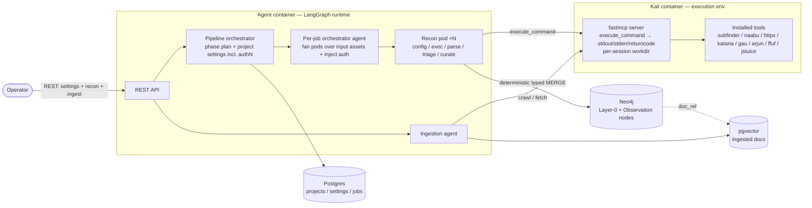
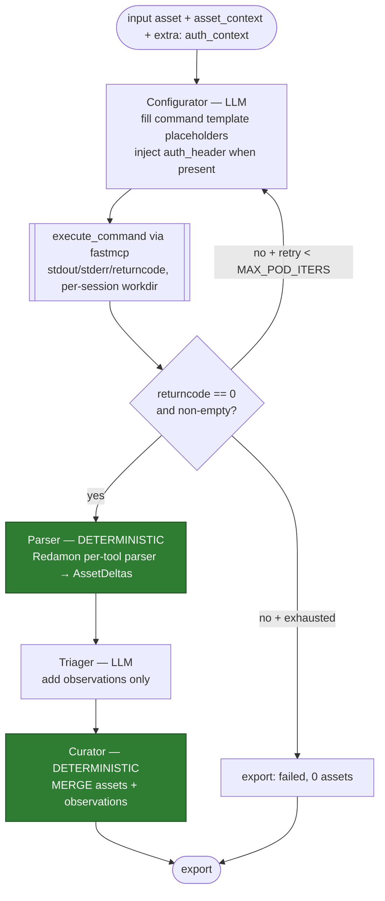

# Reconnaissance MVP — Consolidated Design & Decisions (rev 5)

*Supersedes the retired critique. Companion to `evolution-paradigm.md`. Scope: **iteration 1 of phase 1 — reconnaissance only** (Layer 1, analysis, light threat model, and the phase-2 DAG are deferred; see the paradigm's iteration roadmap, §6).*

**Revision history:** rev 2 fixed the seven core decisions; rev 3 added interfaces + stack; rev 4 added ht-mcp/orchestration/errors. **Rev 5** (this is the MVP-complete design): execution via **fastmcp** with a single `execute_command`; **programmatic parsing as the flat default** via Redamon-derived **command templates**; **triager reduced to observation-adding**; **auditor deferred**; and **authenticated reconnaissance** wired end-to-end.

### Changes in rev 5

| # | Change | Where |
|---|---|---|
| A | Execution MCP rolled back to **fastmcp**, exposing **one tool `execute_command`** → `{stdout, stderr, returncode}`, with **per-session working-directory creation** so files never overlap. Native HTTP transport (no stdio bridge). | §2, §10.4, §11.3 |
| B | **Programmatic is the flat default.** The tool-skill carries a **command template with placeholders** replicating Redamon's canonical invocation; the **configurator fills placeholders**; the **triager only adds observations**; success is a **deterministic returncode gate**. | §3, §4, §10.1, §10.6 |
| C | **Auditor deferred**; configurator flexibility deferred ("further on"). | §3, §9 |
| D | Job `consumes`/`produces` **and** the command templates are **imported from Redamon**. | §4, §7 |
| E | **Authenticated reconnaissance** — a settings endpoint stores authN cookies; the pipeline orchestrator loads them from project settings and passes them via an **`extra` kwargs channel** on the recon-job agent and `PodState`; the crawl/active-HTTP job-skill injects them via an `{auth_header}` template placeholder. | §3, §10.1, §10.2, §10.5 |

---

## 1. Scope

**In:** an autonomous reconnaissance pipeline that (a) runs recon jobs against a target — **optionally in an authenticated context** — (b) builds the **Layer-0 descriptive attack-surface graph** (Redamon typing adopted verbatim), (c) attaches **natural-language Observation nodes** to broad basic elements, and (d) supports **operator-initiated documentation ingestion** into a vector store. Single project (`project_id`), single user `admin:admin`. A REST API launches and monitors recon and writes settings; no web frontend.

**Out (deferred):** service/system model and its axes/trust edges; attack-surface analysis; light threat model / test design / execution; the attack-chain DAG; scope/RoE enforcement; budget governor; multi-tenancy; the **auditor** and a flexible (non-template) configurator; `llm` parse-mode.

---

## 2. Architecture



**Execution boundary (rev 5).** Tools run in the **Kali container** under a **fastmcp** server exposing a single generic tool, **`execute_command`**, which returns `{stdout, stderr, returncode}` and **creates a per-session working directory** (so concurrent pods writing files never collide). fastmcp serves over HTTP/SSE natively, so the agent reaches it directly at `KALI_MCP_URL` — no stdio bridge. Output is clean piped stdout (ANSI-stripped), so programmatic parsing needs no sentinel tricks.

---

## 3. The recon control loop

### Two-level orchestration over a phase plan, carrying settings

- **Pipeline orchestrator.** Loads **all project settings from Postgres** — including the **recon settings, among them the authN cookies** — into `ReconState`. Builds the **phase plan**: Redamon recon phases with encoded produces/consumes dependencies, **rooted in the project's domain (or placeholder)**, starting at **subdomain discovery**. Phases run behind a **barrier — phase `i+1` waits for all phase-`i` jobs**. For each job it selects the per-job agent configuration `{ job, skill, system_prompt, input_assets, extra }`, where **`extra`** is the kwargs channel carrying settings-derived context (the auth context, future extras).
- **Per-job orchestrator agent.** Instantiates **one recon pod per input asset**, transferring `{ job, tool, skill }` and the **`extra`** context. For **crawl / active-HTTP jobs** it **retrieves the authenticated context** (cookies) from `extra` and hands it to **each pod's state** so the configurator can inject it. Fan-out via `Send`, bounded to `MAX_PODS`. Returns to the pipeline once all pods terminate.
- **Termination.** Pod → `END` (exports); per-job agent → all pods exported; pipeline → all phase jobs returned → advance.

### Recon pod (one parameterised subgraph)



Roles: **Configurator** (LLM) fills the tool-skill's command template from the input asset and injects `{auth_header}` when the job-skill declares auth use and the context is present; **Execute** calls `execute_command`; a **deterministic returncode gate** decides success (Redamon's three-way: `returncode≠0` → error/retry; `returncode==0` empty → no assets; else parse); **Parser** (deterministic, Redamon per-tool) → `AssetDelta`s; **Triager** (LLM) adds observations only; **Curator** (deterministic) MERGEs. The retry edge is bounded by `MAX_POD_ITERS` + `recursion_limit`. **No auditor in the MVP** (deferred).

---

## 4. Output parsing & command templates (deliverables #2 + auth)

**Programmatic is the flat default.** With a single `execute_command` returning clean stdout, and the tool invoked through a **fixed command template that replicates Redamon's canonical command**, the output format is exactly what Redamon's parser expects — so extraction is deterministic and cheap, and the LLM is confined to observation-adding.

**How it works.** Each job-skill carries a **command template with placeholders**. The configurator fills the placeholders (target from the input asset; `{auth_header}` from the auth context) — it does **not** choose format-affecting flags (those are baked into the template). The template's structured-output flags mirror Redamon (`-j`/`-json`/`-jsonl`/`-oJ`), so the **Redamon per-tool parser** (imported, deliverable #1) parses the stdout into `AssetDelta`s. The triager then adds observations. *(A flexible, non-template configurator and an `llm` parse-mode remain available but are deferred.)*

**Command templates (derived from Redamon's MCP wrappers — extracting the exact per-tool flags is the concrete build step):**

| Phase / job | Tool | Command template | Auth |
|---|---|---|---|
| subdomain discovery | subfinder | `subfinder -d {domain} -all -json -silent` | — |
| port scan | naabu | `naabu -host {target} -top-ports 100 -json` | — |
| http probe | httpx | `httpx -u {target} -sc -title -server -td -fr -silent -j {auth_header}` | ✓ `-H "Cookie: …"` |
| resource enum (crawl) | katana | `katana -u {target} -d 3 -jc -kf robotstxt -c 10 -rl 50 -ef png,jpg,gif,css,woff,woff2,ttf -silent -jsonl {auth_header}` | ✓ `-H "Cookie: …"` |
| passive URLs | gau | `gau {domain}` | — |
| param discovery | arjun | `arjun -u {target} -oJ /work/{session}/arjun.json {auth_headers} && cat /work/{session}/arjun.json` | ✓ `--headers "Cookie: …"` |
| web fuzz | ffuf | `ffuf -u {target}/FUZZ -w /usr/share/seclists/Discovery/Web-Content/common.txt -mc 200,403 -of json {auth_header}` | ✓ `-H "Cookie: …"` |
| JS analysis | jsluice | `jsluice urls -R {baseurl} {js_input}` | n/a |

For file-output tools (arjun, or httpx `-o`), the template writes into the **per-session workdir** and `cat`s it back — clean stdout, no collisions. `{auth_header}` expands to the tool's cookie-header form when the auth context is present and the job-skill sets `use_auth: true`; otherwise it is empty. Passive jobs (subfinder, gau, naabu, whois, dnsx, amass) omit it.

---

## 5. Data model (GP-D2/D3/D5/D8/D9, Decisions 6 & 7)

**Layer-0 typing: adopt Redamon verbatim, minus security/CVE nodes.** Nodes: `Domain, Subdomain, IP, Port, Service, DNSRecord, BaseURL, Endpoint, Parameter, Header, Certificate, Technology, Secret, Traceroute, ExternalDomain`. Edges: `BELONGS_TO / HAS_SUBDOMAIN, RESOLVES_TO, HAS_PORT, RUNS_SERVICE, SERVES_URL / HAS_BASE_URL, HAS_ENDPOINT, HAS_PARAMETER, HAS_HEADER, HAS_CERTIFICATE, USES_TECHNOLOGY, HAS_TRACEROUTE, HAS_EXTERNAL_DOMAIN`, plus `HAS_OBSERVATION`.

**No `Vulnerability`/`CVE`/`MitreData`/`Capec` nodes.** `nuclei` removed; CVE & MITRE out of scope. **All `security_check` findings** are recorded as **Observations**, not vulnerabilities.

**Deltas from Redamon:** (1) `project_id` only, `admin:admin`; (2) `first_seen`/`last_seen` on every node; (3) typed parameterised `MERGE` only; (4) **Observations as graph nodes** on broad anchors:
```
(:BroadElement)-[:HAS_OBSERVATION]->(:Observation {
    id, macro_kind, severity, evidence, rationale,
    source_job, source_tool, observed_at, project_id })
```
(5) **Doc vector store**: external docs → `pgvector`, referenced by `doc:<type>:<anchor>` on the anchoring broad element; immutable after ingestion.

---

## 6. Documentation ingestion (GP-R11)

Operator-initiated; the **ingestion agent** builds the sitemap and ingests into `pgvector` via Redamon's Tradecraft tiering — deterministic extractors first, budget-bounded agentic-crawl fallback:

| Source | Deterministic path | Fallback |
|---|---|---|
| Target API contract | OpenAPI/Swagger; GraphQL introspection | Infer from observed shapes |
| Target sitemap / web map | `robots.txt` + `sitemap.xml`; deep crawl (katana) | Bounded agentic-crawl (≤30 pages / ≤20 LLM calls / ≤180 s / depth 3) |
| OSS codebase | GitHub Trees API (`recursive=1`), filtered | Release tarball |
| Target codebase (white-box) | Direct repo ingest | — |

---

## 7. Job set & tool porting (GP-R8)

**Job set (Redamon recon phases, minus exclusions):** domain discovery (subfinder, amass, puredns, dnsx, whois), port scan (naabu), HTTP probe (httpx), resource enumeration (katana, gau), parameter/endpoint discovery (arjun, ffuf), JS analysis (jsluice), AI-surface recon (custom Python), security checks (custom Python → **Observations**). **`produces`/`consumes` and command templates imported from Redamon.**

**Excluded:** `nuclei`, CVE & MITRE, heavy OSINT (`uncover`), secret-hunting (`gitleaks`/`trufflehog`).

**Porting: LOW.** Redamon's `mcp/kali-sandbox/Dockerfile` already installs the suite via `go install`. Reuse it; replace Redamon's per-tool MCP wrappers with the single **fastmcp `execute_command`** and discard the DinD pipeline. `puredns` (massdns + resolvers) is the one non-trivial port. Port-scan (`naabu`) is a pinned `go install` at build.

---

## 8. What remains: the next build step

1. **Extract the exact Redamon command per tool** (§4) into the job-skill templates, and **import the matching Redamon per-tool parsers**.
2. **Instantiate each job contract**: `produces`/`consumes` (from Redamon), template + placeholders, `use_auth`, eval-criteria, file-naming.
3. **Wire the auth channel** end-to-end (settings → `ReconState.settings` → per-job `extra` → `PodState.extra` → `{auth_header}`).

---

## 9. Decisions log (delta from rev 4)

| Item | Decision |
|---|---|
| Execution MCP | **fastmcp**, single `execute_command` → `{stdout, stderr, returncode}`; **per-session workdir**; native HTTP (no bridge) |
| Parsing | **Programmatic, flat default**, via Redamon **command templates**; `llm` mode deferred |
| Configurator | Fills template placeholders (+ `auth_header`); flexible configurator deferred |
| Auditor | **Deferred** |
| Triager | **Adds observations only**; success is a deterministic returncode gate |
| Job contract | `consumes`/`produces` **and** templates imported from Redamon |
| Auth (new) | Settings endpoint for authN cookies → pipeline loads from project settings → `extra` kwargs on recon-job agent + `PodState` → `{auth_header}` template injection on crawl/active-HTTP jobs |
| *(all earlier decisions carry forward from rev 4 §9)* | |

---

## 10. Interface agreements

Structural payloads typed; only `rationale`/`asset_context` free text. `project_id`, `first_seen`, `last_seen` injected by the **curator**.

### 10.1 Agent-to-agent communication (LangGraph state + node I/O)

```python
# ---- Pod subgraph state ----
class PodState(TypedDict):
    job: JobSpec              # {tool, skill, command_template, produces[], consumes,
                              #  use_auth, eval_criteria, file_naming}
    input_asset: dict         # one instance of the job's `consumes` type
    asset_context: str        # NL/graph slice (read-only)
    extra: dict               # **kwargs channel — carries auth_context (+ future extras)
    session_id: str           # per-pod workdir key
    invocation: ToolInvocation
    exec_result: ExecResult    # {stdout, stderr, returncode}
    iteration: int
    assets: list[AssetDelta]  # from the deterministic parser
    observations: list[Observation]  # from the triager
    export: PodExport

# ---- Recon parent state ----
class ReconState(TypedDict):
    run_id: str
    project_id: str
    settings: dict            # project settings incl. recon.auth_context
    phase_plan: list[Phase]
    current_phase: int
    pod_exports: Annotated[list[PodExport], operator.add]
    status: str
```

The per-job agent config mirrors this with an **`extra: dict`** field; the pipeline fills it from `settings` (auth context for crawl/active-HTTP jobs).

| Node | Reads | Writes | Kind |
|---|---|---|---|
| configurator | `job.command_template`, `input_asset`, `asset_context`, `extra.auth_context` | `invocation` | LLM |
| execute | `invocation`, `session_id` | `exec_result` | fastmcp |
| *(gate)* | `exec_result.returncode`, stdout | route: parse / retry / fail | deterministic |
| parser | `exec_result.stdout`, `job.produces` | `assets` | deterministic |
| triager | `exec_result`, `assets` | `observations` | LLM |
| curator | `assets`, `observations` | graph (`MERGE`); `export` | deterministic |

**Pod export:** `{ input_asset, verdict:"success|failed", assets_merged, observations_merged, iterations, error }`.

### 10.2 Payload data contracts

```jsonc
// AuthContext (project setting → extra.auth_context)
{ "cookies": [ {"name":"session","value":"abc123"}, {"name":"csrf","value":"…"} ],
  "scope": "app.example.com" }               // optional host scope; applied to in-scope targets

// ToolInvocation (configurator → execute)
{ "command": "httpx -u https://app.example.com -sc -title -server -td -fr -silent -j -H \"Cookie: session=abc123\"",
  "session_id": "run42-pod7" }

// ExecResult (execute ← fastmcp)
{ "stdout": "…", "stderr": "…", "returncode": 0, "duration_ms": 8123 }

// AssetDelta (deterministic parser output)
{ "type":"Endpoint",
  "identity":{ "path":"/api/v1/users","method":"GET","baseurl":"https://app.example.com" },
  "props":{ "status_code":200,"content_type":"application/json","source":"http_probe" },
  "edges":[ {"rel":"HAS_ENDPOINT","dir":"in","node_type":"BaseURL",
             "node_identity":{ "url":"https://app.example.com" }} ] }

// Observation (triager → curator; attached to a BROAD anchor)
{ "macro_kind":"auth_surface", "severity":"info",
  "evidence":"Authenticated crawl reached /account/* behind session cookie.",
  "rationale":"Authenticated surface materially larger than anonymous; account area is the higher-risk zone.",
  "anchor":{ "type":"BaseURL","identity":{ "url":"https://app.example.com" } },
  "source_job":"resource_enum","source_tool":"katana" }
```

### 10.3 Attack-surface asset schemas (Layer-0)

Every node carries `project_id`, `first_seen`, `last_seen`. Identity key = the `MERGE` key (Redamon constraints, `user_id` dropped).

| Node | Identity key | Key properties | Relationships |
|---|---|---|---|
| `Domain` | `(name)` | registrar, creation_date, expiration_date | `-[:HAS_SUBDOMAIN]->Subdomain`, `-[:HAS_EXTERNAL_DOMAIN]->ExternalDomain` |
| `Subdomain` | `(name)` | has_dns_records, status, status_codes[] | `-[:BELONGS_TO]->Domain`, `-[:RESOLVES_TO {record_type}]->IP`, `-[:HAS_DNS_RECORD]->DNSRecord`, `-[:HAS_BASE_URL]->BaseURL` |
| `IP` | `(address)` | version | `-[:HAS_PORT]->Port`, `-[:HAS_TRACEROUTE]->Traceroute`, `-[:HAS_CERTIFICATE]->Certificate` |
| `Port` | `(number, protocol, ip_address)` | state | `-[:RUNS_SERVICE]->Service` |
| `Service` | `(name, port_number, ip_address)` | product, version, banner | `-[:SERVES_URL]->BaseURL`, `-[:USES_TECHNOLOGY]->Technology` |
| `DNSRecord` | `(type, value, subdomain)` | — | (attached to Subdomain) |
| `BaseURL` | `(url)` | scheme, host, source, status_code, title, content_type, final_url | `-[:HAS_ENDPOINT]->Endpoint`, `-[:USES_TECHNOLOGY]->Technology`, `-[:HAS_HEADER]->Header`, `-[:HAS_CERTIFICATE]->Certificate`, `-[:HAS_SECRET]->Secret` |
| `Endpoint` | `(path, method, baseurl)` | url, status_code, content_type, content_length, title, server, response_time_ms, source, category, endpoint_type | `-[:HAS_PARAMETER]->Parameter` |
| `Parameter` | `(name, position, endpoint_path, baseurl)` | type, category, input_type, required, source, sample_values[] | (attached to Endpoint) |
| `Header` | `(name, value, baseurl)` | — | (attached to BaseURL/Endpoint) |
| `Certificate` | `(subject_cn)` | issuer, san[], not_before, not_after | (attached to BaseURL/IP) |
| `Technology` | `(name, version)` | category, source, cpe | — |
| `Secret` | `(value_hash)` | kind, source, redacted | (attached to BaseURL) |
| `Traceroute` | `(ip_address)` | hops[] | (attached to IP) |
| `ExternalDomain` | `(domain)` | context | (attached to Domain) |
| `Observation` | `(id)` | macro_kind, severity, evidence, rationale, source_job, source_tool, observed_at | `BroadElement-[:HAS_OBSERVATION]->Observation` |

**Curator MERGE template:**
```cypher
MERGE (n:Endpoint {path:$path, method:$method, baseurl:$baseurl, project_id:$project_id})
ON CREATE SET n.first_seen = datetime()
SET n += $props, n.last_seen = datetime()
```

### 10.4 Execution interface — fastmcp `execute_command`

```python
@mcp.tool()
def execute_command(command: str, session_id: str, timeout_s: int = 300) -> dict:
    """Run a shell command in the Kali sandbox and return its output.
    Creates/uses a per-session working directory (cwd=/work/{session_id}) so
    concurrent pods never collide on files. Strips ANSI. No scope enforcement (MVP).
    Returns: { stdout, stderr, returncode, duration_ms }."""
```

A single generic tool (not Redamon's per-tool wrappers). The pod passes `session_id = {run_id}-{pod_id}`; the server ensures `/work/{session_id}` exists and runs there. `returncode` drives the deterministic success gate (§3).

### 10.5 REST API

| Method + path | Body (defaults) | Returns |
|---|---|---|
| `POST /projects` | `{ name }` | `{ project_id }` |
| `PUT /projects/{id}/settings` | `{ recon: { max_pods?, auth_context?: AuthContext } }` — the settings-writing endpoint; **authN cookies live here** | `{ ok }` |
| `POST /projects/{id}/recon` | `{ jobs?, settings? }` — `jobs` omitted ⇒ full pipeline (phase-DAG-ordered from subdomain discovery); the run **loads project settings incl. `auth_context`** | `{ run_id }` |
| `GET /projects/{id}/recon/{run_id}` | — | `{ status, current_phase, per_job:[…], pod_exports:[…] }` |
| `POST /projects/{id}/ingest` | `{ sources:[{ type, ref }] }` | `{ ingest_id }` |

Validation: unknown `project_id` → 404; unknown job → 400; a `jobs` subset breaking a `consumes` dependency → 400; malformed `auth_context` → 400.

### 10.6 Error semantics

Recon is **best-effort and idempotent**; errors degrade to a partial graph, never abort. All writes are `MERGE`, so retries are safe.

| Failure class | Detected at | Handling | Effect |
|---|---|---|---|
| `returncode ≠ 0` / tool error | gate (returncode, stderr) | retry via configurator, bounded by `MAX_POD_ITERS` | on exhaustion: `export.verdict=failed`, 0 assets |
| Timeout | execute (`timeout_s`) | same; configurator may lower rate/scope | partial or failed |
| `returncode==0`, empty stdout | gate | treat as **no-match** (not an error) | 0 assets, verdict `success` |
| Parser failure (unexpected format) | parser | log + `export.verdict=failed` (no `llm` escalation in MVP) | visible in registry |
| LLM error (configurator/triager) | node | node retry w/ backoff; else pod `error` | export `error` |
| Curator MERGE rejection | curator | reject that delta, log, continue | partial merge |
| Recursion cap | LangGraph | `GraphRecursionError` → pod `error` | export `error` |
| Missing/invalid auth context on a `use_auth` job | configurator | proceed **unauthenticated** + emit an Observation noting reduced coverage | anonymous recon |
| Pod error | per-job agent | does not fail the job | job continues |
| Zero-success job | per-job agent | mark `degraded`; pipeline advances | registry `degraded` |
| Phase barrier | pipeline | waits for pods to **terminate** (success or error) | no deadlock |

---

## 11. Technology stack & configuration

### 11.1 Topology (docker-compose, 4 services)

| Service | Image / base | Role |
|---|---|---|
| `agent` | `python:3.12-slim` | LangGraph runtime, FastAPI, MCP client, Redamon parsers |
| `kali` | `kalilinux/kali-rolling` | tool execution; **fastmcp `execute_command`** |
| `neo4j` | `neo4j:5-community` | Layer-0 graph + Observations |
| `postgres` | `pgvector/pgvector:pg16` | projects/settings/jobs + checkpoints + doc embeddings |

Volumes: `neo4j-data`, `pg-data`, `seclists`, `resolvers`, `work` (per-session workdirs). Single network.

### 11.2 Agent container

**Deps (pinned):** `langgraph==1.1.6`, `langgraph-checkpoint-postgres==3.1.0`, `langchain-core`, chat-model client, MCP client, `neo4j`, `psycopg[binary]`, `fastapi`, `uvicorn`; **vendored Redamon per-tool parsers**.

**LangGraph config:** typed state (§10.1); reducer only on `pod_exports`; per-job `Send` fan-out batched to `MAX_PODS`; pod = compiled subgraph (2-level nesting); loop bounded by `MAX_POD_ITERS` + `recursion_limit`; durability via `AsyncPostgresSaver` (`thread_id=run_id`, `checkpoint_ns=phase/job`, `.setup()` once, `LANGGRAPH_STRICT_MSGPACK=true`). Progress by polling `GET …/recon/{run_id}`.

**LLM per role:** triager and configurator only (auditor deferred); models are per-role config. **Settings:** `MAX_PODS`, `MAX_POD_ITERS`, model ids, `EXEC_TIMEOUT_S`, `OUTPUT_BYTE_CAP`.

### 11.3 Kali container

- **Base:** `kalilinux/kali-rolling` + Go toolchain + `gcc/make`.
- **Tools (build-time, pinned `go install`):** subfinder, naabu, httpx, katana, dnsx, gau, amass, ffuf, jsluice (`CGO_ENABLED=1`); `arjun` via `pip`; puredns (compile `massdns` + `resolvers.txt`); SecLists at `/usr/share/seclists`; AI-surface-recon + security-checks as Python modules.
- **fastmcp server:** exposes `execute_command` (§10.4) over HTTP/SSE on a fixed port (`KALI_MCP_URL`); creates `/work/{session_id}` per call. **No sandboxing/scope enforcement** (MVP).

### 11.4 Neo4j

- `neo4j:5-community`; auth `neo4j/<password>`; `bolt://neo4j:7687`.
- Init (idempotent) = Redamon constraints/indexes **adapted**: identity keys drop `user_id` (keep `project_id`); no `Vulnerability`/`CVE`/OTX constraints; add `Observation(id)` uniqueness. E.g.:
  ```cypher
  CREATE CONSTRAINT endpoint_unique IF NOT EXISTS
    FOR (e:Endpoint) REQUIRE (e.path, e.method, e.baseurl, e.project_id) IS UNIQUE;
  ```
- Driver: `neo4j` Python driver + pool; parameterised `MERGE` only.

### 11.5 Postgres + pgvector

- `pgvector/pgvector:pg16`; `CREATE EXTENSION IF NOT EXISTS vector;`
- App schema: `projects`, `settings` (**holds `recon.auth_context`**), `recon_runs`, `recon_jobs` (registry: `id, run_id, phase, job, status, started_at, finished_at, stats, error`). LangGraph checkpoint tables via `AsyncPostgresSaver.setup()`.
- Doc store: `doc_chunks(id, doc_ref, source_type, anchor, chunk_text, embedding vector(D), created_at)` + HNSW index; immutable.
- Embeddings: provider-pluggable; `EMBED_MODEL` + `EMBED_DIM=D` match the column/index.

### 11.6 Configuration / env matrix

| Variable | Service | Purpose |
|---|---|---|
| `NEO4J_URI` / `NEO4J_USER` / `NEO4J_PASSWORD` | agent | graph connection |
| `POSTGRES_DSN` | agent | app data + checkpoints + `pgvector` |
| `KALI_MCP_URL` | agent | fastmcp `execute_command` endpoint |
| `MAX_PODS` / `MAX_POD_ITERS` | agent | fan-out width + pod loop ceiling |
| `LLM_MODEL_TRIAGER` / `_CONFIGURATOR` | agent | per-role model ids |
| `EXEC_TIMEOUT_S` / `OUTPUT_BYTE_CAP` | agent/kali | execution + context bounds |
| `LANGGRAPH_STRICT_MSGPACK=true` | agent | safe checkpoint deserialization |
| `EMBED_MODEL` / `EMBED_DIM` | agent | doc embedding + index dimension |
| `PROJECT_ID` | agent | single-project tenancy (`admin:admin`) |

*Note — authN cookies are **not** env vars: they are per-project runtime settings written via `PUT /projects/{id}/settings` and stored in Postgres, loaded into `ReconState.settings` at run start.*
