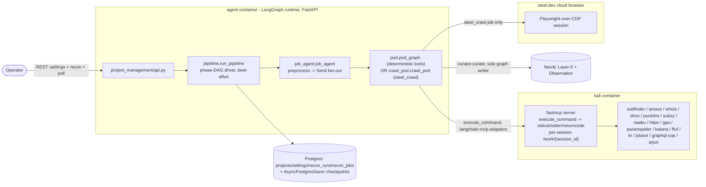
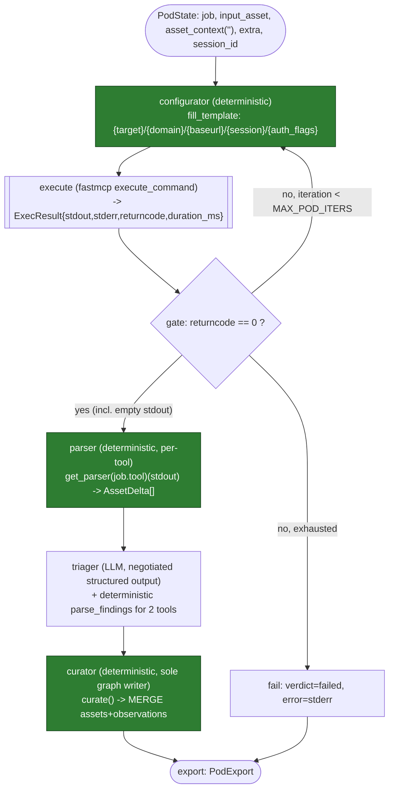
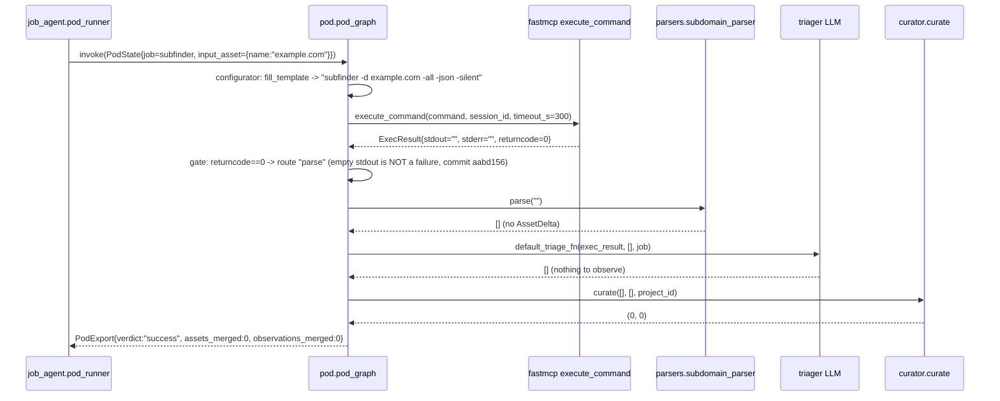
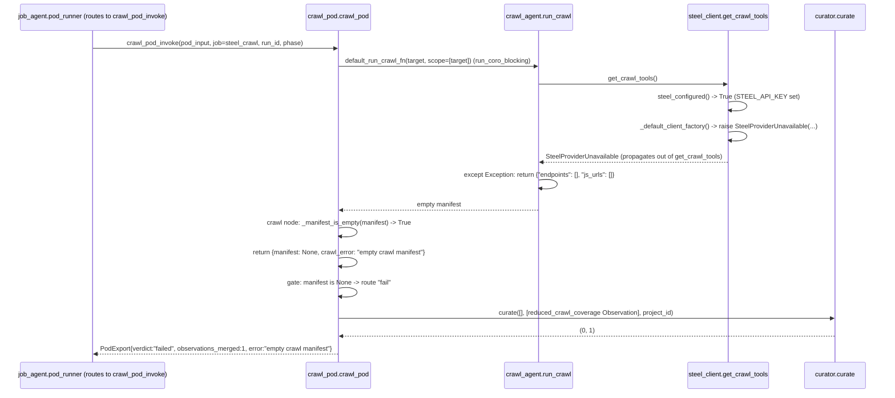
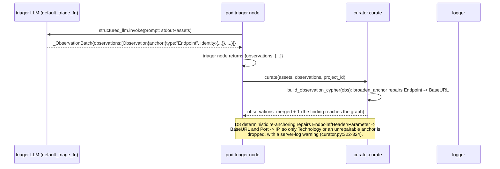

# Recon Pipeline - Consolidated Design (authoritative)

*Single source of truth for the built and validated Phase-2 recon pipeline.*
*Supersedes `recon-mvp-design.md`, `agent-context-architecture.md`, `context-memory-end-to-end.md`, `context-scaffolding-three-levels.md`, and `jobs-tools-skills-taxonomy.md` - those five files are retained for historical trace but are no longer authoritative; see §11 "Supersession map."*
*Companion: `recon-pipeline-forward-decisions.md` (deferred/non-MVP decisions register).*

Every claim below is grounded in the real implementation (`path:line`) as of this revision.
The module restructure is applied throughout: `agent/recon/` is `src/polymerhus/recon/{control,domain,crawl}/`, and `agent/app/routes.py` is `src/polymerhus/project_management/api.py` (see `module-restructure.md`); citations are refreshed to that layout.
Where an older doc disagreed with the code, the code wins and the correction is noted inline.
The system reached a sound real-target end-to-end validation run (memory `recon-e2e-validation`); this document describes what actually runs, not a proposal.

---

## 1. Scope

**Built and validated (this document's primary subject):** an autonomous reconnaissance pipeline that runs 16 scheduled recon jobs against a target domain across 11 phases, optionally in an authenticated context, builds a Layer-0 descriptive attack-surface graph in Neo4j, and attaches natural-language `Observation` nodes to broad anchors.
Single project (`project_id`) tenancy.
A REST API launches and polls runs and writes settings; no web frontend.

**Designed but NOT built** (carried here for completeness, clearly marked): the three-level context-memory scaffold (`recon_signals` / L1, coverage verdicts / L2, macro synthesis + finding-triggered extension / L3) - see §9.
None of `PodSignal`, `CoverageVerdict`, `MacroDigest`, `recon_signals`, `synthesize_macro_observations`, or `JobState.job_context` exist in the codebase today (verified: zero matches across `src/polymerhus/recon/`).
`request_targeted_recon` is the one exception: it IS built (`src/polymerhus/recon/control/targeted.py`, the D2 re-entrant interface; see §9.5).
`asset_context` is threaded through `PodState`/`JobState` end to end but is always the empty string - nothing populates it and neither the configurator nor the triager reads it (`src/polymerhus/recon/control/job_agent.py:72-80,120,325`, `src/polymerhus/recon/domain/pod.py:707` - `default_triage_fn`'s signature is `(exec_result, assets, job)`, no `asset_context` parameter).
The `skills/recon/triager/writing-observations/SKILL.md` file exists on disk but is not loaded by `pod.py` - the triager's live prompt is the inline string at `agent/recon/pod.py:339-346`.

**Out of scope (deferred, not attempted):** service/system modeling and trust edges, attack-surface analysis, threat modeling, scope/RoE enforcement, budget governor, multi-tenancy, an auditor role, a flexible non-template configurator, `llm` parse-mode.
See `recon-pipeline-forward-decisions.md`.

---

## 2. Architecture



**Execution boundary.** Tools run in the Kali container behind a single fastmcp tool, `execute_command`, returning `{stdout, stderr, returncode, duration_ms}` and creating a per-session working directory so concurrent pods never collide on files (design decision, real wiring: `src/polymerhus/recon/domain/pod.py:590-644` `default_exec_fn`, connecting via `langchain_mcp_adapters.client.MultiServerMCPClient` at `config.KALI_MCP_URL`, `transport="streamable_http"`).
The agentic `steel_crawl` job (§4) is the one exception: it does not call `execute_command` at all - it drives an in-process Playwright-over-CDP session against steel.dev directly (`src/polymerhus/recon/crawl/steel_client.py:1-14`).

---

## 3. The recon control loop

Three real nesting levels: **pipeline orchestrator -> per-job orchestrator agent -> recon pod**, each a compiled LangGraph graph.

### 3.1 Pipeline orchestrator (`src/polymerhus/recon/control/pipeline.py::run_pipeline`)

- Before phase 0, runs one LLM **auth-gateway** turn on the `ReconOrchestratorActor` (`src/polymerhus/recon/control/orchestrator_agent.py`; the `job_orchestrator` role, #223) and configures the run from its structured `GatewayVerdict`: the selected account's identifier is bound into pipeline state and a `browser_only` verdict prunes the plan to the Steel crawl (`pipeline.py:310-316,370-375,451-500`).
- Loads project settings once (`load_settings`, default `polymerhus.app.clients.pg.load_settings`) - `pipeline.py:381`.
- Builds the phase plan from the static job registry (`control/jobs.py::JOBS`, `PHASES`) via `build_phase_plan` (`pipeline.py:420`, `jobs.py:532-544`), optionally restricted to a validated `job_subset` (`jobs.py:512-529`).
- For each phase (index order), for each job in that phase: resolves `input_assets` - phase 0 seeds from the resolved target seed via `seed_assets` (`pipeline.py:153-167`), phase>0 re-queries Neo4j via `read_assets(job.consumes, project_id)` (`pipeline.py:253-291`), which validates `node_type` against `curator.ALLOWED_LABELS` before interpolating it into the Cypher label position (the only place a label appears unparameterised - `pipeline.py:271-272`).
- Builds `extra = {"project_id": project_id}`, plus the auth feed for `use_auth` jobs: the gateway-bound account identifier rides `extra["auth_account"]` (never the material) and each phase's assembly resolves it from the shared store, projecting the flat request material as `extra["auth_context"]` (the pod serialises it per tool at fill time) and the persisted profile key as `extra["steel_profile"]` for the agent-driven crawl (#223 T4 #243 - supersedes the retired settings-blob injection).
- Runs every job in a phase concurrently via `asyncio.gather` (`pipeline.py:169`) - this is the **phase barrier**: phase `i+1`'s `input_assets` are not even resolved until every phase-`i` job has returned (`_run_one` wraps `run_job` and is awaited as a batch).
- The run reaches the terminal `registry.set_run_status(run_id, "complete")` only on the full happy path, as the function's last statement (`pipeline.py:797`); a gateway `GatewayStop` (`pipeline.py:462-468`) or a `browser_only` verdict that prunes the plan empty (`pipeline.py:476-489`) terminates the run as `"failed"` first - so `"complete"` is no longer unconditional.

### 3.2 Per-job orchestrator agent (`src/polymerhus/recon/control/job_agent.py::run_job`)

A two-node compiled `StateGraph(JobState)`:

- `preprocess_node` calls the injected `preprocess_fn` (production default: `default_preprocess_fn`) which deterministically maps `input_assets` 1:1 to `pod_inputs`, capped at the `MAX_JOB_ASSETS` total-work budget, threading `extra` through verbatim - auth-eligibility is decided once, upstream in the pipeline's per-phase assembly, so a passive pod never carries feed material it was not bound.
  The `job_orchestrator` LLM role is registered (`src/polymerhus/app/llm/providers.py`) but is **not exercised** by `default_preprocess_fn` - this is the stubbed seam the context-memory L1 design (§9) targets; the role IS exercised as the run's pre-pipeline auth gateway (§3.1).
- `fan_out` returns one `Send("pod_runner", ...)` per `pod_input` (`job_agent.py:228-240`) - LangGraph's native fan-out primitive.
- `pod_runner_node` calls the injected `pod_invoke` (production default: `default_pod_invoke`, `job_agent.py:163-208`), which routes `configurator_mode="agent"` jobs (only `steel_crawl`) to `crawl_pod_invoke` and everything else to `pod_graph.invoke`.
  A `pod_invoke` exception is caught here and converted to a `verdict="failed"` `PodExport` (`job_agent.py:242-255`) - one pod's crash never aborts its siblings.
- Results accumulate via `pod_exports: Annotated[list[PodExport], operator.add]` (`job_agent.py:80`) - the reducer that lets concurrent `Send`s write to the same list key without clobbering each other.

### 3.3 Recon pod (`src/polymerhus/recon/domain/pod.py::pod_graph`)



Node-by-node, with the real wiring (`src/polymerhus/recon/domain/pod.py::build_pod_graph`, lines 296-543):

| Node | Function | Reads (state) | Writes (state) | Kind |
|---|---|---|---|---|
| `configurator` | `configurator` (`pod.py:326-370`) | `job.command_template`, `input_asset`, `extra`, `session_id` | `invocation`, `iteration += 1` | deterministic template fill (`fill_template`, `pod.py:233-279`) |
| `execute` | `execute` (`pod.py:372-395`) | `invocation`, `session_id` | `exec_result` | fastmcp call, real collaborator `default_exec_fn` (`pod.py:590-644`) |
| *(gate)* | `gate` (`pod.py:397-410`) | `exec_result.returncode`, `iteration` | routes: parse / retry / fail | deterministic |
| `parser` | `parser` (`pod.py:412-418`) | `exec_result.stdout`, `job.tool`, `input_asset` | `assets` | deterministic, `get_parser(job.tool)` |
| `triager` | `triager` (`pod.py:420-456`) | `exec_result`, `assets`, `job` (NOT `asset_context` - unbuilt, §9) | `observations` | LLM (`default_triage_fn`) + deterministic `parse_findings` merge for `graphql-cop`/`subdomain_takeover` |
| `curator` | `curator_node` (`pod.py:458-503`) | `assets`, `observations`, `project_id` | `export` (verdict=`"success"`) | deterministic, `curate_fn` -> `curator.curate` |
| `fail` | `fail` (`pod.py:505-523`) | `exec_result` (may be `None`) | `export` (verdict=`"failed"`) | deterministic |

`build_pod_graph` takes `exec_fn`/`curate_fn`/`triage_fn` as parameters specifically so `tests/recon/test_pod.py` never touches live Kali/LLM/Neo4j (`pod.py:1-13`).
The module-level `pod_graph` (`pod.py:770`) wires the three real collaborators; importing `pod.py` performs no I/O (`default_exec_fn`/`default_triage_fn` resolve their clients lazily, `pod.py:590-644,707-769`).

### 3.4 Crawl pod - the one agentic exception (`src/polymerhus/recon/crawl/crawl_pod.py::crawl_pod`)

`steel_crawl` is the only job with `configurator_mode="agent"` (`src/polymerhus/recon/control/jobs.py:359-366`).
It replaces `configurator -> execute -> gate` with a single `crawl` node (`crawl_pod.py:161-184`) that runs the vendored ReAct loop (`crawl_agent.run_crawl`, wrapped synchronously via `async_bridge.run_coro_blocking`), then rejoins the shared `parse -> triager -> curator` shape.
See §7.3 for its failure semantics in detail - it is the **best-effort exemplar** of the whole design: three distinct failure sources (`SteelProviderUnavailable`, any other exception, an empty manifest) all converge on the identical `fail` node.

---

## 4. Interface agreements & data contracts

All types live in `src/polymerhus/recon/domain/types.py` (196 lines total).

```python
# src/polymerhus/recon/domain/types.py:6-196
class Edge(BaseModel):
    rel: str; dir: Literal["in", "out"]; node_type: str; node_identity: dict

class AssetDelta(BaseModel):
    type: str; identity: dict; props: dict = {}; edges: list[Edge] = []

class Observation(BaseModel):
    macro_kind: str; severity: str; evidence: str; rationale: str
    anchor: dict            # {"type": str, "identity": dict}
    source_job: str; source_tool: str

class ExecResult(BaseModel):
    stdout: str; stderr: str; returncode: int; duration_ms: int = 0

class ToolInvocation(BaseModel):
    command: str; session_id: str

class JobSpec(BaseModel):
    tool: str; skill: str; command_template: str
    produces: list[str]; consumes: str; use_auth: bool = False
    configurator_mode: Literal["deterministic", "agent"] = "deterministic"
    eval_criteria: str = "returncode_zero_nonempty"

class PodExport(BaseModel):
    input_asset: dict; verdict: Literal["success", "failed"]
    assets_merged: int = 0; observations_merged: int = 0
    iterations: int = 0; error: str | None = None; stats: dict | None = None

class PodState(TypedDict, total=False):
    job: JobSpec; input_asset: dict; asset_context: str; extra: dict
    session_id: str; project_id: str; invocation: ToolInvocation
    exec_result: ExecResult; iteration: int; assets: list[AssetDelta]
    observations: list[Observation]; export: PodExport

class ReconState(TypedDict, total=False):
    run_id: str; project_id: str; settings: dict; phase_plan: list[dict]
    current_phase: int
    pod_exports: Annotated[list[PodExport], operator.add]
    status: str
```

Correction against `recon-mvp-design.md` §10.1: rev-5's `ReconState`/`PodState` sketch has no live counterpart at that granularity - `pipeline.run_pipeline` (§3.1) does not build or thread a `ReconState` object at all; it works from local variables (`settings`, `plan`, `job_configs`) and writes directly to the Postgres registry.
`JobState` (below) is the real per-job carrier, not the design doc's `ReconState`.

```python
# src/polymerhus/recon/control/job_agent.py:72-80
class JobState(TypedDict, total=False):
    job: JobSpec; input_assets: list[dict]; asset_context: str; extra: dict
    run_id: str; phase: int; pod_inputs: list[dict]
    pod_exports: Annotated[list[PodExport], operator.add]
```

### 4.1 The curator's write contract (`src/polymerhus/recon/domain/curator.py`)

The **sole** graph-write path (`curator.py:1-10`).
`build_asset_cypher`/`build_observation_cypher` are pure - they never touch a driver; `curate` is the impure orchestrator that injects `project_id` and calls `merge_fn` (default `polymerhus.app.clients.neo4j_client.merge`) per item, returning a 4-tuple `(assets_merged, observations_merged, merged_assets, merged_observations)` (`curator.py:255-334`).

```python
# curator.py:27-41
ALLOWED_LABELS = frozenset({
    "Domain", "Subdomain", "IP", "Port", "Service", "DNSRecord", "BaseURL",
    "Endpoint", "Parameter", "Header", "Certificate", "Technology", "Secret",
    "Traceroute", "ExternalDomain",
})
ANCHOR_ALLOWLIST = frozenset({"Domain", "Subdomain", "BaseURL", "IP", "Service"})
```

`build_asset_cypher` raises `ValueError` for any `delta.type` outside `ALLOWED_LABELS` (`curator.py:124-125`).
`build_observation_cypher` first repairs a too-narrow anchor through `broaden_anchor` (`Endpoint`/`Header`/`Parameter` -> `BaseURL`, `Port` -> `IP`; `curator.py:72-96`) and only then raises `ValueError` for an anchor still outside `ANCHOR_ALLOWLIST` (`curator.py:176,183-184`).
This closes the anchor-allowlist gap `agent-context-architecture.md` §3 flagged (the D8 deterministic re-anchoring); only `Technology` and genuinely unrepairable anchors are dropped, caught per item and logged at `curator.py:322-324` while the batch continues.
The `writing-observations` skill on disk (`skills/recon/triager/writing-observations/SKILL.md`) encodes the allowlist explicitly, but is **not loaded** by the live triager prompt - confirmed unbuilt (§9).

Every `Observation`'s Neo4j `id` is a deterministic SHA1 of `macro_kind|evidence|anchor|source_tool` (`curator.py:186-189`), so re-running the same tool against the same target and getting the same finding text converges on the same node (idempotent `MERGE`) rather than duplicating.

### 4.2 The job registry & phase DAG (`src/polymerhus/recon/control/jobs.py`)

18 `JobSpec` entries in `JOBS` (`jobs.py:18-429`), of which 16 are scheduled, grouped into 11 ordered `PHASES` (`jobs.py:444-486`):

```
Phase 0:  subfinder, whois                             (consumes Domain)
Phase 1:  dnsx, puredns, subdomain_takeover            (consumes Subdomain)
Phase 2:  naabu                                        (consumes Subdomain)
Phase 3:  httpx                                        (consumes Subdomain)
Phase 4:  httpx_services                               (consumes Service; host-mode only)
Phase 5:  katana, ffuf, steel_crawl                    (consumes BaseURL)
Phase 6:  jsluice                                      (consumes Endpoint)
Phase 7:  httpx_reprofile                              (consumes Endpoint)
Phase 8:  kiterunner                                   (consumes Endpoint)
Phase 9:  arjun                                        (consumes Endpoint)
Phase 10: graphql-cop                                  (consumes Endpoint)
```

`amass` and `paramspider` remain `JOBS` entries but are withdrawn from `PHASES` (so they never schedule); `gau` was removed outright.
`validate_job_subset` (`jobs.py:512-529`) statically checks that every selected job's `consumes` type is either the seeded `Domain` root or produced by an earlier-phase selected job, walking `_available_types_by_phase` (`jobs.py:489-509`) - this is the check behind the REST API's 400 on a `jobs` subset that breaks a dependency (`src/polymerhus/project_management/api.py`).

Command templates fill placeholders `{target}`, `{domain}`, `{baseurl}`, `{session}`, `{auth_flags}` via `fill_template`.
Format-affecting flags (`-json`, `-jsonl`, `-oJ`) are baked into the template - the configurator never chooses them, because the deterministic parser depends on the exact shape.
`{auth_flags}` expands from the auth feed's per-phase projection: the pipeline resolves the gateway-bound account identifier from the shared store at assembly and threads the flat request material as `extra["auth_context"]` (only for `use_auth` jobs - auth-eligibility is decided once, upstream); `fill_template` serialises it per tool at fill time (`control/auth_feed.py::serialize_auth_flags`), using the `--headers` flag for `arjun`, the comma-joined form for `graphql-cop`, and `-H` for every other tool. (Supersedes the retired settings-blob `{auth_header}` path, #223 T4 #243.)

Correction against `recon-mvp-design.md` §7/§9: rev-5 explicitly excluded `nuclei`, `kiterunner`, `paramspider`, `graphql-cop`, `subdomain_takeover`, and `steel` from the MVP job set.
The live `JOBS` registry includes `kiterunner`, `paramspider`, `graphql-cop`, `subdomain_takeover`, and `steel_crawl` (5 of those 6) - this is `recon-pipeline-forward-decisions.md` D1's operator-confirmed expansion (2026-07-03), not an inconsistency; `nuclei` alone stays out of the default DAG per D2 (on-demand only, never built as a job because the on-demand entry point itself is unbuilt - see forward-decisions).

### 4.3 Parser contract (`stdout -> list[AssetDelta]`)

`src/polymerhus/recon/domain/parsers/__init__.py::get_parser(tool: str)` resolves a `PARSERS` dict keyed by tool name (`parsers/__init__.py:17-41`, `get_parser` at `:44-45`) to a `Callable[[str], list[AssetDelta]]`.
17 deterministic parse functions exist across 12 parser modules: one per Kali binary (the three httpx-family keys `httpx`/`httpx_reprofile`/`httpx_services` share `parse_httpx`) plus `parse_steel_crawl` for the crawl manifest.
Two parser modules additionally expose `parse_findings(stdout) -> list[dict]` - a deterministic, non-LLM finding source: `graphql_parser` and `takeover_parser` (wired at `pod.py:104,443-447`).
Parsers whose signature declares `target_url` (introspected via `inspect.signature`, `pod.py:153-163`) receive the pod's `input_asset` URL/baseurl/name (`_input_asset_url`, `pod.py:115-124`); others are called with `stdout` alone - this signature-aware dispatch means adding a new findings-capable tool never requires touching `pod.py`'s call sites.

### 4.4 Findings contract (`src/polymerhus/recon/domain/findings.py`)

`finding_to_observation(finding, *, source_job, source_tool) -> Observation | None` (`findings.py:37-71`) normalizes a parser-emitted finding dict (`{title, severity, evidence, anchor?}`) into the same `Observation` shape the LLM triager produces.
Returns `None` (logged at debug) only when the finding has no usable anchor: `graphql_parser.parse_findings` now threads `target_url`, so a graphql-cop finding derives a `BaseURL` anchor rather than being dropped for an out-of-allowlist `Endpoint` (`findings.py:46-50`).
`normalize_severity` maps graphql-cop's uppercase severities and any unrecognized value onto the canonical lowercase set `{critical, high, medium, low, info}`, defaulting unknowns to `"info"` (`findings.py:23-34`).

### 4.5 LLM provider/role contract (`src/polymerhus/app/llm/providers.py`, `roles.py`)

The registry is a tuple of `Role` records (`providers.py:367-380`); the recon-relevant roles are:

```python
# providers.py:367-380 (recon subset)
Role("configurator",     "LLM_CONFIGURATOR",     "session")
Role("triager",          "LLM_TRIAGER",          "session",  "low")
Role("job_orchestrator", "LLM_JOB_ORCHESTRATOR", "session",  "medium")
Role("crawler",          "LLM_CRAWLER",          "session")
```

(The full tuple also carries the analysis and hunting roles; the provider table is `openai`/`openrouter`/`swissai`/`opencode`/`opencode-go`, `providers.py:203-209`.)

`resolve_role(role)` reads `LLM_{ROLE}` as `"<provider>:<model>"`, raising `LLMConfigError` if unset or malformed (`providers.py:431-445`).
`build_chat_model` raises `LLMConfigError` on an unknown provider or a missing `API_KEY_{PROVIDER}` (`providers.py:683-688,716-717`) - **fail-fast at bootstrap**, not per-call: `validate_llm_config()` (`providers.py:771-789`) is called at startup so a misconfigured role is caught before any pod runs, not mid-run.
Every `ChatOpenAI` instance is constructed with the Langfuse callbacks at build time (`providers.py:767`) so tracing survives being invoked inside a worker thread where LangGraph's callback contextvar does not propagate (`async_bridge.run_coro_blocking`).
`chat_model_for(role)` (`roles.py:79`) is the one-line façade used by the crawl call site (`crawl_agent.py`).
Three of the four recon roles are invoked today: `triager` (every job), `crawler` (the ReAct crawl loop), and `job_orchestrator` (the run's pre-pipeline auth gateway, §3.1).
Only `configurator` remains dormant - deterministic mode never builds an LLM for it, and it is reserved for the #238 rate-limit work.

The triager's structured output is no longer built inline with a hardcoded method. It runs through the session/role seams (`stateful_turn` when a pod session is bound, else `invoke_role`), and the structured-output method is capability-negotiated rather than fixed:

```python
# pod.py:759-767
result = stateful_turn("triager", ctx.address, messages, schema=_ObservationBatch, ...)
# else: result = invoke_role("triager", messages, schema=_ObservationBatch)
```

This supersedes the former `method="function_calling"` requirement: the open `Observation.anchor: dict` (no `additionalProperties: false`) is handled by the negotiated `json_schema` strict=False rung (`app/llm/roles.py`), with `function_calling`/`json_mode` as fallbacks.

---

## 5. Delivery semantics

- **Best-effort / degraded model, never abort.** Every layer catches its collaborators' exceptions and converts them to a degraded/failed status rather than propagating: pod-level (`job_agent.py:242-255`), job-level (`pipeline.py:609-614,631-636`), and launch-level (`src/polymerhus/project_management/api.py:190-195`).
- **Terminal status.** The happy path reaches `registry.set_run_status(run_id, "complete")` (`pipeline.py:797`), the function's last statement, outside any per-job try/except - so no *job/phase* failure can prevent it. It is no longer unconditional: a gateway `GatewayStop` (`pipeline.py:462-468`) or a `browser_only` verdict that prunes the plan empty (`pipeline.py:476-489`) ends the run as `"failed"` first.
- **`operator.add` reducer.** Both `ReconState.pod_exports`... *(design-only field, §4 correction)* ...and the real `JobState.pod_exports` (`job_agent.py:80`) use `Annotated[list[PodExport], operator.add]` so LangGraph merges the parallel `Send`-fanned `pod_runner` writes into one list rather than the last writer winning.
- **`Send` fan-out.** `job_agent.py:228-240` builds one `Send("pod_runner", {...})` per `pod_input`; LangGraph schedules them concurrently, bounded upstream by `MAX_PODS` (the cap applied in `default_preprocess_fn`, `job_agent.py:120,145`), not by a fan-out-side limiter.
- **Phase barrier.** `asyncio.gather(*[_run_one(name) for name in job_configs])` per phase (`pipeline.py:169`) - the pipeline's only synchronization point; phase `i+1` never starts resolving `input_assets` until every phase-`i` job's `_run_one` coroutine has returned (success or degraded).
- **Empty-clean-output = success (commit `aabd156`, 2026-07-07).** The pod `gate` treats `returncode == 0` as success regardless of stdout length (`pod.py:397-410`): "subfinder with no subdomains, jsluice on a page with no JS URLs, naabu with no open ports" are valid zero-finding results, not failures.
  This is a fix, not the original design: `recon-mvp-design.md` §3/§10.6 described a three-way gate (`returncode≠0` -> retry; `returncode==0` empty -> "no-match" success; else -> parse) that in the pre-fix code actually routed `returncode==0` + empty stdout to the retry/fail path, mislabeling e.g. a DataDome-blocked `jsluice` run (403 homepage, legitimately no JS URLs) as `degraded`.
  The regression is fixed and covered (`tests/recon/test_pod.py`); the design doc's stated intent now matches the code.
- **Triager structured output.** See §4.5 - the method is capability-negotiated (`json_schema` strict=False default, with `function_calling`/`json_mode` fallbacks), replacing the former hardcoded `function_calling`; the open `Observation.anchor: dict` is no longer a strict-mode hazard.

---

## 6. Exception handling - exhaustive

| Failure | Where detected | Handling | Propagates or degrades? |
|---|---|---|---|
| `returncode != 0` | pod `gate` (`pod.py:397-410`) | retry via `configurator`, bounded by `MAX_POD_ITERS` (default 3, `config.py:3`) | degrades to `verdict="failed"` on exhaustion (`pod.py:505-523`) |
| `returncode == 0`, any stdout (incl. empty) | pod `gate` | routed to `parser` unconditionally | success; empty stdout -> `assets=[]` -> 0 merges, still `verdict="success"` |
| MCP artifact missing/malformed | `_exec_result_from_artifact` (`pod.py:546-587`) | treated as **failure** (`returncode=1`, `stderr="no structured result..."`), never assumed success | degrades via the normal gate retry/fail path |
| Curator: unknown asset label | `build_asset_cypher` raises `ValueError` (`curator.py:124-125`) | `curate()` catches, logs `warning`, skips that one delta, continues the batch (`curator.py:305-307`) | single-item skip, never aborts the batch |
| Curator: out-of-allowlist observation anchor | `build_observation_cypher` repairs via `broaden_anchor` then raises `ValueError` only for an unrepairable anchor (`curator.py:176,183-184`) | same skip+log+continue (`curator.py:322-324`) | single-item skip; the D8 re-anchoring repairs `Endpoint`/`Header`/`Parameter`/`Port`, so only `Technology`/unrepairable anchors are lost (§4.1) |
| Curator: `merge_fn` raises (Neo4j error) | `curate()` (`curator.py:311-313,328-330`) | caught per item, logged, continue | single-item skip |
| Pod subgraph raises (any node) | `job_agent.pod_runner_node` (`job_agent.py:242-255`) | caught, converted to `PodExport(verdict="failed", error=str(exc))` | degrades that pod only; siblings unaffected |
| `run_job` raises (whole job-agent invocation) | `pipeline._run_one` (`pipeline.py:631-636`) | caught, `registry.upsert_job(..., "degraded", error=...)` | degrades that job only; phase continues |
| Job setup blip (`read_assets`/`registry.upsert_job` raises before dispatch) | `pipeline.run_pipeline`'s per-job try (`pipeline.py:609-614`) | caught, job marked `"degraded"`, loop `continue`s to the next job in the phase | that job never gets a `job_configs` entry, so it's excluded from the phase's `_run_one` batch - no crash |
| All pods in a job fail | `pipeline._run_one` (`pipeline.py:638-647`) | `status="degraded"` if `failed == total` and `total > 0`; `"skipped"` if `total == 0`; `"success"` otherwise (partial success still counts as success) | job-level status only, never raised |
| `SteelNotConfigured` (`STEEL_API_KEY` unset) | `steel_client.get_crawl_tools` (`steel_client.py:119`) raises; caught in `crawl_agent.run_crawl`'s broad `except Exception` (`crawl_agent.py:127`) | returns the empty manifest `{"endpoints": [], "js_urls": []}` | crawl pod's `crawl` node sees an empty manifest -> `_manifest_is_empty` -> `fail` node (§7.3) |
| `SteelProviderUnavailable` (playwright/steel deps absent; a real provider exists) | `steel_client._default_client_factory` (`steel_client.py:94`) raises when the deps are not importable | same broad catch in `crawl_agent.run_crawl` -> empty manifest | graceful degrade; `crawl/steel_provider.py::SteelCrawlProvider` is the production provider (§7.3) |
| Crawl loop LLM/tool error | `crawl_agent.run_crawl`'s `except Exception` (`crawl_agent.py:127`) | returns empty manifest | same degrade path |
| Crawl pod: any exception from `crawl()`'s body | `crawl_pod.crawl` node (`crawl_pod.py:176-178`) | caught explicitly (`except Exception as exc`), returns `{"manifest": None, "crawl_error": str(exc)}` | routes through `gate` to `fail` |
| Crawl pod: empty manifest (both keys empty) | `_manifest_is_empty` (`crawl_pod.py:65-68`), checked in `crawl()` (`crawl_pod.py:180-181`) | `crawl_error="empty crawl manifest"` | routes to `fail` |
| Crawl pod `fail` node | `crawl_pod.fail` (`crawl_pod.py:230-244`) | curates **one** `reduced_crawl_coverage` `Observation` anchored on the input `BaseURL` (`crawl_pod.py:71-85`), sets `verdict="failed"` | the only pod type that writes something to the graph even on failure |
| Unresolvable gateway account on a `use_auth` job | the feed's `resolve_account` fails open | `extra["auth_context"]` simply omitted; `fill_template` collapses `{auth_flags}` to `""` | proceeds unauthenticated loudly (fail-open) - **no Observation is emitted noting reduced coverage** (correction: `recon-mvp-design.md` §10.6 claimed this Observation exists; it does not in the live code) |
| REST: unknown `project_id` | `project_management/api.py:120,142,215` | `HTTPException(404)` | client error, no run created |
| REST: unknown job in `jobs` subset | `validate_job_subset` raises `ValueError`, caught at `project_management/api.py:217` | `HTTPException(400)` | client error |
| REST: `jobs` subset breaks a `consumes` dependency | `validate_job_subset` raises `ValueError`, caught at `project_management/api.py:217` | `HTTPException(400, detail=str(exc))` | client error |
| REST: launch-task setup exception (before `run_pipeline`'s own try) | `_schedule_pipeline._run` (`project_management/api.py:190-195`) | caught, `logger.exception(...)`, task ends; scheduling is via `runtime.schedule` (`api.py:202`), so the runtime owns cancellation/teardown | swallowed at the task boundary - the run row exists (`api.py:219`) but may never leave `"in_progress"` on a setup crash; **this remains a gap**, not best-effort by design - an operator polling `GET .../recon/{run_id}` sees a stuck run with no further signal beyond the server log |

No `GraphRecursionError`/recursion-cap handling exists in the live code for the pod's retry loop beyond `MAX_POD_ITERS` gating the `gate` function's own routing (`pod.py:397-410`) - LangGraph's `recursion_limit` is not explicitly configured anywhere in `pod.py`/`job_agent.py`/`pipeline.py`, so it runs on LangGraph's library default.
Correction against `recon-mvp-design.md` §10.6, which lists a `GraphRecursionError -> pod error` row as if the pipeline set an explicit `recursion_limit`: no such configuration exists in the current code.

---

## 7. Sequence diagrams - non-happy paths

### 7.1 A tool clean-exits with empty output (subfinder finds nothing)



### 7.2 A WAF/DataDome-blocked tool (rc=1 after MAX_POD_ITERS)

```mermaid
sequenceDiagram
    participant JA as job_agent.pod_runner
    participant POD as pod.pod_graph
    participant KALI as fastmcp execute_command

    JA->>POD: invoke(PodState{job=jsluice, iteration=0})
    loop up to MAX_POD_ITERS=3
        POD->>POD: configurator: iteration += 1
        POD->>KALI: execute_command("curl -s https://target | jsluice urls -j ...")
        KALI-->>POD: ExecResult{stdout="", stderr="curl: (22) 403", returncode=1}
        POD->>POD: gate: returncode!=0, iteration<3 -> route "configurator" (retry)
    end
    POD->>POD: gate: iteration==3, exhausted -> route "fail"
    POD->>POD: fail: export=PodExport{verdict:"failed", error:"curl: (22) 403", iterations:3}
    POD-->>JA: PodExport{verdict:"failed"}
    Note over JA: job_agent does not fail the job; pipeline._run_one sees<br/>failed==total for a 1-pod job -> job status "degraded", run continues
```

Note: retries never vary the command (no tunable configurator, §9 L1) - three identical requests hit the same block.
This is the exact operational-blindness gap the unbuilt L1 `recon_signals` scaffold targets: nothing records "this host WAF-blocked jsluice" for a later phase to read.

### 7.3 An unreachable-host / SteelProviderUnavailable crawl pod



Same diagram shape covers an unreachable host (network error inside the ReAct loop) and a `SteelNotConfigured` (missing `STEEL_API_KEY`) - both are caught by the identical `except Exception` in `crawl_agent.run_crawl` (`crawl_agent.py:127`) and produce the same empty-manifest degrade.
A real provider IS wired now: `crawl/steel_provider.py::SteelCrawlProvider` (async Playwright-over-CDP + Steel SDK) is returned by `_default_client_factory` (`steel_client.py:67-103`) whenever the `playwright`/`steel` deps are importable; `SteelProviderUnavailable` (`steel_client.py:94`) fires only when they are absent, so it is a deployment-dependency failure, not the everyday path.

### 7.4 A triager Observation with an out-of-allowlist anchor (repaired)



### 7.5 Steel-provider-unavailable authenticated crawl (viewer URL timing gap)

```mermaid
sequenceDiagram
    participant CP as crawl_pod.crawl node
    participant CA as crawl_agent.run_crawl
    participant PROV as SteelCrawlProvider
    participant LOOP as _run_agentic_crawl (blocking)

    CP->>CP: feed state = extra.auth_context cookies + extra.steel_profile
    CP->>CA: run_crawl_fn(target, scope, auth_cookies, steel_profile)
    CA->>PROV: get_crawl_tools(auth_cookies, steel_profile)
    PROV->>PROV: sessions.create(profile_id=steel_profile) read-only + context.add_cookies
    CA->>LOOP: _run_agentic_crawl(body, mcp_manager) [BLOCKS]
    LOOP-->>CA: manifest
    CA-->>CP: manifest
```

Profile-mount only (#223 T4 #243): the crawl runs under the gateway-established persisted state - no interactive path, no operator prompt. The retired `steel_await_auth` human-in-the-viewer flow and its viewer-URL surfacing are gone with their machinery.

---

## 8. REST API (`src/polymerhus/project_management/api.py`)

| Method + path | Body | Success | Errors |
|---|---|---|---|
| `POST /projects` | `{name}` | `{project_id}` (uuid4) | - |
| `PUT /projects/{id}/settings` | `{recon: {...}}` | `{ok: true}` | 404 unknown project (settings carry no auth since #223 T4 #243 - auth lives in the shared store) |
| `POST /projects/{id}/recon` | `{jobs?, settings?, with_analysis?}` | `{run_id}` (uuid4), returns immediately - `run_pipeline` is scheduled via `runtime.schedule("recon", ...)`, never awaited inline (`api.py:173-204`) | 404 unknown project; 400 unknown job; 400 subset breaks a dependency; 503/unhandled `RuntimeError` when no runtime is active (`api.py:185-188`) |
| `GET /projects/{id}/recon/{run_id}` | - | `{status, current_phase, per_job: [...]}` | 404 unknown run |

The surface has grown beyond the MVP set: `GET /projects`, `GET /projects/{id}/graph`, `GET /runs`, `PUT`/`GET /projects/{id}/auth`, `POST /projects/{id}/recon/{run_id}/stop`, `POST /projects/{id}/analysis`, `GET /projects/{id}/analysis/{run_id}` all live on the same router (`api.py:34`).

Correction against `recon-mvp-design.md` §10.5: the live `SettingsUpdate.recon` body carries a bare `dict`, not the typed `{max_pods?, auth_context?}` sketch - the settings face validates nothing beyond the project guard (#223 T4 #243 retired the `auth_context` sub-object validation); `max_pods` is read nowhere in `pipeline.py` (`MAX_PODS` is an env-var-only global, not a per-project setting).
There is no `POST /projects/{id}/ingest` endpoint - documentation ingestion (`recon-mvp-design.md` §6) is unbuilt; not present anywhere in `agent/app/routes.py`.

`POST /projects/{id}/recon` also opens the run row synchronously (`repository.open_run`, `api.py:219`) before scheduling the background task specifically so an immediate `GET` poll never race-404s - `run_pipeline`'s own `registry.create_run` call is a no-op on conflict.

---

## 9. Context memory - DESIGNED, NOT BUILT

This section is authoritative on **what is designed** for the three-level context-memory scaffold and **explicit that none of it is implemented**.
Do not read any type/function name below as live code - cross-referenced with §1 and verified by search: zero occurrences of `PodSignal`, `CoverageVerdict`, `MacroDigest`, `recon_signals`, `ExtensionRequest`, `synthesize_macro_observations`, `plan_finding_triggered_extensions`, `build_job_context`, `build_asset_context`, or `JobState.job_context` anywhere under `src/polymerhus/recon/`.
(The one built piece is `request_targeted_recon` (`control/targeted.py`); §9.5 says how it fits.)

### 9.1 Why this exists (the live gap it targets)

`PodState.asset_context` and `JobState.asset_context` are real fields, threaded end to end (`types.py:170`, `job_agent.py:72-80`), but always `""`: `run_job`'s initial `JobState` hardcodes `"asset_context": ""` (`job_agent.py:325`), `default_preprocess_fn` copies whatever it was given verbatim into every `pod_input` (`job_agent.py:120`), and neither `pod.py`'s `configurator` nor `default_triage_fn` reads `state["asset_context"]` at all (`pod.py:326-370,707`).
It is dead plumbing today.

### 9.2 The four memory tiers (design, largely already true of the live system)

| Tier | Substrate | Authority | Live? |
|---|---|---|---|
| Global domain memory | Neo4j (Layer-0 + `Observation`) | curator is the sole writer (§4.1) | **Yes** - this tier is real and correctly single-writer |
| Global knowledge memory | pgvector `doc_chunks` | ingestion agent (deferred) | **No** - no ingestion code exists; `documentation-ingestion-design.md` is a separate, still-deferred doc |
| Global control memory | Postgres `projects`/`settings`/`recon_runs`/`recon_jobs` | REST routes + pipeline registry calls | **Yes** - real (`src/polymerhus/app/clients/pg.py`) |
| Per-job / per-pod memory | `JobState`/`PodState` (LangGraph) | transient | **Yes** - real, but `asset_context` is the unpopulated field noted above |

The rule "domain knowledge lives in Neo4j; LangGraph state is a message bus, not a store" (from `agent-context-architecture.md` §1) is a true description of the live system and worth preserving as a design principle even though the richer per-asset retrieval it anticipates was never built.

### 9.3 L1 - cross-phase operational-failure memory (`recon_signals`) - NOT BUILT

**Proposed mechanism.** The pod triager (already an LLM, §4.5) would additionally classify operational failure modes (`waf`, `rate_limit`, `auth_wall`, `tech_quirk`, `tool_unavailable`, `timeout`) while judging tool output, and emit a `PodSignal` alongside its `Observation`s.
The pipeline (not the pod - preserving the single-control-plane-writer discipline) would persist these into a new Postgres table `recon_signals(run_id, host, kind, evidence, severity, source_tool, source_pod, phase, observed_at)` with a `UNIQUE(run_id, host, kind, source_tool)` dedup constraint.
A later phase's `job_agent.preprocess` would read a bounded per-host digest (`build_job_context`) and feed it to a now-enabled `job_orchestrator` LLM path (`llm_preprocess_fn`) that shapes/skips/deprioritises the pod set - not a tunable configurator (that surface stays deferred; templates remain fixed).

**Concretely missing today, confirmed by code inspection:**
- No `recon_signals` table in any `db/postgres/*.sql` (not checked further by this stream - out of scope; verified absent from `src/polymerhus/app/clients/pg.py`'s function list, which has no `write_pod_signals`/`read_pod_signals`).
- The pod `gate` cannot even detect these failure modes today: it branches only on `returncode == 0` (`pod.py:397-410`) - an HTTP 403 block-page served with `returncode 0` is indistinguishable from success at the gate; the WAF/rate-limit/auth-wall detection would have to live entirely in the triager's judgement, which today receives only `exec_result`, `assets`, `job` (`pod.py:707`), no host-keyed history to compare against.
- `default_preprocess_fn` is fully deterministic (§3.2); the `job_orchestrator` role is registered (`providers.py:367-380`) but never invoked by preprocess - it IS invoked as the run's pre-pipeline auth gateway (§3.1).

### 9.4 L2 - grounded completeness / coverage verdict - NOT BUILT

**Proposed mechanism.** Widen the triager's structured output to also return a `CoverageVerdict{status: adequate|gap, gap_kinds, note, anchor}`, grounded in the Observations already recorded on the target's legal broad anchor (a Neo4j read, `build_asset_context`).
A `gap` verdict becomes a normal `coverage_gap` `Observation` via `coverage_to_observation`, riding the existing curator path with no graph-schema change.

**Concretely missing today:** `default_triage_fn`'s structured-output model is `_ObservationBatch{observations: list[Observation]}` only (`pod.py:645-679`) - no `coverage` field.
No `build_asset_context`/`build_triager_context` function exists anywhere; the anchor-allowlist bug this was scoped to fix is already closed by the D8 deterministic re-anchoring (§4.1, §7.4), not by this scaffold.

### 9.5 L3 - macro synthesis + finding-triggered extension - NOT BUILT

**Proposed mechanism.** A new terminal pipeline step, `run_extension_phase`, after the last phase barrier and before `set_run_status(..., "complete")`: `synthesize_macro_observations` aggregates the run's `Observation`s (incl. `coverage_gap`) + `recon_signals` into a bounded `MacroDigest`; `plan_finding_triggered_extensions` runs a deterministic rule registry over it to generate candidate probes, then an LLM ranks/prunes to a hard `EXTENSION_REQUEST_CAP` (proposed default 5); each surviving candidate dispatches through `request_targeted_recon` - the D2 re-entrant targeted-recon interface, which IS built (`control/targeted.py:116`; see `recon-pipeline-forward-decisions.md` D2 addendum).

**Concretely missing today:** `run_pipeline`'s last statement is `registry.set_run_status(run_id, "complete")` (`pipeline.py:797`) - no synthesis step, no extension loop, no `synthesis.py`; `control/targeted.py` exists but is consumed by the analysis seam, not by any finding-triggered extension loop.
The pipeline's only LLM step is the pre-phase auth gateway (§3.1); it has no macro-synthesis reasoning step, exactly as `context-scaffolding-three-levels.md` §1 characterized it.

### 9.6 Build order and open validation items (carried forward, not re-litigated)

Per the design (`context-scaffolding-three-levels.md` §7, confirmed in `context-memory-end-to-end.md` §10): **L2 first** (lowest risk, needs no new store - the live anchor bug it was scoped to fix is already closed by the D8 re-anchoring, §4.1), **L3 second** (consumes L2's output, targets the already-decided D2 seam, needs a new root reasoning step but no new store), **L1 last** (needs a new Postgres table and enables a new LLM call in `preprocess`, the most net-new machinery).
Seven operator-validation items (V1-V7: LLM-preprocess cost/latency gating, the `recon_signals` writer placement, whether L3 reuses pod machinery vs. a new subgraph, the `triage_fn`/`preprocess_fn` contract widening, the L2-minimal-now tension, `recon_signals`' run-scoped-vs-cross-run durability, and the `EXTENSION_REQUEST_CAP`/rule-registry seed values) remain open and unresolved by any code change - see `context-memory-end-to-end.md` §9 for their full text, preserved there as the historical record of the design conversation.

---

## 10. Technology stack & configuration (as built)

### 10.1 Env / config surface (`src/polymerhus/recon/config.py`, `src/polymerhus/app/llm/providers.py`)

| Variable | Default | Purpose |
|---|---|---|
| `MAX_POD_ITERS` | 3 | pod retry ceiling before `fail` |
| `EXEC_TIMEOUT_S` | 300 | per-`execute_command` timeout |
| `MAX_PODS` | 20 | fan-out cap in `default_preprocess_fn` |
| `STEEL_API_KEY` | "" | steel.dev cloud-browser credential (in-process Playwright-over-CDP; **no** URL setting - correction vs `recon-mvp-design.md`'s "Steel MCP endpoint" phrasing, see forward-decisions D3) |
| `CRAWL_MAX_PAGES` / `_MAX_DEPTH` / `_MAX_ITERS` / `_JOB_TIMEOUT_S` | 50 / 3 / 30 / 480 | agentic-crawl loop bounds |
| `LLM_<ROLE>` | required per invoked role, `"<provider>:<model>"` | per-role model id, `providers.resolve_role` (`LLM_TRIAGER`, `LLM_CRAWLER`, `LLM_JOB_ORCHESTRATOR`, `LLM_CONFIGURATOR`, ...; there is no `LLM_CROSS`) |
| `API_KEY_{OPENAI,OPENROUTER,SWISSAI}` | required per configured provider | provider credential |
| `KALI_MCP_URL` | (in `polymerhus.app.config`, not `recon/config.py`) | fastmcp `execute_command` endpoint |

### 10.2 Real module map

```
src/polymerhus/recon/
  control/pipeline.py    - the phase-DAG driver + auth-gateway wiring (§3.1)
  control/orchestrator_agent.py - the ReconOrchestratorActor auth gateway (§3.1)
  control/authn_loop.py  - the passive gateway state machine
  control/auth_feed.py   - store-resolved per-phase auth projection + {auth_flags} serialisation
  control/job_agent.py   - the per-job orchestrator agent (§3.2)
  control/jobs.py        - JOBS registry + PHASES DAG (§4.2)
  control/batching.py    - derive_consumption_set (input derivation)
  control/scope.py       - resolve_seed / parse_scope
  control/targeted.py    - request_targeted_recon (D2 re-entrant interface)
  control/async_bridge.py- sync<->async bridge for MCP/LLM calls inside sync graph nodes
  domain/types.py        - all shared TypedDict/BaseModel contracts (§4)
  domain/pod.py          - the deterministic recon-pod subgraph (§3.3)
  domain/curator.py      - the sole Neo4j write path (§4.1)
  domain/findings.py     - deterministic parser-finding -> Observation (§4.4)
  domain/noise_filter.py - classify_profile
  domain/api_scope.py    - derive_scan_targets
  domain/parsers/        - 12 parser modules / 17 parse fns (§4.3)
  crawl/crawl_pod.py     - the agentic-mode pod subgraph (§3.4)
  crawl/crawl_agent.py   - thin adapter over the ReAct loop
  crawl/crawl_agentic.py - the ReAct loop
  crawl/steel_client.py  - provider seam (SteelNotConfigured / SteelProviderUnavailable)
  crawl/steel_provider.py- SteelCrawlProvider (Playwright-over-CDP + Steel SDK) (§7.3)
  crawl/prompts/steel-crawl.md - the crawler's role prompt
  config.py              - env-driven tunables
src/polymerhus/project_management/
  api.py         - REST API (§8)
src/polymerhus/app/
  llm/providers.py, roles.py - LLM provider/role contract (§4.5)
  clients/pg.py, neo4j_client.py - Postgres/Neo4j clients
skills/
  recon/triager/writing-observations/SKILL.md - authored, NOT wired (§4.1, §9.1)
  recon/crawler/steel-crawl/SKILL.md  (realised by #222 - the live crawler prompt moved under skills/ and loads via the shared `skill_for` loader)
```

Correction against `jobs-tools-skills-taxonomy.md` §3: the proposed `skills/` layout (`skills/recon/{role}/{skill-name}/SKILL.md`, with a `skill_for(role, job)` resolver in `agent/recon/skills.py`) is only partially realized.
`skills/recon/triager/writing-observations/SKILL.md` exists on disk exactly as proposed, but no `agent/recon/skills.py` or `skill_for` function exists to load it (historical note: `skill_for` now lives at `src/polymerhus/recon/domain/skills.py` and the crawler prompt moved to `skills/recon/crawler/steel-crawl/SKILL.md`, #222; the resolver-signature part of this correction still stands).
The taxonomy's conceptual model (job/tool/skill as three axes, `JobSpec.skill` as a job-family label) is accurate to `jobs.py`'s live `skill=` field; only the file-loading mechanism is unbuilt.

---

## 11. Supersession map

| Old doc | Status | What survives here |
|---|---|---|
| `recon-mvp-design.md` (rev 5) | Superseded | Architecture shape, phase-DAG concept, command-template table (corrected against live `jobs.py`), error-semantics table (corrected against live `pod.py`/`pipeline.py`/`curator.py`) - see inline corrections in §3, §4.2, §6, §8, §10.1 |
| `agent-context-architecture.md` | Superseded | The four-memory-tier model (§9.2), the `asset_context` gap diagnosis (§9.1), the anchor-allowlist bug (§4.1, §7.4; since closed by D8 re-anchoring) - all folded in; its proposed `build_asset_context` is now scoped as designed-not-built L2 (§9.4) per the newer `context-scaffolding-three-levels.md` correction |
| `context-memory-end-to-end.md` | Superseded | L1/L2/L3 data contracts and core-function signatures - folded into §9 as explicitly unbuilt; the operator-validation items (V1-V7) preserved by reference |
| `context-scaffolding-three-levels.md` | Superseded | The L1/L2/L3 decomposition rationale and the resolved grey points (A1-A5) - folded into §9; this doc's correction of `agent-context-architecture.md`'s single-builder proposal is preserved (§9.3-9.5 reflect the three-scaffold shape, not the one-hop heuristic) |
| `jobs-tools-skills-taxonomy.md` | Superseded | The job/tool/skill conceptual model and the job table (now 18 `JOBS` entries / 16 scheduled) - folded into §4.2, §10.2, with the `skills/` layout status corrected to "partially realized" |

All five superseded documents remain in `docs/design/` for historical trace (git history + design-conversation record) but are no longer updated or treated as authoritative; this document and `recon-pipeline-forward-decisions.md` are the two live design references for the recon pipeline going forward.
