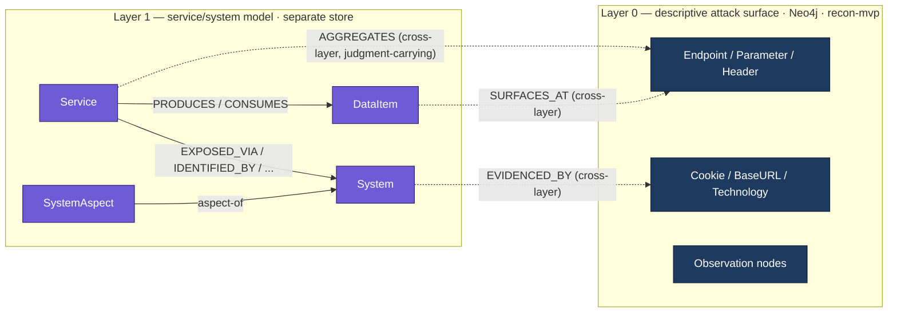
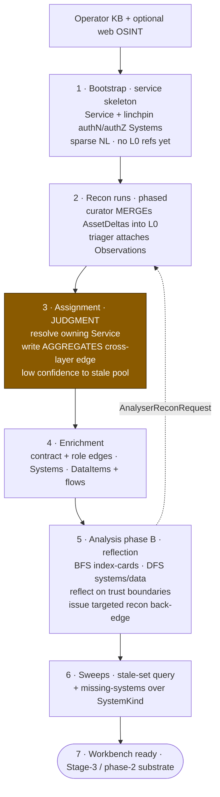
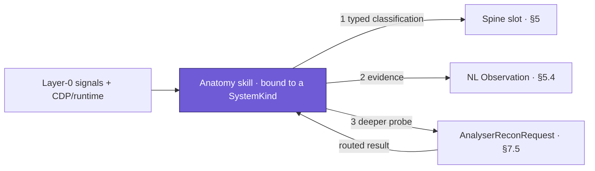

# Service/System Domain Model (Layer 1) — Consolidated Design

*Status: iteration-2 design consolidation. This is the substrate produced by **Stage 2 (attack-surface analysis)**: the Layer-1 service/system model — the anatomy (components, data flows, trust boundaries) that phase-2's attack-chain DAG roots in (`OP-11`), and that phase-1 Stage-3 test projection reads. It is an explanation-and-reference document. The first half explains the ontology, the storage, and the production workflow, and why each is shaped this way; the second half is a referenceable register of decisions, the MVP boundary, non-MVP implementation decisions, open points, and risks.*

*Companion to `evolution-paradigm.md` (paradigm layer), `threat-modeling-system-design.md` (phase-2 target), and `recon-mvp-design.md` (iteration-1 recon, which produces Layer 0). It cross-references their tags: `DD-n` / `OP-n` / `R-n` refer to the phase-2 doc. This document's own decisions are tagged `L1D-n`, open points `L1OP-n`, risks `L1R-n`, and non-MVP implementation decisions `NM-n`.*

---

## 1. Purpose, scope, and the single load-bearing correction

### 1.1 Why this layer exists — the adversarial-analysis rationale

The plain attack surface — the Layer-0 inventory of bare assets (endpoints, parameters, headers, cookies, technologies) — is **not a representation that supports optimal adversarial analysis**. It is single-resource-oriented: a lone endpoint tested in isolation yields only the trivial faults of the component directly behind it, while staying oblivious to the wider system the component is part of. That is where the impactful faults hide.

This layer exists to lift bare assets into **analysis primitives shaped for adversarial thinking**. The primitives are chosen so that the tester (and later the abduction planner) can ask the questions a real attacker asks:

- **How could this service's contract be invalidated?** — the service contract (interface agreement, data contract, the projection of the authorization pyramid onto this service) is the thing an attacker tries to break, so it is a first-class object here.
- **What does this service trust, and what does it assume about what it trusts?** — trust relationships and their attached assumptions are made explicit and, crucially, *derived from represented data flows* rather than asserted (§4.4).
- **What is this application actually *for*?** — the analysis reasons on the **solution / business layer**, not only the technical one. A "reward-points management service" has business invariants an attacker monetises that no purely technical view of its endpoints reveals.

In short, Stage 2 is where the system **reverse-engineers the black-box target the way a human hacker does**: it takes the observable surface and reconstructs the services, the systems they lie on, the data that flows between them, and the trust the whole thing rests on. The Layer-1 model is the artifact of that reverse-engineering — a *testing-oriented* anatomy, not a documentation profile. Everything typed in this document is typed because a symbolic layer must reason over it; everything left in natural language is left there because it is an analyst's adversarial *read*, which is irreducibly NL (the `DD-3` soundness split).

### 1.2 What this layer is, and what it is not

The four-stage invariant workflow is `recon → attack-surface analysis → light threat model (test design) → execution` (`evolution-paradigm §2`). This document designs **only the substrate that Stage 2 emits**: the service/system model. It is deliberately *not* the reasoning over that substrate — Stage-3 checklist projection, phase-2 anatomy abduction, verification pods, and risk scoring are all *reasoning consumers* and are out of scope except as **constraint sources** `[L1D-0]`.

Where a downstream consumer imposes a forward-compatibility constraint on the substrate (e.g. "the DAG will root in this, so identity must survive re-hosting"), that constraint is in scope and is surfaced. Where a note drifts into the reasoning itself (test-to-service assignment, risk thresholds), it is named and pulled back.

### 1.3 The correction that reshapes everything: Layer 0 and Layer 1 are two stores

**Layer 1 is a completely separate data store from Layer 0, independently navigable** `[L1D-1]`. They are joined only by **cross-layer edges**. This is not an implementation detail; it changes what several "invariants" even are:

- **Layer-1 nodes never reuse Layer-0 identity keys** `[L1D-2]`. A `Service` is never keyed by a `BaseURL`; a `DataItem` is never keyed by a `Parameter`. Cross-layer edges reference Layer-0 **by Layer-0's own key**, so either store can be re-derived without churning the other.
- The BFS index-card and all DFS traversal (§8) are **Layer-1-native**: the outer analysis loop never touches Layer 0.
- Cross-layer edges are **lazy fetch edges** — traversed only when concrete assets are needed to test, i.e. traversal-then-fetch *across the layer boundary*, never in the hot loop. This is the token story the paradigm keeps promising and now sites concretely (`DD-4`).



The rest of the document is organised as: the **domain model** (§2–§4: units, data, trust), the **characterisation axes and type/NL boundary** (§5), the **edge taxonomy** (§6), the **production workflow** (§7: the analyser, its two typed interface agreements, and the system-anatomy skills subsystem), the **retrieval/traversal contract** (§8), and the **Stage-3 prefilter constraint** the substrate must serve, including the concretisation-noise hazard (§9). Registers follow (§10–§15). Data-infrastructure concerns (the two stores, identity keys, MERGE, provenance, the vector store) are woven through §3–§7 rather than isolated, since in a graph store identity, edge-typing, and persistence are one decision.

---

## 2. The core ontology: `TestableUnit` → `Service` / `System`

### 2.1 Two node kinds under one supertype

A `TestableUnit` supertype carries the shared machinery (security profile, provenance, bound-doc references, the index-card projection); two operative subtypes specialise it `[L1D-3]`:

- **`Service`** — a **business function** with a **service contract**. "customer-details-update service", "checkout service", "sales-analysis service".
- **`System`** — a **cross-cutting technical capability** that services *lie on*. WAF, CDN, reverse proxy, identification/cookie system, integration system (CSP/CORS), rendering systems, the API-paradigm system, the authentication *mechanism*.

In Neo4j this is multi-label (`:TestableUnit:Service`), giving shared attributes on the supertype and kind-specific identity on the subtype.

### 2.2 The discriminator: membership *direction*

The single test that decides Service vs System is **membership direction** `[L1D-4]`:

- A **Service** *claims* business-facing elements by **business purpose** ("what business function does this endpoint serve?").
- A **System** *overlays* elements (or whole Services) that share a **cross-cutting mechanism** ("every request through this CDN", "every cookie in this identification system"), regardless of business function.

Two hard cases resolve cleanly under this rule:

- **"REST/GraphQL API"** → a **System** (a cross-cutting paradigm overlay many services expose through).
- **"authentication & authorization system"** → **split** `[L1D-5]`. The *mechanism* (how tokens are minted/validated) is a **System**; the *policy* (who may act on this business function) is a facet of that **Service's contract**. This maps onto real bug classes: broken auth *mechanism* is a System bug; broken object-/function-level authorization (BOLA/BFLA) is a Service-contract bug. A tester reasons about them separately, so the model separates them.

> **Assumption exposed** `[L1R-1]`: the surface is *approximately* partitionable by business function. This holds for web/SaaS and for the average target profile; it can fray on a monolith where one endpoint serves several functions. This is *not* patched with hard partition — see §4.1.

### 2.3 The `SystemKind` registry — typed but extensible

Systems draw their kind from a **controlled-vocabulary catalogue node**, not from free strings `[L1D-6]`. A `SystemKind` catalogue row has an id + NL description; a `System` instance points to its kind. Seed kinds: `WAF, CDN, ReverseProxy, APIGateway, RESTApi, GraphQLApi, IdentificationSystem, IntegrationSystem, AuthenticationMechanism, AuthorizationSystem, RenderingSystem_SSR_UI, RenderingSystem_CSR_JSMap, Sitemap` (extensible).

New kinds = **new catalogue rows** (typed, queryable, provenance'd) — never schema migrations, never junk-drawer strings. This is how "which *other* discretely-testable systems exist?" stays a permanent open slot without becoming un-enumerable: the symbolic layer can always enumerate kinds, and adding one is a data write. The web-application population resolves to a recurring finite set of systems; the operator seeds the list, and per-target identification of each is *best-effort, not required* (some systems are absent on some targets).

---

## 3. System identity — defined by adversarial transfer

### 3.1 The identity principle

`deployment-locus` is the **wrong universal key**. The correct principle `[L1D-7]`:

> **Two Systems are the same System iff a finding/technique against one transfers to the other.** Identity-for-dedup is *defined by* identity-for-adversarial-transfer; where they would diverge, transfer wins and dedup follows.

Run locus through this test and it fails as a universal: the same managed WAF ruleset at two edges is **one** adversarial object (a bypass transfers); two different WAF products at one edge are **two** objects. Locus is orthogonal to transfer — except for one kind (path-positional, below).

A second constraint: the key must be **knowable from recon-time fingerprinting**, not require probing (probing is Stage 3/4).

### 3.2 Three identity regimes, one key shape

No single second parameter serves all systems. There are three regimes `[L1D-8]`:

| Regime | Example kinds | Identity ≈ | Discriminator source |
|---|---|---|---|
| **Config/perimeter** | WAF, CDN edge logic | `(kind, product, ruleset/config-fingerprint)` | product + config fingerprint; locus irrelevant |
| **Path-positional** | reverse proxy, API gateway | `(kind, position-on-request-path)` | ordered position on the request path (the *only* place a locus-like field is adversarially load-bearing) |
| **Singleton app** | identification/cookie system, integration system, auth mechanism | `(kind)` within project | `__singleton__` sentinel |

**Unified key:** every System keys on **`(project_id, SystemKind, discriminator)`**, where `discriminator` is a **typed, kind-driven field defaulting to a `__singleton__` sentinel** `[L1D-9]`.

This answers both original doubts directly. *Is deployment-locus the right second parameter?* No — it is the wrong universal and only a special case of the positional discriminator. *Is a second parameter needed at all?* **Structurally yes** (reserve the slot now — adding a key component later is a migration), **operationally usually no** (null/singleton for a simple target). You carry the slot; you rarely populate it — but the average target *does* populate it: multiple authN realms (credential-based vs external IdP), multiple roles, and services behind different CDNs/WAFs across macro-applications all instantiate real discriminators.

> **Reversibility:** one-way door on the slot's *existence* (reserve now); two-way on the per-kind discriminator *semantics* (refine per kind later). Lock the shape now; keep the semantics editable `[L1R-2]`.

---

## 4. Membership, data, and the trust model

### 4.1 Membership cardinality: N:M, because identity ⊥ membership

Hard partition ("each L0 element ∈ exactly one Service") was **rejected** `[L1D-10]`. A shared L0 element is not a defect — it is **load-bearing signal**: a session cookie shared across services *is* the evidence those services sit on one identification System. Partition would delete that signal.

Partition was never the real invariant. The real one is:

> **A Layer-1 unit's identity is independent of its Layer-0 member set** `[L1D-11]` ("never key a unit on its members").

Given that rule, membership is freely **N:M** and stays that way forever. This also kills the endpoint-set candidate for Service identity: a Service is keyed by **business function / contract**, never by the endpoints it aggregates, precisely so that N:M membership never entangles two units' identities into a duplicate tree (`R-5`).

- **Decide-now, one-way door:** the `identity ⊥ membership` rule.
- **Two-way door:** membership cardinality itself (default N:M).

### 4.2 Service identity key

Service identity is `(project_id, business_function_slug)` provisionally at bootstrap, hardening to a **contract-anchored** identity as the contract is filled `[L1D-12]`. Rationale, per the worked-example candidate analysis: endpoint-set identity *churns* on every recon discovery; business-function identity is *stable and human-legible* but needs OSINT/judgment; contract identity is *what the tester actually reasons about* but is knowable only later. The chosen path uses business-function as the early stable anchor and enriches toward contract, never keying on members.

### 4.3 `DataItem` — data as first-class typed structure

A logical data element is a **first-class Layer-1 `DataItem` node** `[L1D-13]` — `client_id`, session token, `sales_figure`, `username` — with identity **independent of the many Layer-0 sites it surfaces at** (a `SURFACES_AT` cross-layer edge to each `Parameter`/`Header`/response-field).

This was decided against two alternatives: edges between L0 `Parameter`s (re-entangles the two stores *and* fragments one logical item into dozens of parameters, so no invariant can be stated once); and NL in the security profile (fails every phase-2 read). The decisive argument is forward-compat: **`DD-18` — "assumptions as machine-checkable predicates over typed objects" — is literally unimplementable without typed data objects.** `DataItem` nodes *are* those objects.

Edges:

- **`DataRelationship`** between DataItems: `derived_from`, `reflected_in`, `equals_hash_of`, … — each carries a **machine-checkable predicate + NL rationale** (`client_id = md5(email+id)`; a user's username reflected in that user's product comment). These are the functional-dependency invariants whose violation hides the trickiest faults.
- **`PRODUCES` / `CONSUMES`** between Service and DataItem.
- **A trust assumption is a predicate on a `CONSUMES` edge, ranging over the typed DataItem it carries** `[L1D-14]`. Because the assumption hangs on a *represented* flow (`A —CONSUMES→ D ←PRODUCES— B`), the structure it constrains exists in the graph; assertion-without-dataflow becomes **structurally unrepresentable** — which is exactly the "derived, not asserted" property required of trust boundaries.

> DataItem identity (when are two data items across services the *same* logical item?) is a semantic-identity problem as load-bearing as Service identity, and is the immediate next hole `[L1OP-1]`. The `DataRelationship` type vocabulary is likewise deferred `[L1OP-2]`. Node-kind-yes is a one-way door and is decided now; the vocabulary/identity are two-way and deferred.

### 4.4 The trust model, correctly tiered

The impactful faults do **not** live on request-path enforcement hops. Those yield signals or a low-value stepping-stone bug usable later in another attack-surface area. The impactful faults live in **inter-service data-flow trust** and **data-relationship invariants** `[L1D-15]`:

| Tier | Locus | Value | Substrate |
|---|---|---|---|
| **1** | Inter-service data-flow trust (A consumes data produced by B, assumes P about it) | **High — primary abduction locus** | `DataItem` + `PRODUCES`/`CONSUMES` + assumption predicate on the edge |
| **1** | Intra data-relationship invariants (functional dependencies among data items) | **High** | `DataRelationship` edges + predicate |
| **3** | Request-path enforcement hops (`ON_REQUEST_PATH`) | **Low — signal / lateral composition** | keep the ordered chain; deprioritise for abduction |

`ON_REQUEST_PATH` is retained (the average target is genuinely multi-hop, multi-realm) but as **capability-composition substrate**, not the crown jewel. The crown jewel is data.

### 4.5 `SystemAspect` — reified facets, only where shared

A phase-2 symptom references "a facet of a service/system" (`DD-12`). A facet may be a plain **tuple-address `(unit, axis, slot | System-edge)`** or a **reified `SystemAspect` node**. The rule `[L1D-16]`:

> **Reify a facet as a `SystemAspect` node iff it is a shared trust/enforcement locus** — i.e. >1 service depends on it, *or* a trust assumption attaches to it. Single-service facets stay tuple-addresses.

Services then edge to the *aspect they trust*, not the whole system. This is not arbitrary: the reason Systems are overlay nodes at all (§2) is that they are shared cross-cutting loci; reifying a shared aspect just *finishes* the overlay model — and it is exactly where the inverse DFS (facet → services) is actually run (§8). The reification rule and the "where faults hide / where the hot traversal runs" heuristic are the same rule. Promotion (address → node) is lazy but **the promotion rule is decided now** because promotion re-anchors references.

---

## 5. The characterisation axes and the type/NL boundary

### 5.1 Typed spine + NL characterisation on typed handles

Neither all-NL (kills every structural query and facet addressability) nor all-typed (kills the adversarial insight — "the origin blindly trusts a gateway-injected identity header" has no enum). The resolution is a **typed spine with NL characterisation hung off typed handles** `[L1D-17]`, mirroring the phase-2 soundness split (`DD-3`): the symbolic layer reasons over the typed spine; the creative planner consumes the NL.

| Axis | Typed spine | NL / handles |
|---|---|---|
| **Solution** | `business_function` (typed handle); **contract** = `authz_model` + `data_contract` (typed refs into the data axis) | NL label + contract detail |
| **Technical** | enums for enumerable mechanisms (`api_paradigm ∈ {REST,GraphQL,gRPC,…}`; **two independent dimensions** `navigation_model ∈ {SPA,MPA,Hybrid}` and `rendering_model ∈ {CSR,SSR,SSG,StreamingSSR,HydratedSSR}` — see §5.5; `auth_methods: set<enum>`); **cross-cutting systems are NOT slots — they are edges to System nodes** | analyst read per mechanism |
| **Technological** | `(technology, version, role)` triples; where the tech is itself a testable System, the triple **is** the H1 edge (no duplication) | version/context notes |
| **Data** | typed entry points (lifted `Parameter`/`Header` as `SURFACES_AT`) + `DataRelationship` edges | rationale per relationship |

The technical axis is therefore **a handful of enums plus a set of edges**, not a property blob. This dissolves the raw description's self-contradiction (CDN as stack-string *and* as testable system): "service X is fronted by Datadome" is an **edge** `Service —FRONTED_BY→ CDN-System`, never a string in a technological-axis blob `[L1D-18]`.

### 5.2 Facet addressability is the precondition for phase-2 symptom identity

Because the spine is typed and cross-cutting systems are nodes, a phase-2 symptom references a facet as an **addressable graph locus** `(unit_node, axis, slot | System-edge | SystemAspect)`. If the technical axis were free NL, that anchor would be a brittle substring match — un-dedupable, breaking `OP-2`. **The typed spine is the precondition for phase-2 symptom identity existing at all** `[L1D-19]`; it is the single strongest forward-compat lever in Layer 1.

### 5.3 Reversibility of the type/NL cut

The **spine typing is one-way** (retyping slots + re-anchoring facets is a migration). The **NL side is two-way and additive** — a recurring NL observation can always be promoted into a typed slot later. Therefore: **decide the spine now; keep the NL side liberal** `[L1R-3]`.

### 5.4 Security profile and bound documentation

Per `evolution-paradigm §Foundation 2b`, two deliberately-NL content types feed the planner: **Observations** (insights, not vulnerabilities: free text + light metadata `severity`/`evidence`/`macro_kind`) and **bound documentation** (API docs, OSS/target codebases, sitemap). Both live in the **sparse vector store**; graph nodes carry **reference attributes** into it, keyed on **node identity, never a locator string** `[L1D-20]`. Retrieval is traversal-then-fetch and/or semantic match.

### 5.5 Some spine enums are *classifications produced by anatomy skills*, not raw recon facts

Several technical-axis enums cannot be read straight off Layer 0 — they are **classifications** that require a dedicated analysis procedure over runtime signals. The webpage rendering/navigation profile is the canonical case, and it carries a structural lesson: **navigation and rendering are two independent dimensions** and neither may be inferred from the other `[L1D-31a]`. A SPA may use SSR; an MPA may use CSR for individual widgets; framework fingerprints alone (`__NEXT_DATA__`, `id="root"`) are *never* sufficient. Collapsing them into one enum (an earlier draft's mistake) under-models the surface and produces wrong fault-class routing downstream (DOM-XSS vs SSTI hang off *different* dimensions).

The consequence for the substrate: `navigation_model` and `rendering_model` are separate typed slots, each populated by a **system-anatomy skill** (§7.6) that maps observable signals → a typed value + confidence + evidence, and whose deeper probes become backward-recon requests. The spine stores the *classification*; the skill is the *procedure that derives it*.

---

## 6. The edge taxonomy

Edges are typed to **(a) scope the DFS** and **(b) give phase-2 a stable anchor**; sub-granularity rides on a `role` property, **not** on ever-more labels `[L1D-21]`. This avoids an edge zoo while keeping traversal scopable.

| Edge family | From → To | Carries | Purpose |
|---|---|---|---|
| `AGGREGATES` (cross-layer) | Service → L0 element | judgment envelope (§7.4) | membership; N:M; judgment-carrying |
| `SURFACES_AT` (cross-layer) | DataItem → L0 Parameter/Header/field | — | where a logical item appears |
| `EVIDENCED_BY` (cross-layer) | System → L0 element | — | fingerprint evidence for a System |
| `PRODUCES` / `CONSUMES` | Service ↔ DataItem | assumption predicate (on `CONSUMES`) | **Tier-1 trust substrate** |
| `DataRelationship` | DataItem ↔ DataItem | predicate + NL rationale | functional-dependency invariants |
| `EXPOSED_VIA` | Service → API System | — | scopes "which paradigm" |
| `IDENTIFIED_BY` / `AUTHENTICATED_BY` | Service → identity/auth System | `realm?` | mechanism (System) vs policy (contract) split |
| `AUTHORIZED_BY` | Service → AuthorizationSystem role node | `role` | the authorization-pyramid projection (edges to role nodes, not prose) |
| `FRONTED_BY` / `PROTECTED_BY` / `ROUTED_BY` | Service → perimeter System | `role` | scopes "what's in front of S" DFS |
| `SHAPES_DATA_OF` / `RENDERED_BY` | Service → integration/rendering System | `role` | data/rendering path (CSP/CORS, JS map) |
| `ON_REQUEST_PATH` | System → System (ordered), → Service-origin | `order`, `enforces[]` | ordered request chain; Tier-3 (composition) |
| `DEPENDS_ON` | Service → Service / System → System | `role` | generic dependency where none of the above fits |

---

## 7. The production workflow — the analyser

### 7.1 The analyser as a pure function

The attack-surface-analysis pod is a function **`f(L0-slice + observations) → L1-deltas`, written by idempotent MERGE on L1 identity** `[L1D-22]`. Because it is a pure function over an L0 slice, several apparent architecture choices are non-decisions:

- **Streaming vs batch is not a substrate decision** `[L1D-23]`. Push (stream at recon time) or pull (post-recon batch) produce identical reads and writes. **Default batch for iteration 2**; add streaming only when the noise-reduction win is *measured*, not assumed. *(Streaming is the operator's original preference for reducing pattern-match noise; it is a two-way door.)*
- **The stale pool is not a structure** `[L1D-24]`. It is the *derived query* "L0 assets with no inbound `AGGREGATES` edge". The end-of-phase sweep is running that query once the recon phase-barrier clears.
- **Idempotency / monotonic append is already locked** by `identity ⊥ membership` + MERGE. The one true retraction case is **service-splitting** (phase B decides one Service is two) — an *identity* event, declared **non-MVP** (`NM-4`). Phase B may freely *reassign* `AGGREGATES` edges but may **not split a node** in the MVP.

### 7.2 End-to-end pipeline



1. **Bootstrap (pre-surface).** Operator KB (+ optional web OSINT) emits the **service skeleton** into the L1 store: `Service` nodes (sign-in/identification, account management, checkout, orders, reward-points, cart, preferences, reviews, product-introspection, sales-analysis, product-posting, …) plus the **linchpin `System` nodes** (authentication, authorization) that everything later extends. Each Service is a sparse NL node, `MERGE` on `(project_id, business_function_slug)`, empty member set, **no L0 refs yet**. Needs no surface — pure business projection.
2. **Recon runs (phased, per `recon-mvp-design`).** Curator MERGEs `AssetDelta`s into **L0**; triager attaches `Observation`s.
3. **Assignment (judgment, not lookup).** For each `{AssetDelta, Observation}`, the analyser resolves the owning Service and writes a cross-layer `AGGREGATES` edge (referencing L0 by L0 key), or **creates a new Service** if none fits confidently, or **falls through to the stale pool** below a confidence threshold.
4. **Enrichment.** Writes the Service **contract** (NL core + typed `AUTHORIZED_BY` role-edges into the authorization System — the authorization-pyramid *projection is edges to role nodes, not prose*); creates/updates technical `System`s (a JSON endpoint → `Service —EXPOSED_VIA→ RESTApi`); creates `DataItem` nodes + `PRODUCES`/`CONSUMES`/`DataRelationship` edges. All MERGE-idempotent.
5. **Analysis phase (phase B).** Walks Services (BFS over index-cards), drills each one's Systems + DataItems (DFS). Reflects on trust boundaries — *not classification, but adversarial reflection* — and, when technically feasible, deepens the contract and the systems it relies on (e.g. more roles in the authorization pyramid). This reflection yields **narrow, deep recon/scan jobs** (xssscan, sqlmap, …) via the back-edge (§7.5); those results route **back to the requesting analyser**, not through the recon→analyser stream.
6. **Stale + missing-systems sweep (end).** Run the stale-set query; iterate the `SystemKind` registry for unrepresented systems (best-effort identification).
7. **Workbench ready.** L1 = sparse NL nodes referencing L0 by key over a typed spine — ready for the Stage-3 signature queries (§9) and phase-2 rooting.

### 7.3 The two phases of the analyser, contrasted

The recon-time pass (steps 3–4) builds a **classification/documentation profile** — sparse NL that references L0. Phase B (step 5) is **deeper and reflective**: it does not re-run the recon→analyser stream; it reflects on trust boundaries/assumptions and requests stronger, narrower recon whose observations feed **directly back to the requesting agent**.

### 7.4 Interface agreement A — the judgment edge envelope

The layer defines exactly two typed interface agreements that the MVP must ship in final shape (both are one-way doors on the *envelope*, two-way on the *machinery behind it*). This is the first.

Assignment is a **judgment**, not a lookup, with varying confidence and revisability. So the `AGGREGATES` edge is not a bare edge — it **carries a judgment envelope from day one** `[L1D-25]`, and this envelope is the interface every writer (recon-time analyser, phase-B analyser) and every reader (Stage-3 concretiser, audit) agrees on:

```jsonc
// AGGREGATES edge properties
{ "confidence": 0.0,                 // analyser's confidence in the assignment
  "status": "provisional|committed", // MVP may only ever write "committed"
  "evidence_refs": ["obs:…","asset:…"],
  "provenance": { "job": "...", "model": "...", "prompt_id": "..." },
  "ts": "…" }
```

- **Now (one-way):** every assignment edge carries `{confidence, status, evidence_refs, provenance}`, even if the MVP only writes `committed`. Adding these fields later is a migration; carrying them is free.
- **Deferred / lazy (`NM-1`):** reify a competing assignment as an `Assignment` node **only when phase B contradicts phase A** — the same lazy-reification discipline as `SystemAspect`. This is "provenance-of-judgment" done fully, built only for the contested case.

### 7.5 Interface agreement B — the backward recon interface agreement

The second interface agreement. Phase B (and, below, the system-anatomy skills) must be able to **request targeted recon and receive the result routed back to the requesting agent** — not through the generic recon→analyser stream. This is the paradigm's own load-bearing seam (`DD-15`; block-and-reuse is `DD-24`). The decision `[L1D-26]`:

> **Fix the typed backward-recon contract now; implement it synchronously for the MVP.**

```jsonc
// AnalyserReconRequest (requester → recon_jobs registry)
{ "job": "xssscan|sqlmap|targeted-katana|graphql-introspect|…",
  "scope": { "service_id": "…", "targets": ["…"], "auth_context?": "…" },
  "origin": "analyser|anatomy_skill",   // who raised the need
  "skill_id?": "webpage_profile|authz_pyramid|…",  // set when origin=anatomy_skill
  "correlation_id": "…",    // result routed back by this
  "requester_id": "…" }     // …to this agent instance
```

- The **typed contract** (`AnalyserReconRequest` + a correlated routed-result carrying `requester_id`) is the **one-way door**. The `origin`/`skill_id` fields are what let a skill's probing procedure (§7.6) share this one channel rather than inventing its own.
- **Sync-vs-async execution behind it is two-way.** MVP runs it synchronously (requester awaits `{observations}`); async + correlation is the only shape that supports **block-and-reuse** — a second requester of the same in-flight job reuses it, which is the "verification-in-progress" state phase-2 hard-requires (`NM-2`). This is also the exact seam the recon-MVP's typed information-need→job contract was told to anticipate (`evolution-paradigm §2`).

### 7.6 System-anatomy skills — a pluggable subsystem that classifies systems and raises recon

Some Layer-1 facts are neither parsed from Layer 0 nor read from a document; they must be **actively determined by a system-specific analysis procedure** over runtime signals. These procedures are packaged as **system-anatomy skills** `[L1D-31]` — one per `SystemKind` (or per facet of one), pluggable and versioned, bound to the registry of §2.3. A skill is the "how to reverse-engineer *this kind* of system" companion to the registry's "what kinds exist."

**A skill is a triple**, and each leg lands on machinery already defined, which is why the subsystem adds no new storage primitives:

| Skill leg | Content | Lands on |
|---|---|---|
| **Signals → typed classification** | the observable signals and the decision matrix mapping them to a typed value + confidence | a **typed spine slot** (§5) — e.g. `rendering_model`, `navigation_model` |
| **Evidence → NL observation** | the corroborating signals that *caused* the classification, recorded verbatim | an **NL `Observation`** with `{severity, evidence, macro_kind}` + provenance (§5.4) |
| **Deeper probes → recon requests** | procedures that need fresh live interaction to decide or to go deeper | an **`AnalyserReconRequest`** on interface agreement B (§7.5), `origin=anatomy_skill` |

The third leg is the important one: **skills are not passive classifiers, they are recon drivers.** A skill inspects what is already mapped, concludes it needs more, and raises a typed backward-recon request whose result routes back to it — closing the same reflection loop the analyser uses.

**Two seed skills anchor the design:**

- **Webpage-profile skill** (draft exists). Classifies the two independent dimensions `navigation_model ∈ {SPA,MPA,Hybrid}` and `rendering_model ∈ {CSR,SSR,SSG,StreamingSSR,HydratedSSR}` from initial-HTML shape, post-JS DOM, navigation events, CDP `Page.frameNavigated`, network resource-types, and framework fingerprints — under the standing rule that the dimensions are independent and fingerprints alone never suffice (§5.5). Its deeper probes ("navigate route X and watch for a Document request vs Fetch"; "render with JS disabled") are backward-recon requests. Its output sub-classes the `RenderingSystem` a Service is `RENDERED_BY`, which is exactly what the XSS signature (§9.5) branches on.
- **Authorization-pyramid skill.** Reverse-engineers the role→permission structure by *attempting to trigger the same service action under different roles* (the "inverse pyramid" probe). Its classification enriches the Service contract's `authz_model` and the `AUTHORIZED_BY {role}` edges (§6, §7.2); its probes are inherently live and therefore backward-recon requests carrying `auth_context` per role. This skill is the reason role edges are typed rather than prose — the skill must *write* them structurally.

**Scope fence.** A skill's classification, evidence, and probes are all substrate/production and in scope. A skill draft may also list *typical threats* per profile (CSR→DOM-XSS, SSR→SSTI, …); that mapping is a **Stage-3 hint**, kept as a reference the prefilter *may* consume (§9.2), **not** authored or driven here. The skill produces the typed classification; what fault classes that unlocks is downstream reasoning.

**MVP vs later.** The **skill interface** (the triple, bound to a `SystemKind`, emitting to spine + observation + interface-agreement B) is fixed now. The **catalogue of skills** grows over time (`NM-9`); the MVP ships the webpage-profile and authorization-pyramid skills, since both feed spine slots the Stage-3 signatures already depend on.



---

## 8. The retrieval and traversal contract

Two access shapes drive the substrate: **region-1 breadth** (enumerate every service/business function) and **region-2 depth** (all systems underpinning a service, or — inversely — all services relevant to a facet of a system). Three requirements follow `[L1D-27]`:

1. **BFS must be token-light → the index-card projection.** Iterating every unit while pulling its full characterisation + security profile + bound docs blows `DD-4`. Each unit carries a typed **index-card**: `{id, kind, business_function label, key spine enums (api_paradigm, auth_methods, exposure…), salience summary, edge-degree by family, NL-handles}`. The outer loop reads index-cards; depth is fetched only for the unit currently under analysis. Traversal-then-fetch applied to the outer loop.
2. **DFS-down** (Service → its Systems) is one typed hop per edge family. Cheap.
3. **DFS-up** (System facet → its services) is the inverse hot path. If a facet were only a tuple-address, this would be an O(services) scan-and-filter inside the deep loop — the wrong complexity. **`SystemAspect` reification (§4.5) makes it one hop**: services edge to the aspect they trust; "which services manifest this facet" is a single traversal.

Net: **BFS reads index-cards; DFS-down rides typed edges; DFS-up rides `SystemAspect` nodes for shared enforcement/trust loci only.** Downstream query-shape detail beyond "identity-keyed traversal-then-fetch" stays deferred `[L1OP-3]`.

---

## 9. Forward-compat constraint: the Stage-3 three-tier prefilter

*Scope fence: the projection algorithm and semantic validation are Stage 3. This section designs only **what the substrate must contain** for a sound prefilter to run, and is included because getting the vocabulary wrong is a substrate-level one-way door.*

### 9.1 The soundness invariant

Stage-3 test projection is a coarse typed prefilter followed by planner semantic validation. The prefilter is only safe if `[L1D-28]`:

> **Prefilter atoms are *necessary conditions only*, and default-open under uncertainty.** Unknown ⇒ passes. The filter is a **sound over-approximation** — it can only ever cut a unit that *provably cannot* have the fault class.

A *good* atom is therefore one with **confident refutability from typed facts** — necessary **and** cheaply-deniable (e.g. "a GET endpoint with no body and no user-writable parameter *cannot* be insecure-deserialization"). That criterion is the whole design of the atom set.

### 9.2 Three tiers — the same operation (typed reachability over the L1 graph) at three depths

| Tier | Query | Cuts | Cost | Scope |
|---|---|---|---|---|
| **L0 — architecture** | 1-hop: does the required `SystemKind` exist / is the service connected to it? | whole fault *families* on simple targets | trivial | substrate ✓ |
| **L1 — structural** | short path: does the service have the necessary structural atom / data-flow shape? | service *instances* lacking the precondition | cheap, deterministic | substrate ✓ |
| **L2 — semantic** | planner validates the surviving instance | — | LLM | **Stage 3 — out of scope** |

The architecture tier reuses the `SystemKind` registry (no new per-fault vocabulary) and is trivially recall-preserving (no rendering system → no XSS). **But its selectivity is proportional to how often the required system is absent** — nearly every rich service has *an* API and *an* auth system, so it gates little on a real target and cannot pick the *instance*. It is the coarsest tier, not the whole filter; the structural tier does the instance-level cut.

### 9.3 The maintenance worry dissolves: signatures, not per-fault code

You do **not** maintain per-fault projection code. You declare a per-fault **graph-pattern signature** (required `SystemKind`s + required data-flow/structural shape); **one generic engine evaluates it** `[L1D-29]`. The signature vocabulary *is* the shared registry — the same node/edge kinds the whole L1 already uses. Author structural atoms only where the architecture tier is non-selective (ubiquitous-system faults like BAC); rare-system faults ride the architecture tier alone. Bounded and compact.

An atom is a **deterministic typed projection** of the spine + L0 aggregation (`has_user_controlled_input := ∃ user-writable Parameter/Header aggregated`), so the cut is auditable and reproducible (symbolic layer, not planner). A checklist entry that needs a new atom must ship **both** the atom **and** its deterministic derivation rule; otherwise the atom silently default-opens (safe, but a dead cut) `[L1D-30]`.

### 9.4 Worked signature — BAC/IDOR (the "unprojectable" case, resolved)

The BAC projection *does* exist; the doubt conflated **necessary** with **sufficient**. IDOR's necessary precondition is projectable:

- **Structural atom:** *the service aggregates an endpoint carrying a user-supplied parameter classifiable as an object-reference* — path-templated `{id}`, or `*_id`/`ref`/`uuid`-named with an instance-identifier value shape. Derivable from L0: katana gives path templates, arjun gives params, `sample_values` gives value shape.
- **What is *not* projectable is sufficiency** (is ownership actually unchecked) — and that is the *test's* job (L2), needing the authz model you are there to break.
- BOLA/BFLA/missing-authz each own a necessary atom; **missing-authz-with-no-id** genuinely has no structural atom and falls to the architecture tier (auth system exists) + L2.

### 9.5 Worked signature — weak sanitization (XSS): where `DataItem` + System nodes vindicate themselves

- **L0 (architecture):** required system is a **rendering system**, and *which one* sets the sub-class — SSR/MPA → `RenderingSystem_SSR_UI` → reflected/stored *server* XSS; CSR/SPA → `RenderingSystem_CSR_JSMap` → DOM XSS. A pure-JSON service with no rendering system attached is cut here.
- **L1 (structural):** the necessary atom is **not a parameter pattern — it is a reachability fact**: `∃ DataItem that is user-controllable AND has a CONSUMES/RENDERED_BY path into a RenderingSystem`. This is *only expressible because* `DataItem` and `RenderingSystem` are first-class nodes. Bare-parameter pattern-matching cannot see the flow; the L1 graph can. The atom `renders_user_influenced_data` is derivable once the analyser has laid the data-flow edge — precisely its step-4 job (the `sessionStorage`/gadget-X observation).
- **L2:** xssscan confirms the sink is unencoded / CSP-bypassable. The test. Out of scope.

This is the strongest evidence the node/edge model is cut in the right places: the prefilter is a family of typed reachability signatures over the vocabulary the L1 is already building.

### 9.6 The critical hazard: `AGGREGATES` member-set explosion at concretisation

N:M membership (`L1D-10`) was the right call, but it has a **cost that lands at a specific, later moment**, and the substrate must pre-empt it. A single Service can aggregate **tens of thousands** of L0 elements (endpoints × parameters × headers). Three things about *where* this bites `[L1R-8]`:

- **It is not a storage problem.** The graph holds tens of thousands of edges without difficulty.
- **It is not a BFS problem.** The outer loop reads **index-cards** (§8), which are per-unit summaries carrying edge-*degree*, not the member set itself. BFS over conditions on index-cards is unaffected by member-set size.
- **It bites at concretisation.** When an *abstract* test/technique attached to a Service must become an *executable* against concrete L0 targets, a naïve concretiser that fans out over the whole aggregated member set drowns in **noise**: which of 10,000 parameters does this test actually target? The signal is a handful; the fan-out is thousands.

The substrate's obligation (the algorithm is Stage-3/4, out of scope; the *handles* are substrate and in scope) is: **concretisation must never traverse the raw `AGGREGATES` member set. It goes through the small, typed, semantic projections instead** `[L1D-32]`. Three handles, all already present or cheap to add:

1. **`DataItem` as the primary selector.** The abstract test targets a `DataItem` / a data-flow; concretisation hits only the L0 sites that item `SURFACES_AT` — a set two-to-three orders of magnitude smaller than the full parameter inventory. This is a second, previously-unstated reason `DataItem` had to be first-class: it is the **noise filter for concretisation**, not only the Tier-1 trust locus.
2. **Structural atoms carry their witnesses.** When a derivation computes `has_object_ref_endpoint := true`, it records **which** L0 elements witnessed it (`witness_refs`), so the signature's concretiser targets the witnesses, not the member set. An atom that is a bare boolean forces a re-scan; an atom that points at its witnesses does not. (This is a small addition to `L1D-30`: atoms ship a derivation rule *and* emit witness refs.)
3. **Endpoint-template equivalence classes.** `/categories/{id}/parameters` for `id ∈ {1,2,3,…}` is **one** test target, not thousands — the raw doc's own "no duplicate tests across semantically-identical endpoints of one service" benefit. Katana already yields path templates in L0; concretisation dedups member endpoints to their template representative before fanning out. The full equivalence-class engine is deferred (`L1OP-7`, `NM-10`), but the **template key must be preserved on the L0 reference** so the reduction is possible later.

Net: the member set stays large and raw by design; the **typed projections over it stay small and semantic**, and every concretisation entry point is one of those projections. This is the same traversal-then-fetch discipline (§8) enforced at the concretisation boundary — and it is the concrete answer to the raw description's promise of "reduced testing-result noise" and "no duplicate tests across semantically-identical endpoints."

---

## 10. MVP boundary (iteration 2)

**In the MVP.** Two operative node kinds (`Service`/`System`) under `TestableUnit`; the `SystemKind` registry; System identity `(project_id, SystemKind, discriminator=__singleton__ default)`; Service identity on business function hardening to contract; N:M membership with `identity ⊥ membership`; the typed spine + NL characterisation, with `navigation_model` and `rendering_model` as **independent** slots; cross-cutting systems as edges; `DataItem` nodes + `PRODUCES`/`CONSUMES`/`DataRelationship` with assumption predicates on consume edges; the tiered trust model (Tier-1 data-flow primary, Tier-3 request-path retained); the index-card projection; DFS-down over typed edges; the analyser as a pure MERGE function with the bootstrap→assignment→enrichment→sweep pipeline; **interface agreement A — the judgment edge envelope on `AGGREGATES`** (§7.4); **interface agreement B — the backward recon interface, implemented synchronously** (§7.5); the **system-anatomy skill interface** with the **webpage-profile** and **authorization-pyramid** seed skills (§7.6); structural atoms that emit **witness refs** and L0 references that preserve their **endpoint-template key** (§9.6); the stale-pool query and missing-systems sweep; provenance on every node/edge/observation; NL security profile + bound docs in pgvector keyed on node identity.

**Deferred (this document's holes).** `DataItem` identity key `[L1OP-1]`; `DataRelationship` type vocabulary `[L1OP-2]`; `SystemAspect` reification implementation (rule decided, applied lazily); the `DeploymentZone` macro-application hole `[L1OP-4]`; the endpoint-template equivalence-class engine `[L1OP-7]`; downstream query-shape detail `[L1OP-3]`; the skill catalogue beyond the two seeds `[NM-9]`.

---

## 11. Non-MVP implementation decisions (to build forward)

*These are decided in shape now so the MVP substrate does not have to be re-cut when they land.*

- **NM-1 — Reified `Assignment` node.** When phase B contradicts a phase-A assignment, promote the `AGGREGATES` envelope into an `Assignment` node holding competing assignments with evidence, one marked `committed`. Trigger: contradiction only. Reuses the judgment envelope fields verbatim.
- **NM-2 — Async back-edge + block-and-reuse.** Promote the synchronous `AnalyserReconRequest` to async dispatch against the `recon_jobs` registry with `correlation_id` routing and a **verification-in-progress** state so a second requester of an in-flight job blocks-and-reuses rather than re-dispatching. This *is* the phase-2 pod-dispatch seam (`DD-15`, `DD-24`); build it here so phase-2 recycles it.
- **NM-3 — `SystemAspect` promotion engine.** Implement lazy address→node promotion on the decided rule (shared locus / trust-assumption attached), re-anchoring references atomically. Until then, single-service facets remain tuple-addresses.
- **NM-4 — Service-splitting (identity event).** Allow phase B to split one Service into two, with membership-edge re-parenting and reference re-binding. Explicitly out of the MVP; MVP phase B may only reassign edges.
- **NM-5 — `DeploymentZone` System subkind.** Model the macro-application grouping as a `System` subkind, identity `(kind=DeploymentZone, discriminator=app-name)`; services `DEPLOYED_IN` it; perimeter edges (`FRONTED_BY` CDN/WAF) attach *at the zone* and services inherit "behind X" transitively; gives BFS a coarser zone→service frontier. Risk profile lives as an **NL security-profile observation only** (computed risk scoring is Stage 3). Deferred as "quite deep" `[L1OP-4]`.
- **NM-6 — Per-kind System discriminator semantics.** Refine the discriminator meaning per `SystemKind` (config-fingerprint for perimeter; path-position for positional; realm/method for auth). The key *slot* is fixed in the MVP; the semantics are editable.
- **NM-7 — Streaming analyser.** Add the recon-triager→solution-analyser continuous stream once the noise-reduction win is measured; the pure-function contract makes push/pull interchangeable.
- **NM-8 — Signature-evaluation engine.** The generic engine that evaluates per-fault graph-pattern signatures (§9.3) over the L1 graph. Substrate contains the vocabulary now; the engine is Stage 3.
- **NM-9 — System-anatomy skill catalogue.** Grow the skill set beyond the two seeds (webpage-profile, authorization-pyramid) — e.g. skills for the identification/cookie system, CDN request-routing, CORS/CSP integration system, GraphQL schema anatomy, reverse-proxy path-behaviour. Each new skill = a triple bound to a `SystemKind` (§7.6); the interface is fixed, so adding a skill is additive, not a substrate re-cut. This mirrors phase-2's model-prior extensibility and the paradigm's "which other discretely-testable systems exist?" open slot.
- **NM-10 — Endpoint-template equivalence-class engine.** The full reducer that collapses semantically-identical L0 endpoints/parameters to a representative before concretisation fan-out (§9.6). MVP only *preserves the template key* so this can be built later; the engine and its equivalence relation are deferred (`L1OP-7`).

---

## 12. Open points

- **L1OP-1 — `DataItem` identity.** When are two data items across services the *same* logical item? As load-bearing as Service identity (`OP-2`-flavoured); the immediate next decision.
- **L1OP-2 — `DataRelationship` vocabulary.** The closed/extensible set of relationship types and their predicate grammar.
- **L1OP-3 — Downstream retrieval query-shape.** Exact traversal/semantic shapes Stage-3/phase-2 issue; constrained to identity-keyed traversal-then-fetch, otherwise deferred.
- **L1OP-4 — `DeploymentZone` / macro-application.** Deferred as deep; shape sketched in `NM-5`.
- **L1OP-5 — Confidence threshold + stale-pool policy.** The numeric cutoff for assignment fall-through and the resolution policy for the end-of-phase stale sweep.
- **L1OP-6 — Authorization-pyramid schema.** Role-node model and how the per-service projection (`AUTHORIZED_BY {role}`) composes with the global pyramid; multi-realm roles (credential vs IdP). This is what the authorization-pyramid anatomy skill (§7.6) writes into, so the schema and the skill co-evolve.
- **L1OP-7 — Endpoint-template equivalence relation.** The exact relation deciding when two L0 endpoints/parameters are "the same test target" for concretisation dedup (§9.6). MVP preserves the template key; the relation and its engine are deferred (`NM-10`).

---

## 13. Risks

- **L1R-1 — Partitionability assumption.** Service-by-business-function assumes an approximately partitionable surface; a true monolith (one endpoint, many functions) strains it. Mitigated by N:M membership + `identity ⊥ membership`; a unit needing *two primary* functions is a signal that service granularity is wrong, not that identity is N:M.
- **L1R-2 — System-identity slot vs semantics.** Reserving the discriminator slot is one-way; getting per-kind semantics wrong is two-way but silently duplicates systems if a nullable discriminator is MERGE'd carelessly (see `NM-6` and the sentinel rule).
- **L1R-3 — Spine/NL miscut.** Typing something that should be NL, or vice versa; spine retyping is a migration, so err toward NL and promote later.
- **L1R-4 — Judgment silently committed.** If the MVP writes only `status:committed`, a low-confidence assignment can look authoritative. Mitigated by always carrying `confidence`/`evidence_refs` even when unused.
- **L1R-5 — Duplicate-tree from identity error.** A wrong Service/System/DataItem identity degrades L1 into a duplicate tree, breaking dedup, DFS-up, and phase-2 rooting (`R-5`). The `identity ⊥ membership` rule is the primary guard.
- **L1R-6 — Prefilter over-cutting.** A structural atom mistakenly treated as *sufficient* (or not default-open) silently drops fault classes. The necessary-only + default-open invariant (§9.1) is the guard; violations are the highest-value review target.
- **L1R-7 — DataItem under-modelling.** If data flows are not lifted, Tier-1 trust substrate is empty and the impactful-fault locus is invisible; the whole abstraction under-delivers (raw-doc's own warning). Enrichment step 4 is therefore load-bearing.
- **L1R-8 — `AGGREGATES` explosion at concretisation (critical).** N:M membership lets one Service aggregate tens of thousands of L0 elements. Storage and BFS are fine; the hazard is **noise when an abstract test is concretised** into an executable — a naïve fan-out over the member set drowns the handful of real targets. Guard: concretisation must enter only through the small typed projections — `DataItem` selectors, atom `witness_refs`, and endpoint-template equivalence (§9.6, `L1D-32`). Un-guarded, this negates the abstraction's core promise (reduced noise, no duplicate tests) and inflates token cost against `DD-4`. This is the cost side of the N:M decision (`L1D-10`) and must be tracked as such.
- **L1R-9 — Anatomy-skill classification error propagates.** A skill mis-classifies a spine slot (e.g. calls a hydrated-SSR app CSR); every downstream signature that branches on that slot then routes wrong (missed SSTI, or wasted DOM-XSS effort). Guard: skills carry confidence + verbatim evidence (§7.6), and the classification is revisable like any other enrichment; low-confidence classifications should default toward the *broader* fault-class set, consistent with the necessary-only prefilter discipline (§9.1).

---

## 14. Decisions register

| Tag | Decision |
|---|---|
| L1D-0 | Substrate-only scope; reasoning consumers are constraint sources |
| L1D-1 | Layer 1 is a separate, independently-navigable store from Layer 0 |
| L1D-2 | L1 nodes never reuse L0 identity keys; cross-layer edges reference L0 by L0 key |
| L1D-3 | `TestableUnit` supertype; `Service`/`System` subtypes |
| L1D-4 | Discriminator = membership direction (Service partitions by purpose; System overlays a mechanism) |
| L1D-5 | Auth split: mechanism = System, policy = Service-contract facet |
| L1D-6 | `SystemKind` controlled-vocabulary registry (extensible via rows, not migrations) |
| L1D-7 | System identity defined by adversarial transfer |
| L1D-8 | Three System identity regimes (config/perimeter, path-positional, singleton) |
| L1D-9 | System key `(project_id, SystemKind, discriminator=__singleton__ default)` |
| L1D-10 | Hard partition rejected; membership is N:M |
| L1D-11 | `identity ⊥ membership` — never key a unit on its members (one-way door) |
| L1D-12 | Service identity on business function, hardening to contract |
| L1D-13 | `DataItem` first-class L1 node |
| L1D-14 | Trust assumption = predicate on a `CONSUMES` edge over a typed DataItem (derived, not asserted) |
| L1D-15 | Trust tiered: data-flow/data-relationship = Tier-1; request-path hops = Tier-3 |
| L1D-16 | `SystemAspect` reified iff shared trust/enforcement locus (rule now, lazy apply) |
| L1D-17 | Typed spine + NL characterisation on typed handles |
| L1D-18 | Cross-cutting systems are edges, not technological-axis strings |
| L1D-19 | Typed spine is the precondition for phase-2 symptom identity |
| L1D-20 | NL/bound-doc references keyed on node identity, never a locator string |
| L1D-21 | Edges typed to scope DFS + anchor phase-2; sub-granularity on `role`, not more labels |
| L1D-22 | Analyser = pure `f(L0-slice+obs)→L1-deltas`, idempotent MERGE |
| L1D-23 | Streaming vs batch is not a substrate decision (default batch) |
| L1D-24 | Stale pool is a derived query, not a table |
| L1D-25 | **Interface agreement A** — `AGGREGATES` carries a judgment envelope `{confidence,status,evidence_refs,provenance}` from day one |
| L1D-26 | **Interface agreement B** — typed backward-recon contract (`AnalyserReconRequest`, `origin`/`skill_id`/`correlation_id`/`requester_id`), implemented synchronously for MVP |
| L1D-27 | BFS index-card; DFS-down typed edges; DFS-up via `SystemAspect` |
| L1D-28 | Prefilter atoms necessary-only, default-open (sound over-approximation) |
| L1D-29 | Per-fault graph-pattern signatures + one generic engine, not per-fault code |
| L1D-30 | New atom must ship its deterministic derivation rule (and emit witness refs, per L1D-32) |
| L1D-31 | System-anatomy skills: pluggable per-`SystemKind` triple (signals→typed classification, evidence→NL observation, probes→backward-recon requests) |
| L1D-31a | `navigation_model` and `rendering_model` are independent typed dimensions; neither inferred from the other; fingerprints alone never sufficient |
| L1D-32 | Concretisation never traverses the raw `AGGREGATES` member set; it enters via `DataItem` selectors, atom witness refs, and endpoint-template equivalence |

---

## 15. Walkthrough — attack-surface analysis on a sample system

*Target: an ecommerce marketplace (B2B + B2C), average profile. Request path `client → Datadome CDN → WAF → Varnish reverse proxy → Springboot origin`. Multiple authN realms (credential-based from the platform DB, external IdP), multiple roles, services split across macro-applications behind different CDNs/WAFs. Trace one high-value data flow end-to-end to show every primitive firing.*

**Bootstrap.** From the operator KB (+ web OSINT confirming "open marketplace, reviews, reward points"), the analyser writes the skeleton into L1: `Service` nodes {sign-in, account-management, checkout, orders, reward-points, cart, reviews, product-introspection, **sales-analysis**, **item-creation**, product-posting} and linchpin `System` nodes {`AuthenticationMechanism`, `AuthorizationSystem`}. No L0 refs yet. `sales-analysis` keyed `(proj, "sales-analysis")`.

**Recon → assignment.** Recon lands `/categories/{id}/parameters` (JSON, 200, no auth) in L0. The analyser judges: *returns category sell-parameters → introspection of a product category*. It writes `product-introspection —AGGREGATES→ L0:Endpoint(/categories/{id}/parameters)` with envelope `{confidence:0.82, status:committed, evidence_refs:[obs:"returns FLOAT/DICTIONARY sell params"], provenance:{model,prompt}}`. A second endpoint returning per-seller aggregate sales lands and is assigned to `sales-analysis`. A stray `/healthz` falls below threshold → **stale pool** (no inbound `AGGREGATES`).

**Enrichment — systems as edges.** The JSON endpoints cause `sales-analysis —EXPOSED_VIA→ RESTApi (SystemKind, singleton)`. Fingerprints from L0 (`Server: Varnish`, Datadome cookie, WAF signature) create perimeter Systems: `CDN(Datadome)`, `WAF`, `ReverseProxy(Varnish)`, each `EVIDENCED_BY` its L0 evidence. The ordered chain is laid: `CDN —ON_REQUEST_PATH{order:1}→ WAF —{order:2}→ ReverseProxy —{order:3}→ (sales-analysis origin)`, `enforces:[...]` where observed. Because this macro-application sits behind Datadome specifically, the multi-CDN reality means the CDN System's discriminator is *populated* (`product:Datadome`), not `__singleton__` — the reserved slot earns its keep.

**Enrichment — the Tier-1 data flow (the crown jewel).** The client-side JS map shows a `sales_figure` fetched and rendered. The analyser lifts a `DataItem(sales_figure)` and writes:
`item-creation —PRODUCES→ DataItem(sales_figure)` and `sales-analysis —CONSUMES→ DataItem(sales_figure)`, with the **assumption predicate on the CONSUMES edge**. Per the operator's own read of this flow, the consumer here is the rendering system: if the app is CSR/SPA the consumer is the `RenderingSystem_CSR_JSMap` (Webapp); if SSR/MPA it is `RenderingSystem_SSR_UI`. The data is stored in `sessionStorage` and rendered by UI gadget "category X" — captured as a `SURFACES_AT` edge to the L0 storage/DOM element and an NL observation. The assumption predicate reads, e.g., *"the figure was authorized for **this** user"* (and, in the image-delivery variant the operator raised, *"the delivered object is an image from an origin I own, not an upstream-compromise exploit smuggled via a compromised media store"*). Because the predicate hangs on a represented `PRODUCES→…←CONSUMES` flow, it is machine-checkable and derived, not asserted — satisfying `DD-18`.

**Webpage-profile skill fires (resolving the CSR/SSR ambiguity above).** The data-flow paragraph left the rendering system undetermined ("if CSR/SPA… if SSR/MPA…"). The **webpage-profile anatomy skill** (§7.6) resolves it. Its passive signals from L0 (initial-HTML shape, framework fingerprint) are suggestive but insufficient, so its deeper probes become **interface-agreement-B requests**: `AnalyserReconRequest{job:targeted-katana, origin:anatomy_skill, skill_id:webpage_profile, scope:{navigate /sales-dashboard, watch Document-vs-Fetch + CDP frameNavigated}, correlation_id, requester_id}`. The routed result shows URL changes with `pushState` + JSON fetches and no Document request → `navigation_model := SPA`; the post-JS DOM is built from an empty shell → `rendering_model := CSR` — the **two independent slots set independently** (`L1D-31a`), with confidence `High` and the signals recorded verbatim as an `Observation`. That resolves the consumer to `RenderingSystem_CSR_JSMap` and fixes the DOM-XSS branch the signature will later take.

**Contract + authorization projection (authorization-pyramid skill).** `sales-analysis`'s contract is enriched by the **authorization-pyramid skill**, which probes the same action under different roles (interface-agreement-B requests carrying per-role `auth_context`) and writes the result structurally: NL core + `AUTHORIZED_BY {role:"seller"}` and `{role:"seller-admin"}` edges into the `AuthorizationSystem`, and `AUTHENTICATED_BY {realm:"credential"}` / `{realm:"idp"}` edges into the `AuthenticationMechanism` — the multi-realm reality made structural. Mechanism (System) and policy (contract) stay separate. (These role edges are typed precisely because the skill must *write* them, not narrate them — `L1OP-6`.)

**Phase B — reflection + interface agreement B.** BFS reads index-cards; the `sales-analysis` card shows `{kind:Service, api:REST, nav:SPA, render:CSR, auth_methods:{credential,idp}, exposure:authenticated, edges: CONSUMES×1, RENDERED_BY×1, salience:"renders cross-service financial data in UI"}`. The analyser drills DFS-down into its rendering System and DataItem flow, reflects on the trust boundary, and concludes *"scan gadget category-X for XSS."* It emits an **interface-agreement-B** request `AnalyserReconRequest{job:xssscan, origin:analyser, scope:{service:sales-analysis, targets:[gadget-X DOM]}, correlation_id, requester_id}`; the result routes **back to this analyser** (synchronous in the MVP), which attaches the resulting Observations to the `sales-analysis`/`DataItem` nodes — *not* through the recon→analyser stream.

**`SystemAspect` reification (DFS-up).** Because the `AuthorizationSystem`'s "object-level ownership check" facet is depended on by `sales-analysis`, `orders`, *and* `reward-points`, it is promoted to a `SystemAspect` node; those three services edge to the aspect they trust. The inverse query "which services manifest a broken object-level-authz symptom here?" is now one hop — exactly the phase-2 DFS-up the reification rule exists to make cheap.

**Sweeps + workbench.** The stale-set query surfaces `/healthz` for a final identification pass (assigned to no business service → tagged infrastructure); the `SystemKind` sweep confirms no `GraphQLApi`, `IntegrationSystem` present-but-unmodelled, etc. The workbench is now a sparse-NL-over-typed-spine L1 store referencing L0 by key.

**The concretisation-noise moment (the `L1R-8` hazard, handled).** By now `sales-analysis` aggregates a large member set — say 6,000 endpoint/parameter/header elements across the marketplace's category and analytics surface. When the abstract XSS test must become executable, a naïve concretiser would fan out over all 6,000 and drown. It does not: concretisation enters through the **typed selectors** (`L1D-32`). The XSS test targets `DataItem(sales_figure)`, so it hits only the handful of L0 sites that item `SURFACES_AT` (the `sessionStorage` write + the gadget-X DOM sink) — three targets, not 6,000. The IDOR test targets the `has_object_ref_endpoint` atom's **witness refs** — the specific seller-scoped `{id}` endpoints — and collapses `/sellers/{id}/sales` across thousands of seller ids to **one template representative**. The member set stayed large and raw; the tests concretised against small semantic projections. That is the abstraction paying rent.

**What Stage-3/phase-2 then reads (out of scope here, shown to close the loop).** The XSS signature fires: architecture tier finds `sales-analysis —RENDERED_BY→ RenderingSystem_CSR_JSMap` (survives — and CSR, not SSR, because the webpage skill said so, so the branch is *DOM* XSS); structural tier finds `∃ user-influenced DataItem with a path into that rendering system` = `renders_user_influenced_data` true (survives); L2 hands it to the planner/xssscan. The IDOR signature fires on the per-seller sales endpoint: `has_object_ref_endpoint` true (a seller-scoped id in the path), auth system present → survives to L2, where ownership-enforcement is the actual test. Every tier is a typed reachability query over the vocabulary this document defined — which is the intended payoff of cutting the nodes and edges where they were cut.
