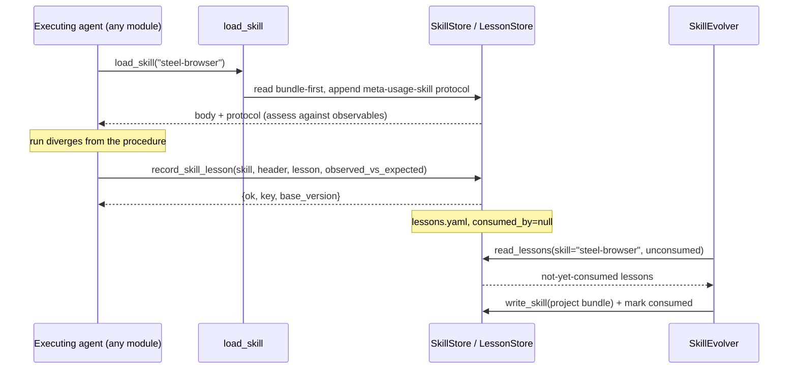

# Skill evolution (#232) - the intended end production system

*Status: DRAFT design, grilling food. This is the missing specification the #232 implementation hands off against: the skill-usage lesson layer (a note-taking tool bound to every skill-bound agent), the `SkillEvolver` agent, and the layout refactor of the persisted notes layer.*
*Base: `dev` HEAD `3af0f14` (the #222/#234/#220/#221/#223 workstreams merged). Companions: `progressive-skill-lifecycle-adr.md` (the session ADRs, parts A/B), `progressive-skill-lifecycle-system.md` (the earlier high-level draft), `skill-writing-primitives-spec.md` + `skill-writing-primitives-234-decisions.md` (the transitory system that landed), `skills-typed-surface-spec.md` and `skill-runtime-loading-222-decisions.md` (the #222 loader rules), issue #232 (the source spec).*
*Where this document contradicts an earlier draft, this document wins; the earlier draft's decisions were taken before the current code existed and several are now evidenced-wrong (see section 1).*

---

## 0. The three gaps

The transitory #234 system landed the skill read surface and the `write_skill` executor path.
The intended end system of #232 still misses three things:

1. **A skill-usage lesson layer.** The executing agent must be able to emit a reusable lesson about a skill it used, from every module, without choosing storage. Today no such surface exists (section 1).
2. **A `SkillEvolver`.** The agent that turns accumulated lessons plus existing skills into candidate revisions, with a profile, a lifecycle, a trigger, and a verifiability story (section 2).
3. **A layout refactor of the persisted notes layer.** The hunting notes surfaces are module-scoped, fault-keyed, and threefold; skill lessons are skill-scoped and cross-module. The persisted layer must move to one app-owned, skill-scoped home (section 3).

---

## 1. The skill-usage lesson layer

### 1.1 Evidence: the "notes store" the earlier draft assumed does not exist

The #234 draft (ADR B6) said lessons ride "the existing notes store; no new store and no new typed schema", keyed `skill:<skill_name>:<lesson_header>`.
The current code contradicts that premise on four points.

- **There are three notes surfaces, not one, and all are hunting-scoped.**
  - `NotesTool` (`src/polymerhus/attack/hunting/hunter_tools.py:514`) over `HunterMemoryStore` -> `<data>/<project_id>/hunting/hunter/notes.yaml` (`hunter_memory.py:242`).
  - `ProjectMemoryStore` (`hunt_store.py:625`).
  - `PodNoteTool` (`src/polymerhus/attack/hunting/pod/note_tool.py:81`) over `PodMemoryStore` -> `<root>/notes.yaml` (`pod_memory.py:223`).
- **The tool hard-requires a hunt identity.** `NotesTool._write` requires `fault_key` and validates it against a `HuntStore` (`_fault_key_violation`, returning `fault_key_mismatch`); `HunterMemoryStore.write_note` calls `_validate_fault_key`, which demands the 3-part config key `<unit_id>_<CWE_ID>_<vulnerability_class>` (`hunter_memory.py:267-279`). A `skill:<skill_name>:<header>` key is neither that grammar nor backed by a config, so it fails closed.
- **The note vocabulary is hunt-specific.** `kind` is `hypothesis_refusal | implicit_test_primitive | freeform`; `provenance` is the typed hunt `NoteProvenance` (`source`, `run_id`, `verdict_stub`, `probe_refs`). `PodNoteTool` has a third vocabulary and a `spec_id` + variant `order` identity.
- **Recon and analysis have no notes surface at all.** No notes tool, no store, no bucket. `PROJECT_SCAFFOLD` (`src/polymerhus/app/data_root.py:41`) reserves only `skills`, `auth`, `hunting/*`; there is no `recon/` or `analysis/` dir.
- D234-13 explicitly records the hole: "`source_note_ids` is a reserved parameter with **no notes system behind it**".

**Confirmed:** instrumenting all agents is not "just bind a tool" against an existing store. There is no generic store to bind, and the one that exists cannot accept a skill-scoped key.

### 1.2 Reflection: replicate the pattern, but for a new skill-scoped artifact

The question is whether to replicate the established data-model pattern for recon, or to introduce a new data model.

The established pattern, repeated three times in the codebase, is: an explicit-root per-project store resolved through `app.data_root.project_dir`, atomic whole-file writes (`temp + os.replace`), one `threading.Lock` per project, fail-open reads, strict writes, coded in-band envelopes (`hunt_store`, `app/auth/store.py`, `SkillStore`).

The lesson is **about a skill**, not about a hunt fault, a pod spec, or a recon run.
Its owner is therefore the skills-access domain (ADR B1), and it must be readable by the `SkillEvolver` alongside lessons written by any other module about the same skill.

A module-scoped notes store (a "recon notes") is the wrong axis: a lesson about `steel-browser` written during a recon run must sit beside a lesson about `steel-browser` written during a hunting run, not in a recon bucket.

**Decision (recommended): replicate the data-model pattern, but for a new skill-scoped artifact owned by the skills domain.**
This is simpler than reuse (no hunt coupling, no `fault_key`, no `HuntStore`) and simpler than per-module stores (one store, one binding edit instruments every agent), and it preserves domain ownership.
It supersedes ADR B6's "no new store" clause, whose premise was evidenced-wrong.

The alternative - a generic notes store in the app layer that every module keys arbitrarily - is rejected as the first move: it re-creates the exact "one store, many owners, no domain" ambiguity that produced the three hunting notes surfaces.

### 1.3 Proposal

**Layout.** A new file under the already-scaffolded skills directory; no scaffold change is needed (`skills` is reserved by `PROJECT_SCAFFOLD`).

```diff
 data/<project_id>/
 ├── skills/
+│   ├── lessons.yaml            # NEW: append-only skill-usage lessons (any skill)
 │   ├── <skill>/                # project skill bundles (existing #234)
 │   │   ├── SKILL.md
 │   │   └── references/
+│   └── lessons/                # OPTION B: one <skill>.yaml per skill (see 1.5)
 ├── auth/
 └── hunting/
```

**Record.** A minimal typed envelope with the prose in free text, mirroring the pod-notes lesson (the evolver needs `skill` and `base_version` structurally; a bare free-text body would force it to parse):

```yaml
- key: "skill:steel-browser:login-form-timing"
  skill: steel-browser
  base_version: "1.0"            # STORE-STAMPED from the bundle/catalogue metadata
  outcome: divergence            # divergence | extension | confirmation
  observed_vs_expected: "the form has no CSRF token; the procedure asserts it does"
  lesson: "probe the token field directly before the full submission"
  evidence: "run 41, step 7: POST without token returned 200"
  provenance: {run_id: ..., session_id: ..., module: recon, agent_role: triager, written_at: ...}
  consumed_by: null              # revision id, or null (see 1.5)
```

**Tool.** `record_skill_lesson(...)`, bound to the project, one call, coded in-band envelope, never a raise.
The agent never supplies the version or the provenance: the store stamps `base_version` (resolved through the same `SkillStore.meta` seam the loader uses) and the run/session provenance (from the ambient scope), exactly as the auth store stamps `origin`/`updated_at` server-side.
This respects D234-13's ruling that the reading agent receives skill text, never frontmatter metadata.

```text
record_skill_lesson(skill, lesson_header, lesson, observed_vs_expected="", evidence="", outcome="divergence")
  -> {ok: true, key, base_version} | {ok: false, error: skill_unknown|store_unavailable|lesson_invalid}
```

**Binding.** One edit instruments every agent: the lesson tool rides the same `SkillAgentBinding` as `load_skill` (`app/llm/skills.py:279`), so every bound (non-exempt) role gets it for free, and the exempt roster keeps paying nothing.

```diff
 def build_skill_tools(project_id, with_write_skill=False, store=None):
-    tools = [build_load_skill_tool(project_id, store=store)]
+    tools = [build_load_skill_tool(project_id, store=store),
+             build_record_lesson_tool(project_id, store=store)]
     if with_write_skill:
         tools.append(build_write_skill_tool(project_id, store=store))
     return tools
```

```diff
 recon configurator ─┐
 recon triager ──────┤
 analysis proposers ─┤   skill_agent_binding(role_id)   [ONE call, all roles]
 hunting hunter ─────┤        │
 pod runner ─────────┘        ├─ load_skill            (read)
                              ├─ record_skill_lesson   (NEW, universally bound)
                              └─ write_skill           (only with_write_skill)
```

**Why not route this through `write_skill`.** `write_skill` mutates the procedure; it stays gated to the auth-executing agents (`with_write_skill`).
`record_skill_lesson` is a cheap, safe, append-only observation; it is the one surface that is safe to bind universally, which is exactly what "instrument all agents" requires.
The trust boundary of #232 section 9 is preserved: an executor can always record a lesson but cannot publish a revision without the evolver (and, later, the admission gate).

### 1.4 Interaction, end to end



### 1.5 Open questions (grilling food)

1. **Single file vs per-skill shard.** `skills/lessons.yaml` (simple, one append log, mirrors the hunt notes) vs `skills/lessons/<skill>.yaml` (read-amplification-free, natural per-skill consumption). Recommendation: start with the single file; the skill count is small and the per-project lock already serialises it.
2. **Typed envelope vs free text.** B6 said no typed attributes. The evolver wants to filter by `skill`/`base_version` and to dedupe. Recommendation: the minimal envelope above, prose free.
3. **Consumed tracking without a cursor.** The draft forbids a high-water-mark store. Options: (a) derive the consumed set from the union of `source_note_ids` cited by existing revisions (no extra state, requires a revision index); (b) a per-record `consumed_by` stamp (a cursor at record grain, not a high-water-mark). Recommendation: (a) as the primary model, with (b) as the write-time stamp that makes (a) cheap.
4. **Lesson key uniqueness.** Is a repeated `skill:<name>:<header>` an append (a new lesson) or an update? Recommendation: append; the evolver reconciles.
5. **Should `meta-usage-skill` keep directing a direct `write_skill` for auth agents, or emit a lesson?** The migration boundary in the spec says only the body changes. Recommendation: keep `write_skill` for the authn procedure until the evolver takes it over.

---

## 2. The `SkillEvolver`

### 2.1 Profile

| Facet | Design |
|---|---|
| **Role id** | `skill_evolver` (declared in `ROLE_SKILLS`; a session-mode, stateful agent). |
| **Domain** | Skills-access (app layer), beside the loader/store/writer. Not recon, analysis, or hunting. |
| **Goal** | Turn accumulated lessons plus existing skills into candidate skill revisions (or new skills), grounded in cross-task/historical evidence, never opportunistically. |
| **Context** | The project's skill bundles, the shared catalogue, the lesson store, and version history. It never touches the live target, the graph, the auth records, or the hunt stores. |
| **Tools** | `list_skills`, `load_skill`, `read_lessons(skill, unconsumed_only)`, `write_skill` (project-bound), and a consumed-marking primitive (or the revision provenance is the mark). |
| **Skills** | `meta/meta-write-skill` (the authoring discipline, reused unchanged - content-stable per D234-9); task-specific `meta/*` skills (e.g. `meta/authn-skill-writing`) as they land. `meta-usage-skill` is NOT appended to the evolver (it is a usage protocol, not an authoring one). |
| **Data access** | Read+write `data/<pid>/skills/**` (bundles + lessons); read the shared `skills/` catalogue; read the lesson store. Nothing else. |
| **Observability** | Langfuse run trace: the consumed lesson ids, the produced revision, the base version, and the acceptance/rejection outcome as metadata + scores; fail-open (the existing observability canon). |
| **Functional verifiability** | A revision is structurally valid (frontmatter, `name == dir`, size), cites its base version, and carries provenance. The unconsumed-diff is deterministic (same lesson set -> same selection). |
| **Quality verifiability** | The produced procedure meets the `writing-great-skills` bar (compact, no sediment, no no-ops, positive instruction, disclosure ladder); the claim-criticality rule (D234-13) holds: every divergence/lack claim is grounded on objective evidence, defensible from any perspective. Evaluation cases (generated per #232 section 5) score the revision. |

### 2.2 Workflow

The #232 section 5 procedure, made concrete:

```text
arun_evolution_pass(project_id, skill)
  inspect        load the skill + its version + its unconsumed lessons
  decide         create a new skill | update the existing one | no write (zero-skip)
  produce        draft the candidate procedure (meta-write-skill discipline)
  validate       structural: frontmatter, name==dir, size; refute on failure
  evaluate       generate evaluation cases; score the candidate vs the base
  iterate        bounded re-draft while the score improves
  publish        write_skill(project bundle) + bump metadata.version + cite provenance
```

- **Zero-skip default.** No objectively-grounded change -> no write (D234-13's anti-oscillation rule). An unevidenced flip-flop has no path.
- **One revision per skill per pass.** Bounded blast radius and a clean audit trail.
- **Project bundle only.** Canonical `skills/` promotion waits for the admission gate (section 2.5).
- **Content-only revisions.** The revision touches the body; `name`/`description`/`version` stay store-owned (D234-15).

### 2.3 Lifecycle and trigger

- **Systematic, control-plane-triggered, never opportunistic** (ADR B7). Candidate triggers: at the close of a run that emitted lessons; or a periodic tick over projects that have unconsumed lessons. Recommendation: end-of-run plus a manual/operator invocation, so the first build is testable without a scheduler.
- **Coverage without a cursor.** The evolver selects all lessons whose `consumed_by` is null (or unreferenced by any revision) for the target skill, and injects them into its turn. A previously-consumed lesson re-surfaces naturally through the revision's provenance.
- **Idempotent re-entry.** Re-running a pass with no new lessons produces no write.
- **Reap/stop** follows the module runtime seam (the actor runtime, `app/llm/actor.py`), like the hunting actors.

### 2.4 Meta-skill-writing skill

- `meta/meta-write-skill` is the authoring procedure and is reused **unchanged** (the content-stability test of the #234 migration).
- The #232 section 5 "`skill-creator` / `skill-evolver`" meta-skill is therefore `meta-write-skill`; no new authoring skill is required for the first build.
- The evolution *procedure* (inspect/decide/validate/evaluate/publish) is the evolver's harness workflow, not a skill - it is code, not procedural knowledge the agent loads.
- If a distinct evolution-procedure meta-skill is later wanted, it lands under `skills/meta/` and is exempt by the existing `is_meta_skill` path rule.

### 2.5 Trust boundary and the admission gate

- Executors write lessons (section 1) and, transitionally, their own project bundle.
- The evolver writes project bundles.
- Canonical `skills/` is promoted only through the future evaluation/admission gate (#232 sections 5-6), which is out of scope for the first build.
- A revision is reversible: `metadata.version` is monotonic, the base version is cited, and traces carry the run.

---

## 3. The persisted notes-layer layout refactor

### 3.1 Current state

Three hunting-scoped notes files plus a project-config file, all under the app root after #234's migration but each module-keyed by fault/config/spec.

### 3.2 Target

```diff
 data/<project_id>/
 ├── skills/
 │   ├── lessons.yaml          # skill lessons (NEW, section 1)
 │   └── <skill>/
 ├── auth/
 └── hunting/
     ├── orchestration/
     │   ├── hunt_configs/{produced,consumed}/
     │   └── notes.yaml        # orchestrator notes (config-keyed) - stay put
     ├── hunter/
     │   ├── test-specs/<fault_key>/
     │   └── notes.yaml        # hunter notes (fault-keyed) - stay put
     └── test-executor-pod/
         └── notes.yaml        # pod notes (spec-keyed) - stay put
```

- The hunting notes files are domain-correct as they are: they are keyed by hunting identities and consumed by hunting agents. They are **not** refactored into the lesson store; that would be the wrong axis (section 1.2).
- The refactor the target system needs is the **addition** of the skill-scoped lesson file and its owner, not the migration of the hunting notes.
- The one genuine layout concern is consistency: the new lesson store must resolve through `app.data_root.project_dir(project_id, "skills")`, so no new path spelling exists.

### 3.3 Open question (grilling food)

- **Is a single app-layer notes abstraction worth it?** After the lesson store lands there are four notes-shaped surfaces with four contracts. A unifying read interface (`read_notes(scope, filters)`) could reduce cognitive load, but risks re-creating the "many owners, one store" ambiguity. Recommendation: keep the four stores separate; share only the physical idiom (atomic write + per-project lock), which they already do.

---

## 4. Mapping to #232

| #232 | This design |
|---|---|
| section 1 learning signal | the lesson record (section 1.3) |
| section 2 `SkillProvider` | the two-source store seam (`SkillStore` + catalogue) is the proto-provider; a filesystem/REST abstraction stays future |
| section 3 progressive access | bundle layout + `references/` pointers (already landed) |
| section 4 `SkillEvolver` | section 2 |
| section 5 meta-writing skill | `meta/meta-write-skill`, reused |
| section 5.5 usage protocol | `meta-usage-skill`, appended by `load_skill` (already landed) |
| section 6 evaluation/admission | future; project-scoped now |
| section 7 trajectory/knowledge/skill split | lessons (experience) vs bundles (skill); two stores |
| section 8 versioning/provenance | `metadata.version` + `source_note_ids` + lesson `base_version` |
| section 9 trust boundary | executors write lessons; bundles by evolver; canonical gated |

---

## 5. Build order (recommended)

1. The lesson store + `record_skill_lesson` + the universal binding (section 1) - unblocks the evolver and instruments all agents.
2. The `SkillEvolver` harness + role (section 2) - reads lessons, writes project bundles.
3. `meta-usage-skill` body migration (direct write -> lesson emission) once the evolver owns production.
4. Canonical promotion + admission gate (future, out of scope).

## 6. Out of scope

- Structural/triggering/behavioural evaluation, admission policy, canonical publication and rollback (#232 sections 5-6).
- `SkillProvider` as a filesystem/REST abstraction.
- Any change to the hunting notes contracts or to the #234 `write_skill` contract.
