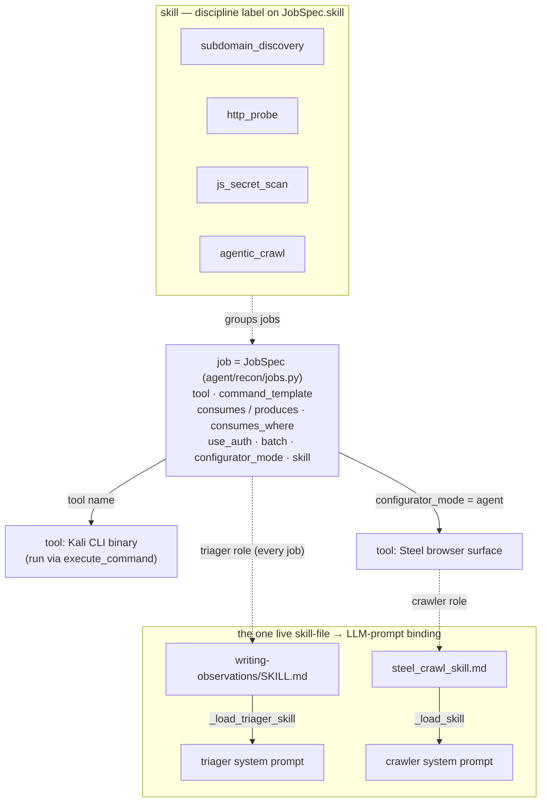
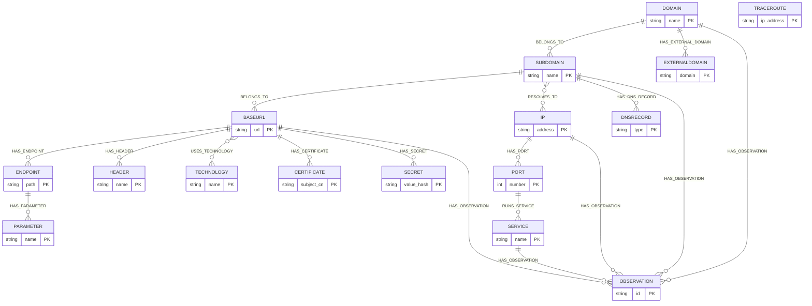
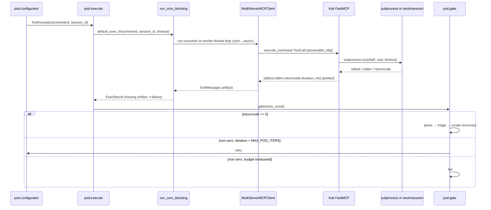
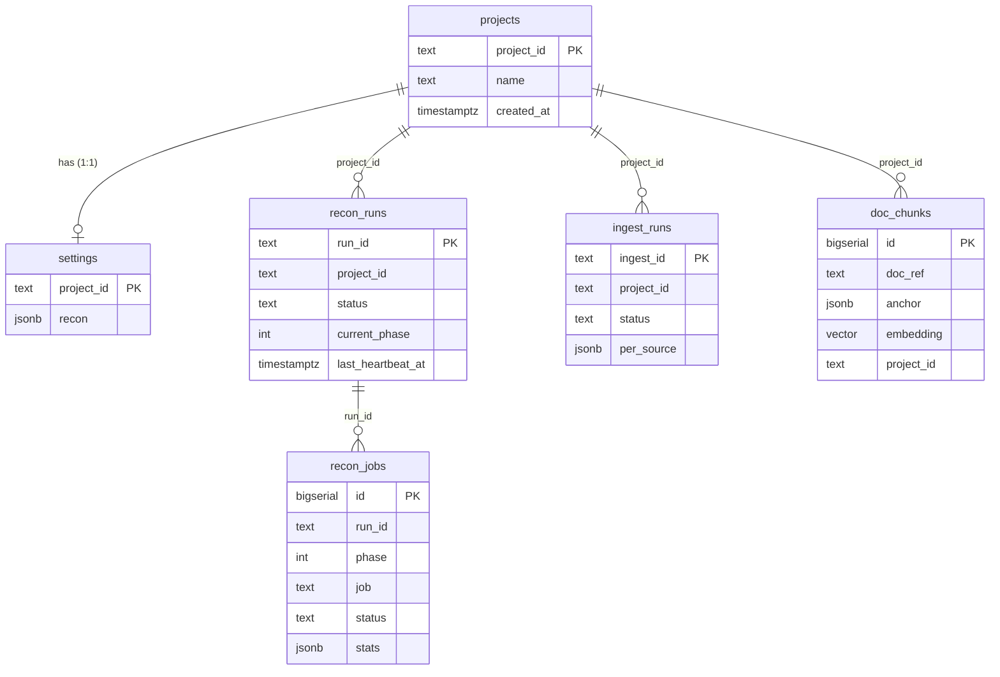
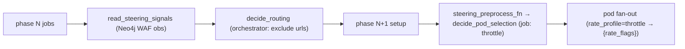

# polymerhus — Technical Architecture

*Internal technical design of each macro component. Diátaxis register: Explanation + Reference.*
*The code is the source of truth; where an existing prose doc disagrees, the code wins and the divergence is flagged inline.*

## Purpose and how to read this

This is the middle document of the top-down set. The [system topology doc](./system-topology.md) answers *what are the running pieces and by which wire does each pair talk*; this document goes one level deeper — *how each macro component is built and why* — while staying one level above line-by-line code. The [technological-architecture doc](./technological-architecture.md) sits one level below it, covering framework and runtime mechanics (LangGraph state machines, the artifact taxonomy, container/protocol plumbing).

Five macro components are covered: the **agent container** (gaps only — its LangGraph pipeline is already authoritative in [`recon-pipeline-design.md`](./recon-pipeline-design.md)), **Neo4j** (the attack-surface graph), **Kali** (tool-call execution), **Postgres** (the application domain model), and the **frontend** (brief). Read a component's prose first, then its diagram as reference.

A note on the authoritative design doc: `recon-pipeline-design.md` is marked authoritative and grounds every claim in `path:line`, but its §1 has drifted behind the code in two places flagged below — the triager skill is now wired, and a web frontend now exists. The code wins.

---

## 1. Agent container — technical gaps

> **Already covered elsewhere → pointer.** The phase barrier, the two-level job/pod nesting, the `Send` fan-out, the pod state machine, and the `asset_context` channel are documented in `recon-pipeline-design.md` (§3, §4) and the technological-architecture doc. This section covers only three gaps: the **skill/job/tool taxonomy**, the **execution steering points**, and the **bundled FastAPI backend**. Everything else about the pipeline: see those two docs.

### 1.1 The skill / job / tool taxonomy

The pipeline's vocabulary has three layers that are easy to conflate. From the bottom up: a **tool** is an executable capability — almost always a Kali CLI binary (`subfinder`, `httpx`, `ffuf`), invoked through the single Kali MCP `execute_command` surface, with the one agentic exception (`steel_crawl`) driving the Steel browser instead. A **job** wraps a tool with everything the pipeline needs to schedule and run it: a `JobSpec` (`agent/recon/types.py:49`) carrying the `tool` name, a `command_template`, an IO contract (`consumes` one Layer-0 label, `produces` a list of them), an optional `consumes_where` selector to narrow inputs, and flags — `use_auth`, `batch`, `configurator_mode`, and a `skill` label. A **skill** is the discipline an LLM role applies; jobs group under skill labels like `subdomain_discovery` (subfinder + amass share it), `http_probe`, `agentic_crawl`, and `js_secret_scan`.

The `JOBS` registry (`agent/recon/jobs.py:17`) holds 17 jobs, and `PHASES` (`jobs.py:225`) orders them into a 10-phase DAG rooted at subdomain discovery. Each job's `consumes` type must be either the pre-seeded `Domain` root, the seed host injected into every `Subdomain`-consuming job (`pipeline._inject_seed_host`), or a type produced by an earlier phase — `validate_job_subset` enforces this. The DAG encodes real data dependencies discovered in production: `jsluice` sits in its own phase *after* `katana` because it consumes the `.js`/`.mjs` `Endpoint`s katana crawls up (`consumes_where` = path ends-with `.js`/`.mjs`), and a reprofile pass (`httpx_reprofile`) re-probes crawler- and JS-derived BaseURLs so the later API-enumeration jobs (`kiterunner` gated to `profile==restapi`, `graphql-cop` to `profile==graphql_api`) finally see the JS-derived API surface.

The subtlety the taxonomy hinges on: **`JobSpec.skill` is a bare label, not a loaded artifact.** It groups jobs and documents intent, but for 16 of 17 jobs nothing reads a file from it. The *one* place a skill becomes a live artifact is the triager. `pod.py::_load_triager_skill` (`pod.py:415`) reads `skills/recon/triager/writing-observations/SKILL.md`, strips its YAML frontmatter, and injects the body verbatim as the triager LLM's `SystemMessage` (`pod.py:478`) — single-sourcing the prompt from the skill file so hardening the skill hardens the live triager with no copy to keep in sync (it degrades to no system prompt if the mount is missing). The agentic crawler does the same via `crawl_agent._load_skill` reading `steel_crawl_skill.md`. So "skill" is a real, testable artifact for exactly two roles (triager, crawler) and a label everywhere else.

**Status caveat (design-doc-confirmed).** The taxonomy is only partially realized. There is no `skill_for(role, job)` resolver — `agent/recon/skills.py` does not exist; `_load_triager_skill` hardcodes the path rather than resolving it from `job.skill`. `recon-pipeline-design.md` §1 further states the SKILL.md file "exists on disk but is not loaded by pod.py." **This is now stale: the code wins.** `_load_triager_skill` *is* wired into `default_triage_fn`, so the live triager prompt is the skill file, not the inline string the doc cites. The remaining gap (no `skill_for`, `JobSpec.skill` inert for selection) stands.

### 1.2 Execution steering points

The pipeline adapts to WAF detection through two *distinct* control loops that share primitives in `steering.py` but own their own decisions. Both are fed by `read_steering_signals` (`pipeline.py:148`), a deliberately separate Neo4j read — from the label-allowlist-clean `read_assets` — that returns WAF `Observation`s (`macro_kind` in `{waf_protected, waf_detection}`) anchored to `BaseURL` nodes. Both are **fail-open**: any LLM or parse error returns the neutral decision, so a steering blip degrades adaptivity but never the run.

The first loop is **orchestrator cross-job routing between phases**. Between phases, `run_pipeline` calls `decide_routing(signals, phase_jobs)` (`orchestrator_agent.py:58`, invoked at `pipeline.py:273`) only when signals exist. The orchestrator agent reasons about which upcoming job should *not* receive which flagged host, returning `{job_name: [urls to exclude]}`. The intent, framed in `ORCHESTRATOR_STEERING` over the shared `STEERING_PRIMITIVES`: a WAF's bot-blocking is IP-based, so request-based crawlers (`katana`/`ffuf`/`kiterunner`/`graphql-cop`) egressing from the pipeline IP keep getting 403s — route the flagged host *away* from them and toward `steel_crawl`, which egresses from separate cloud-browser infrastructure and presents a real browser. The pipeline then filters those URLs out of the excluded jobs' input sets (`pipeline.py:306`).

The second loop is **per-asset throttling within a job**. The job agent's `steering_preprocess_fn` (`job_agent.py:153`), when `extra["steering"]` is present, calls `decide_pod_selection(signals, job.tool, assets)` (`job_agent.py:127`) to decide which candidate assets to *throttle* — it never drops an asset (selection is the orchestrator's job). A throttled asset carries `extra["rate_profile"] = "throttle"`, which `fill_template` turns into the tool's `{rate_flags}` slot (`pod.py:94,122`). Today only `ffuf` carries that slot: it consumes `BaseURL`, so a WAF-flagged host actually reaches `decide_pod_selection`, whereas `httpx` runs in the detection phase *before* any WAF signal exists, so its slot was a dead no-op and was removed. Throttling is a preventive lever against a not-yet-flagged host; it cannot un-flag an already-flagged IP.

Below both, the pod has its own **retry gate** (`pod.py:219`). After `execute`, the `gate` node routes a clean exit (`returncode == 0`) to the parser — even with empty stdout, which is a valid zero-finding result — and a non-zero exit back to `configurator` for retry, up to `MAX_POD_ITERS`, then to `fail`. This is a local reliability loop, orthogonal to the two steering loops above.

### 1.3 The bundled FastAPI backend

The agent container is not just the pipeline: `agent/app` is a FastAPI application (`main.py`) that fronts both databases and is the *only* way to drive the system. `routes.py` exposes the surface below; every write to project state, every run launch, and every status poll goes through it.

| Method & path | Purpose | Backend |
|---|---|---|
| `POST /projects` | Create a project (UUID) | Postgres |
| `GET /projects` | List projects | Postgres |
| `PUT /projects/{id}/settings` | Save `recon` settings (validated, deep-merged) | Postgres |
| `POST /projects/{id}/recon` | Launch a run, non-blocking, returns `{run_id}` | Postgres + pipeline |
| `GET /projects/{id}/recon/{run_id}` | Poll run status + per-job rows | Postgres |
| `GET /runs?status=running` | Running runs with `live`/`stalled` liveness | Postgres |
| `GET /projects/{id}/graph` | Live attack-surface graph for the SPA | Neo4j |
| `GET /health` | Per-backend health with error strings | all three |

The launch seam is deliberately non-blocking. `launch_recon` validates the job subset and refuses a targetless run (which would silently fall back to `example.com`), synchronously creates the run row so an immediate poll sees it, then calls `_launch_pipeline` (`routes.py:172`) — a module-level `asyncio.create_task` wrapper that fires `run_pipeline` and returns `{run_id}` at once. Making `_launch_pipeline` a module seam lets tests monkeypatch it with a recorder instead of exercising the whole pipeline/DB/Kali/Neo4j stack.

The **run registry** lives in Postgres (`clients/pg.py`) and is defended by a heartbeat/reaper pair. `run_pipeline` runs a `_heartbeat_loop` (`pipeline.py:179`) that bumps `last_heartbeat_at` every tick via `asyncio.to_thread` (so the blocking write never stalls the API loop); `GET /runs` derives `live`/`stalled` from a TTL against that timestamp, and `main.py`'s `_reaper_loop` sweeps runs whose heartbeat has gone stale (or whose process crashed) to `failed`. `/health` runs an independent check per backend (`pg.check`, `neo4j_client.check`, `await kali_mcp.check`) and reports *why* a backend is down, not just a boolean, so a degraded stack is diagnosable from the endpoint alone. The live graph read (`GET …/graph`) delegates to `graph_read.fetch_project_graph`, covered in §2.

The graph itself is read for the SPA by `graph_read.py`: one Cypher query (`_GRAPH_CYPHER`) matches every project-scoped node with an `OPTIONAL MATCH` on outgoing relationships (so zero-degree nodes still return), and `format_graph_records` normalizes it into the `{nodes, links}` contract, coercing Neo4j temporal/spatial property types into JSON-safe primitives so serialization never 500s.

---

## 2. Neo4j — the attack-surface graph

Neo4j holds a **Layer-0 descriptive attack-surface graph**: 15 entity labels plus an `Observation` node, every node scoped by `project_id` for multi-tenant identity. The schema (`db/neo4j/schema.py`) is pure DDL — uniqueness constraints that double as identity keys, plus tenant and lookup indexes. The identity key is what makes a MERGE idempotent: re-running a tool re-asserts the same node rather than duplicating it.

| Label | Identity key (uniqueness constraint) | Represents |
|---|---|---|
| `Domain` | `(name, project_id)` | An engagement-root / registrable domain |
| `Subdomain` | `(name, project_id)` | A discovered host under a domain |
| `IP` | `(address, project_id)` | A resolved IP address |
| `Port` | `(number, protocol, ip_address, project_id)` | An open port on an IP |
| `Service` | `(name, port_number, ip_address, project_id)` | A service behind a port |
| `DNSRecord` | `(type, value, subdomain, project_id)` | A DNS record on a subdomain |
| `BaseURL` | `(url, project_id)` | A web origin (scheme+host+port) |
| `Endpoint` | `(path, method, baseurl, project_id)` | A path/method on a BaseURL |
| `Parameter` | `(name, position, endpoint_path, baseurl, project_id)` | An input on an endpoint |
| `Header` | `(name, value, baseurl, project_id)` | A response header |
| `Certificate` | `(subject_cn, project_id)` | A TLS certificate |
| `Technology` | `(name, version, project_id)` | A fingerprinted product |
| `Secret` | `(value_hash, project_id)` | A secret found in a JS bundle |
| `Traceroute` | `(ip_address, project_id)` | A path to an IP *(label reserved; no producer wires it today)* |
| `ExternalDomain` | `(domain, project_id)` | An out-of-scope domain a subdomain points at (takeover) |
| `Observation` | `(id)` — sha1 of `macro_kind\|evidence\|anchor\|source_tool` | An NL security judgement on a broad anchor |

**The single write chokepoint.** `curator.curate` (`curator.py:226`) is the *only* graph-write path for recon assets. Every source — including `steel_crawl` — funnels its `AssetDelta`/`Observation` records through it, so scope and safety rules apply once and cover all tools. `curate` injects `project_id`, calls the pure builders per item, and skips-and-logs single-item failures so one bad delta never aborts a batch. `build_asset_cypher` emits a `MERGE` on the identity key (raising if the label is not in `ALLOWED_LABELS`), stamps `first_seen`/`last_seen`, and mints each edge from the delta's `edges`; `build_observation_cypher` mints the `HAS_OBSERVATION` edge from an anchor to the `Observation`.

**Typed relationships** are minted by the deterministic parsers (as `AssetDelta.edges`, each an `Edge` with `rel`/`dir`) and realized by `build_asset_cypher`. The canonical directed set:

- `(:Subdomain)-[:BELONGS_TO]->(:Domain)` and `(:BaseURL)-[:BELONGS_TO]->(:Subdomain)` — the `Domain → Subdomain → BaseURL` spine (`subdomain_parser`, `httpx_parser`).
- `(:Subdomain)-[:RESOLVES_TO]->(:IP)` and `(:Subdomain)-[:HAS_DNS_RECORD]->(:DNSRecord)` (`subdomain_parser`, `dns_parser`).
- `(:IP)-[:HAS_PORT]->(:Port)-[:RUNS_SERVICE]->(:Service)` (`naabu_parser`).
- `(:BaseURL)-[:HAS_ENDPOINT]->(:Endpoint)-[:HAS_PARAMETER]->(:Parameter)` (`_urls`, `steel_parser`, `active_param_parser`).
- `(:BaseURL)-[:HAS_HEADER]->(:Header)`, `(:BaseURL)-[:USES_TECHNOLOGY]->(:Technology)`, `(:BaseURL)-[:HAS_CERTIFICATE]->(:Certificate)` (`httpx_parser`).
- `(:BaseURL)-[:HAS_SECRET]->(:Secret)` (`jsluice_parser`).
- `(:Domain)-[:HAS_EXTERNAL_DOMAIN]->(:ExternalDomain)` (`takeover_parser`).

**Why anchors are broad.** `ANCHOR_ALLOWLIST` restricts `Observation` anchors to `{Domain, Subdomain, BaseURL, IP, Service}` — deliberately broad, well-identified nodes. The triager is instructed (in the `writing-observations` skill) to re-anchor a finding *up* to the owning broad asset and name the narrow element in `evidence`; an out-of-allowlist anchor (Endpoint/Technology/Parameter/…) is a triager error, correctly dropped, because widening the set would only mask mis-anchoring and fragment the host-level observation graph. As a belt-and-suspenders net, the **D8 deterministic re-anchor repair** (`broaden_anchor`, `curator.py:72`) rescues a mis-anchored observation by *pure identity-key derivation* — an Endpoint/Header/Parameter's owning `BaseURL` is already carried in its `baseurl` key, a Port's owning `IP` in `ip_address` — re-anchoring up and preserving the narrow identity in `evidence`. `Technology` (global `{name, version}`, no owner key) is deliberately unrepairable and falls through to drop-and-log.

Finally, `project_id` scopes every node and every read, and `curate`'s `scope_domain` argument drops out-of-scope BaseURLs (and everything anchored to them — the social/analytics origins httpx and katana surface from page links) right at the chokepoint, so out-of-scope surface never enters the graph.

*(Every entity's true identity key also includes `project_id`; the diagram shows the discriminating field. `TRACEROUTE` is a reserved label with no producer edge today. `RESOLVES_TO` and `USES_TECHNOLOGY` are drawn many-to-many because an IP/technology is shared across hosts.)*

---

## 3. Kali — tool-call handling, end to end

A tool call travels from a pod's intent to a graph-ready result across a sync↔async boundary and a process boundary. Trace one `execute_command`:

The pod's **`configurator`** node builds the command string. For a normal job it calls `fill_template` (`pod.py:66`), substituting `{target}`/`{domain}`/`{baseurl}`/`{session}` from the input asset and `{auth_header}` via `_auth_header` when the job is `use_auth` and settings carry an `auth_context`. `_auth_header` (`pod.py:155`) speaks each tool's header dialect: the default repeated `-H "k: v"` flags for httpx/katana/ffuf/kiterunner, arjun's single newline-joined `--headers` blob, and graphql-cop's comma-joined `Key:Value` `--headers` argument — every value `shlex`-quoted so an operator token can never break the command. A batched job (`jsluice`) skips template-fill entirely and builds its command from the bundle batch via `batching.build_batch_command`.

The **`execute`** node calls the injected `exec_fn` — in production `default_exec_fn` (`pod.py:362`). It lazily builds a `MultiServerMCPClient` pointed at `config.KALI_MCP_URL` with `transport="streamable_http"`, resolves the `execute_command` tool, and invokes it **as a `ToolCall`** (not a plain dict) — this is load-bearing: a plain-dict invocation drops the structured artifact and returns only bare string content. Because the pod node is a sync function running inside the async pipeline, it crosses the boundary through **`run_coro_blocking`** (`async_bridge.py:32`): no running loop → `asyncio.run`; a running loop (the usual case) → run the coroutine on a fresh loop in a worker thread, never re-entering `asyncio.run` on the calling thread.

On the far side, the Kali container's **FastMCP server** (`kali/mcp_server.py`) runs `execute_command`: it `makedirs` a per-session `/work/{session_id}` working directory (so concurrent pods never collide on files like `ffuf.json`), runs the command with `subprocess.run(shell=True, cwd=workdir, timeout=timeout_s)`, maps a timeout to returncode **124**, strips ANSI escapes from both streams, and returns `{stdout, stderr, returncode, duration_ms}`. `PATH` is primed for the ProjectDiscovery + gap-filled tools (`postrun.sh` installs the binaries the reused image lacks into a persisted `/opt/localbin`). There is **no scope enforcement server-side** (MVP): the container reaches lab targets via a compose `extra_hosts` route, and scope is enforced later, at the curator.

Back in the pod, **`_exec_result_from_artifact`** (`pod.py:327`) reconstructs an `ExecResult` from the ToolMessage's `.artifact` (registered `content_and_artifact`, so the structured payload rides in `.artifact`, raw or wrapped under `structured_content`). The critical rule: **a missing structured artifact is treated as failure, not success** — without a real `returncode` there is no evidence the command exited 0, so it must not be assumed. The **`gate`** node then branches on that returncode: `0` → `parser` (parse stdout → assets → triager → curator → success export), non-zero → retry via `configurator` up to `MAX_POD_ITERS`, then → `fail`.

---

## 4. Postgres — the application domain model

Postgres holds the **application state** the pipeline reads and writes: project configuration, run/job bookkeeping, the document-ingestion corpus, and — colocated — LangGraph's own checkpoints. The schema is `db/postgres/init.sql`; the access layer is `clients/pg.py`. The design mixes relational tables (identity, run tracking) with **JSONB** columns for open-ended, evolving payloads.

A `project` has **one** `settings` row (PK/FK on `project_id`, `ON DELETE CASCADE`) whose `recon` JSONB blob holds `target_domain`, `auth_context` (cookies, arbitrary headers, optional autonomous-login `credentials`), and scope. Settings are written by `save_settings` with a **recursive `jsonb_deep_merge`** (a custom SQL function) rather than a plain `||`. The reason is correctness of partial PUTs: a PUT that only sets `auth_context.credentials` must not wipe a previously-stored `auth_context.cookies`, and a PUT that only adds `auth_context` must not drop `target_domain` (which would silently fall back to the `example.com` placeholder). `jsonb_deep_merge` descends into nested objects; scalars and arrays (the cookies list) are still replaced wholesale, so setting cookies overwrites the list as expected.

A `recon_run` has **many** `recon_jobs` (keyed by `UNIQUE(run_id, phase, job)`, so `upsert_job` is idempotent). The run row is the registry the API polls: `status`, `current_phase`, and `last_heartbeat_at` (the liveness signal the reaper reads). Each job row carries a `stats` JSONB blob recording per-job data lineage — pods run, succeeded/failed, `consumed` input count, and `produced_assets`/`produced_observations` merged into the graph — so "which phases ran with what data" is verifiable from state rather than reconstructed. `ingest_runs` tracks the parallel document-ingestion subsystem, and `doc_chunks` is its corpus: chunked text with a **pgvector `vector(1024)`** embedding, an **HNSW cosine** index (`vector_cosine_ops`) for similarity search, and a GIN index on the JSONB `anchor`.

Finally, LangGraph's checkpoint tables live in this same database. `pg.ensure_checkpoint_tables` runs `AsyncPostgresSaver.setup()` at startup, so pipeline durability and application state share one Postgres — no separate checkpoint store.

*(`recon_runs.project_id` / `recon_jobs.run_id` / `ingest_runs.project_id` / `doc_chunks.project_id` are logical foreign keys — referenced in queries but not declared as DB-level FK constraints. LangGraph checkpoint tables also live in this database, created by `AsyncPostgresSaver.setup()`.)*

The steering decisions of §1.2 sit *outside* Postgres — they read WAF `Observation`s from Neo4j — but relative to the phase loop they slot in exactly here:

---

## 5. Frontend — brief

The frontend (`frontend/src/`) is a **client-side-rendered SPA** (Vite/React, `react-router-dom`) and a **read-only viewer**. `App.tsx` declares three routes: a projects list (`/`), a live graph (`/p/:id`), and a run-status page (`/p/:id/runs`). Because it is CSR, `index.html` ships an empty root and React renders everything in the browser after fetching JSON from the agent's REST API (`api/client.ts` — `getProjects`, `getGraph`, `getRunningRuns`, base URL from `VITE_AGENT_BASE_URL`); there is no server-side render, so the API is the sole data source. The graph view is a `react-force-graph-2d` canvas (`graph/GraphCanvas.tsx`) fed directly by `GET /projects/{id}/graph`, colouring nodes by label and showing a per-node attribute tooltip whose content is HTML-escaped because it originates from scanned third-party targets. For the rendering/build pipeline and how the SPA is served, → see the technological-architecture doc.

**Flag:** `recon-pipeline-design.md` §1 states "no web frontend." That is now stale — the SPA exists and consumes the documented endpoints. The code wins.

---

## 6. Pointers

- **Topology** (running pieces, network placement, wire+protocol per link): [`system-topology.md`](./system-topology.md).
- **Technological architecture** (LangGraph runtime and state-machine mechanics, artifact taxonomy, container/protocol plumbing, frontend build): [`technological-architecture.md`](./technological-architecture.md).
- **Authoritative pipeline design** (phase barrier, job/pod/crawl graphs, `asset_context`, the validated end-to-end run): [`recon-pipeline-design.md`](./recon-pipeline-design.md), with `recon-pipeline-forward-decisions.md` for deferred decisions.

**Code-vs-doc discrepancies flagged in this document:** (1) the triager skill file is now loaded and single-sourced into the live prompt (`pod.py::_load_triager_skill`), contra `recon-pipeline-design.md` §1; (2) a web frontend now exists, contra the same §1's "no web frontend"; (3) the skill taxonomy remains partially realized — no `skill_for` resolver, `JobSpec.skill` inert for selection; (4) the phase DAG has grown to 10 phases / 17 jobs (post-D27 reprofile pass and D17 jsluice split), where older prose cites 6 phases.
