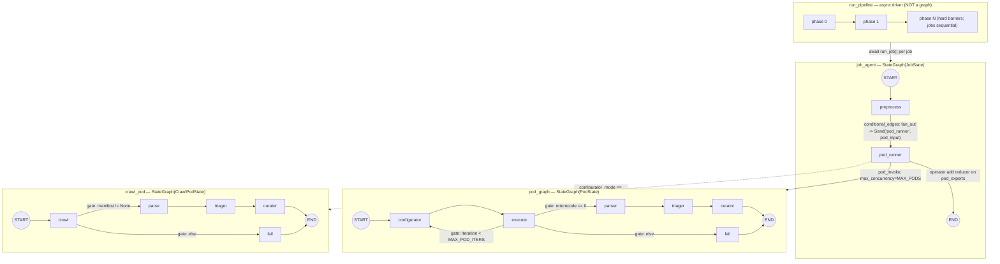
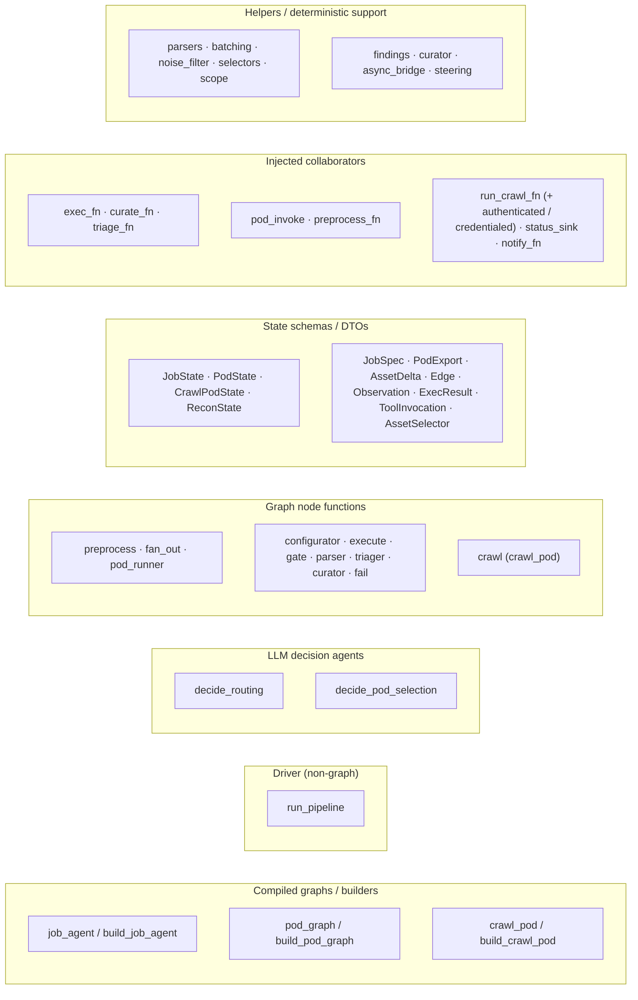
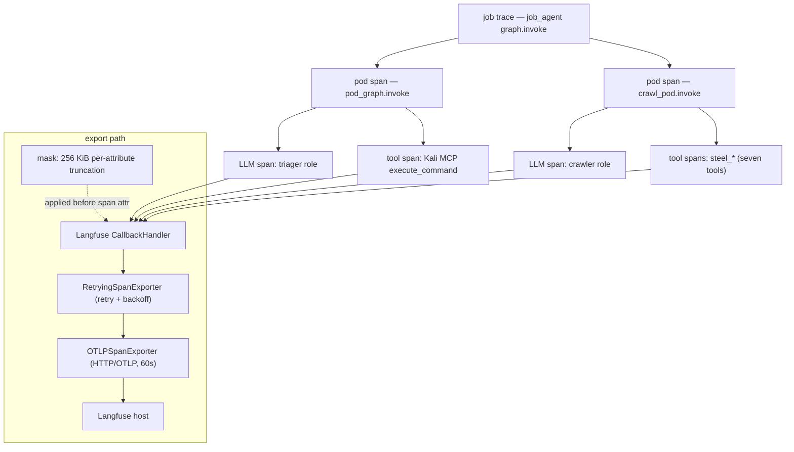

# Technological Architecture — Agent Container & Frontend

**Register:** Reference + Explanation. **Scope:** two components only — the
Python **agent container** (heavy) and the **frontend** SPA (light). This is the
deepest document of the set: it catalogues *what the system is built on, how each
framework is configured, and every LangGraph artifact in the agent codebase*.

**How to read this.** Sections 2–7 are the agent, weighted toward §4, the
class-grouped LangGraph artifact inventory — the centrepiece. If you are trying
to point at a graph, node, agent, state schema, or injected collaborator and ask
"which class does this belong to and what does it do," go straight to §4. The
config-choice prose (§3) explains the *why* behind the two-level graph nesting
and the injected-collaborator pattern; the tables elsewhere are reference-grade
and cite a source file for every claim. Container/network topology, the Neo4j
entity model, the Postgres schema, and Kali call-handling as a *function* live in
the topology doc (`01-system-topology.prompt.md`) and the recon technical /
design docs (`recon-pipeline-design.md`); this document references them and does
not repeat them. The functional "what the pipeline discovers" narrative also
belongs to `recon-pipeline-design.md`.

The code is the source of truth throughout. Where a config choice has a
documented rationale in a code comment or design doc, it is given.

---

## 2. Agent — Framework Stack

The agent runs from the `redamon-agent:latest` base image (`agent/Dockerfile`),
which already ships the orchestration and LLM libraries; the Dockerfile layers
only two thin `pip install` steps on top — `requirements-observability.txt`
(Langfuse) and `requirements-crawl.txt` (Steel/Playwright) — because "the base
image was assumed to provide these but does not" for crawl, and because baking
Langfuse in "lets operators enable tracing purely via `LANGFUSE_*` env vars." The
container entrypoint is `uvicorn agent.app.main:app --host 0.0.0.0 --port 8080`.

Because the orchestration/LLM libraries come from the base image, their versions
are **not pinned in-repo** (marked *unpinned (base image)* below). The
platform-stack implementation plan (`docs/design/plans/2026-07-02-platform-stack-implementation-plan.md`)
documents the base image as **Python 3.11** and enumerates what it provides;
the host dev/test toolchain, by contrast, runs Python 3.13 (its `pytest` bytecode
artifacts are `cpython-313`). Only three files pin versions directly:
`requirements-observability.txt`, `requirements-crawl.txt`, and the host-only
`requirements-dev.txt`.

| Purpose | Component | Version | Source |
|---|---|---|---|
| Runtime | Python (production container) | 3.11 (base image) | platform-stack plan |
| Runtime | Python (dev/test toolchain) | 3.13 | `cpython-313` test bytecode |
| Web framework | FastAPI + `uvicorn` | unpinned (base image) | `agent/app/main.py`, `Dockerfile` CMD |
| Orchestration | LangGraph | unpinned (base image); verified against **1.2.7** | `agent/recon/job_agent.py` comment |
| Orchestration | LangChain core | unpinned (base image) | `pod.py`, `crawl_agentic.py` imports |
| LLM client | `langchain-openai` (`ChatOpenAI`) | unpinned (base image) | `agent/app/llm/providers.py` |
| Tool transport | `langchain-mcp-adapters` (`MultiServerMCPClient`) | unpinned (base image) | `pod.py::default_exec_fn` |
| Graph data | `neo4j` driver | 5.27.0 (dev); server `neo4j:5.26-community` | `requirements-dev.txt`; platform plan |
| Checkpoint / registry | `psycopg[binary]` + `AsyncPostgresSaver` | psycopg 3.2.3 (dev); saver from base image | `requirements-dev.txt`; `main.py` startup |
| Observability | `langfuse` | **4.13.0** | `requirements-observability.txt` |
| Observability | OpenTelemetry OTLP HTTP exporter | unpinned (langfuse dep) | `langfuse_tracing.py` |
| Crawl | `steel-sdk` | unpinned | `requirements-crawl.txt` |
| Crawl | `playwright` (async, over CDP) | unpinned | `requirements-crawl.txt` |
| MCP server (Kali) | `fastmcp` | ≥2.14,<3 (host) | `requirements-dev.txt` |
| Test | `pytest`, `httpx` | 8.3.4, 0.28.1 | `requirements-dev.txt` |

The Steel/Playwright layer is a **cloud-browser** client, not a local browser:
the Dockerfile deliberately notes "Cloud browser over CDP, so no
`playwright install` (local browsers) is needed."

---

## 3. Agent — LangGraph Configuration Choices

**Two-level graph nesting.** Orchestration is a job graph wrapping a pod
subgraph (`agent/recon/job_agent.py` → `agent/recon/pod.py`). The job graph
(`StateGraph(JobState)`) has two nodes: `preprocess` maps a job's `input_assets`
1:1 into `pod_inputs` (capped at the `MAX_JOB_ASSETS=500` total-work budget), and
`pod_runner` invokes the pod subgraph once per pod input. The pod subgraph is a
separate compiled graph invoked from inside `pod_runner`, so the pod's own node
tree (`configurator → execute → gate → parser → triager → curator`) nests under
the job trace rather than being flattened into it.

**`Send` fan-out with an `operator.add` reducer.** `preprocess` is wired to
`pod_runner` through `add_conditional_edges("preprocess", fan_out, ["pod_runner"])`,
where `fan_out` returns a list of `Send("pod_runner", …)` — one per pod input.
Parallel `pod_runner` executions each return `{"pod_exports": [export]}`, and the
`JobState` field is declared `Annotated[list[PodExport], operator.add]` so the
concurrent Sends accumulate instead of clobbering one another.

**`max_concurrency=MAX_PODS` is a ceiling, not a cap.** `run_job` invokes the
graph with `config={"max_concurrency": MAX_PODS}` (`MAX_PODS=20`). Every asset up
to the `MAX_JOB_ASSETS` budget becomes a pod — coverage is complete — but
LangGraph runs at most `MAX_PODS` pod Sends at a time, in waves. The two knobs are
orthogonal by design: `MAX_PODS` bounds *concurrency* (peak CPU/mem/sockets);
`MAX_JOB_ASSETS` bounds *total work* so a pathological input (a 41k-subdomain org)
cannot spawn unbounded pods.

**Injected-collaborator seams.** Every graph builder takes its side-effecting
collaborators as `*_fn` parameters — `build_pod_graph(*, exec_fn, curate_fn,
triage_fn)`, `build_job_agent(*, pod_invoke, preprocess_fn)`,
`build_crawl_pod(*, run_crawl_fn, parse_fn, triage_fn, curate_fn, …)`. The
default collaborators resolve their real clients (Kali MCP, triager LLM, Neo4j
driver, Steel provider) **lazily on first call**, so *importing a module performs
no network I/O and requires no env vars*: building the module-level `pod_graph` /
`job_agent` / `crawl_pod` only wires function references. Tests inject fakes and
never touch live infrastructure.

**Sync `.invoke` offloaded to a worker thread.** The pod subgraphs are plain sync
`graph.invoke()`-able graphs (all nodes are sync functions), but their work
(LLM triage, the sync Neo4j curate, the exec bridge) blocks. `run_job` therefore
offloads the whole invocation via `asyncio.to_thread(graph.invoke, …)` so a
blocking pod never stalls the API event loop or serialises the pipeline fan-out.
Inside that thread there is no running loop, so `run_coro_blocking`
(`agent/recon/async_bridge.py`) cleanly takes its `asyncio.run` path for the
async collaborators (Kali MCP, Steel).

**The pipeline is a hand-written async driver, not a graph.** `run_pipeline`
(`agent/recon/pipeline.py`) is deliberately *not* a `StateGraph`. Each phase is a
**hard barrier**: a phase's jobs run **sequentially** (one `await run_job` — its
`MAX_PODS` fan-out included — completes before the next job starts), which bounds
peak concurrency to a single job's pods rather than `(jobs in phase) × MAX_PODS`
(the latter OOM-killed the container on heavy phases). The next phase does not
even resolve its `input_assets` until every job in the current phase returns.
A `StateGraph` cannot express these sequential hard barriers and bounded-memory
semantics as naturally, so the driver stays hand-written. It is also *best-effort*:
one job (or pod) failing degrades that job but never aborts the run — it always
reaches a terminal `set_run_status(run_id, "complete")`.

---

## 4. Agent — LangGraph Artifact Inventory

This is the complete, class-grouped inventory of every LangGraph artifact in
`agent/recon/` (plus `agent/recon/crawl/`). Name · file · one-line role.

### 4.1 Compiled graphs / builders

| Artifact | File | Structure & role |
|---|---|---|
| `job_agent` / `build_job_agent(*, pod_invoke, preprocess_fn)` | `job_agent.py` | `StateGraph(JobState)`; nodes `preprocess` → (conditional `fan_out` → `Send`) → `pod_runner`; module-level instance wired with `default_pod_invoke` + `steering_preprocess_fn`. |
| `pod_graph` / `build_pod_graph(*, exec_fn, curate_fn, triage_fn)` | `pod.py` | `StateGraph(PodState)`; nodes `configurator → execute → gate{parse\|configurator\|fail} → parser → triager → curator/fail`; wired with `default_exec_fn`, `curate`, `default_triage_fn`. |
| `crawl_pod` / `build_crawl_pod(*, run_crawl_fn, parse_fn, triage_fn, curate_fn, …)` | `crawl/crawl_pod.py` | `StateGraph(CrawlPodState)`; nodes `crawl → gate{parse\|fail} → parse → triager → curator/fail`; the `configurator_mode="agent"` variant of the pod graph. |

### 4.2 Driver (non-graph orchestration)

| Artifact | File | Role |
|---|---|---|
| `run_pipeline` | `pipeline.py` | Async phase-barrier driver over the phase plan; seeds phase 0, reads later phases from Neo4j, threads auth/scope/steering into each job's `extra`, records status in Postgres. **Not a graph.** |

### 4.3 LLM decision agents (structured-output calls, not graph nodes)

| Artifact | File | Role |
|---|---|---|
| `decide_routing` | `orchestrator_agent.py` | Recon-**orchestrator** agent: cross-job routing — routes WAF-flagged hosts away from request-based crawlers toward the agentic crawler. `with_structured_output(RoutingDecision, method="function_calling")`, role `job_orchestrator`, fail-open `{}`. |
| `decide_pod_selection` | `job_agent.py` | Recon-**job** agent: per-asset **throttle** decision (never asset selection — every candidate always runs). `with_structured_output(PodThrottlePlan, method="function_calling")`, role `job_orchestrator`, fail-open `set()`. |

### 4.4 Graph node functions (deterministic pipeline phases)

| Node | Graph | File | Role |
|---|---|---|---|
| `preprocess` (`preprocess_node`) | job_agent | `job_agent.py` | Calls the injected `preprocess_fn` to map `input_assets` → `pod_inputs`. |
| `fan_out` | job_agent | `job_agent.py` | Conditional-edge fn: emits one `Send("pod_runner", …)` per pod input. |
| `pod_runner` (`pod_runner_node`) | job_agent | `job_agent.py` | Invokes `pod_invoke`; on exception degrades to a `verdict="failed"` `PodExport`; returns `{"pod_exports": [export]}`. |
| `configurator` | pod_graph | `pod.py` | Deterministic command build (`fill_template`, or `build_batch_command` for batched jobs); increments `iteration`. |
| `execute` | pod_graph | `pod.py` | Runs the command via `exec_fn`; returns `ExecResult`. |
| `gate` | pod_graph | `pod.py` | Conditional edge: `returncode==0 → parse`; else `iteration < MAX_POD_ITERS → configurator` (retry); else `fail`. |
| `parser` | pod_graph | `pod.py` | Deterministic tool-output parse via `get_parser(job.tool)` → `list[AssetDelta]`. |
| `triager` | pod_graph | `pod.py` | LLM triage (`triage_fn`) + deterministic `parse_findings` merge for `graphql-cop`/`subdomain_takeover`. |
| `curator` (`curator_node`) | pod_graph | `pod.py` | Writes assets/observations via `curate_fn`; builds the success `PodExport`. |
| `fail` | pod_graph | `pod.py` | Terminal failure node; builds a `verdict="failed"` `PodExport` from `stderr`. |
| `crawl` | crawl_pod | `crawl/crawl_pod.py` | Runs the agentic Steel crawl (anonymous / cookie-seeded / credentialed / interactive), best-effort; produces `manifest` or `crawl_error`. |
| `gate` | crawl_pod | `crawl/crawl_pod.py` | Conditional edge: `manifest is not None → parse`; else `fail`. |
| `parse` | crawl_pod | `crawl/crawl_pod.py` | Parses the manifest JSON via `get_parser("steel_crawl")`. |
| `triager` | crawl_pod | `crawl/crawl_pod.py` | Triages a synthetic `ExecResult` carrying the manifest as stdout (shares `default_triage_fn`). |
| `curator` (`curator_node`) | crawl_pod | `crawl/crawl_pod.py` | Curates assets/observations; carries the Steel `viewer_url` on export stats. |
| `fail` | crawl_pod | `crawl/crawl_pod.py` | Curates one `reduced_crawl_coverage` Observation anchored to the input BaseURL. |

### 4.5 State schemas & DTOs

| Schema | File | Role / notable fields |
|---|---|---|
| `JobState` (TypedDict) | `job_agent.py` | `job, input_assets, asset_context, extra, run_id, phase, pod_inputs, pod_exports: Annotated[list[PodExport], operator.add]`. |
| `PodState` (TypedDict) | `types.py` | `job, input_asset, asset_context, extra, session_id, project_id, invocation, exec_result, iteration, assets, observations, export`. |
| `CrawlPodState` (TypedDict) | `crawl/crawl_pod.py` | `PodState` + `manifest, crawl_error, viewer_url, run_id, phase` (undeclared keys are silently dropped by `StateGraph`, so they must be declared here). |
| `ReconState` (TypedDict) | `types.py` | Legacy run-level schema (`run_id, project_id, settings, phase_plan, current_phase, pod_exports, status`); superseded by the hand-written `run_pipeline` driver. |
| `JobSpec` (BaseModel) | `types.py` | Job definition: `tool, skill, command_template, produces, consumes, consumes_where, batch, use_auth, configurator_mode, eval_criteria`. |
| `PodExport` (BaseModel) | `types.py` | Pod terminal result: `input_asset, verdict, assets_merged, observations_merged, iterations, error, stats`. |
| `AssetDelta` / `Edge` (BaseModel) | `types.py` | Typed asset upsert record + its graph edges. |
| `Observation` (BaseModel) | `types.py` | Security observation: `macro_kind, severity, evidence, rationale, anchor, source_job, source_tool`. |
| `ExecResult` (BaseModel) | `types.py` | `stdout, stderr, returncode, duration_ms`. |
| `ToolInvocation` (BaseModel) | `types.py` | `command, session_id`. |
| `AssetSelector` (BaseModel) | `types.py` | Declarative predicate for `JobSpec.consumes_where`. |

### 4.6 Injected collaborators / seams

| Seam (param → default) | Graph | File | Role |
|---|---|---|---|
| `exec_fn` → `default_exec_fn` | pod_graph | `pod.py` | Runs the command via the Kali MCP `execute_command` tool (`langchain-mcp-adapters`, `streamable_http`). |
| `curate_fn` → `curate` | pod_graph / crawl_pod | `curator.py` | The sole Neo4j MERGE write path. |
| `triage_fn` → `default_triage_fn` | pod_graph / crawl_pod | `pod.py` | Triager LLM structured-output call. |
| `pod_invoke` → `default_pod_invoke` | job_agent | `job_agent.py` | Invokes `pod_graph`, or `crawl_pod_invoke` when `configurator_mode=="agent"`. |
| `preprocess_fn` → `steering_preprocess_fn` (falls back to `default_preprocess_fn`) | job_agent | `job_agent.py` | Builds pod inputs; applies per-asset throttle when steering signals are present; batches for `job.batch`. |
| `run_crawl_fn` → `default_run_crawl_fn` | crawl_pod | `crawl/crawl_pod.py` | Anonymous / cookie-seeded agentic crawl (wraps `crawl_agent.run_crawl`). |
| `run_crawl_authenticated_fn` → `default_run_crawl_authenticated_fn` | crawl_pod | `crawl/crawl_pod.py` | Interactive `steel_await_auth` viewer path; returns `(manifest, awaiting_status)`. |
| `run_crawl_credentialed_fn` → `default_run_crawl_credentialed_fn` | crawl_pod | `crawl/crawl_pod.py` | Autonomous credentialed login crawl (D23), host-gated to the credentials' domain. |
| `status_sink` → `default_status_sink` | crawl_pod | `crawl/crawl_pod.py` | Surfaces the Steel `viewer_url` to the `recon_jobs` row mid-flight (early surfacing). |
| `notify_fn` → `default_notify_fn` | crawl_pod | `crawl/crawl_pod.py` | Best-effort out-of-band (Discord) notify of the viewer URL. |

### 4.7 Helpers / deterministic support modules

Collaborators to the graphs, but not graphs themselves.

| Module | Key surface | Role |
|---|---|---|
| `parsers/*` (`parsers/__init__.py`) | `get_parser`, `PARSERS` (18 tools) | Deterministic tool-output → `AssetDelta`; `parse_findings` for the two findings tools. |
| `batching.py` | `build_batch_assets`, `build_batch_command` | Bundle reduction + pack survivors into `≤ MAX_PODS` batch-pods (D17). |
| `noise_filter.py` | `filter_deltas` | Path-based endpoint noise classifier (D15); JS bundles never dropped. |
| `selectors.py` | `apply_selector` | Pure predicate interpreter for `consumes_where` (D17/Q5). |
| `scope.py` | `parse_scope` | Exact-host vs wildcard-zone descriptor (D14). |
| `findings.py` | `finding_to_observation`, `normalize_severity` | Parser findings → `Observation` (canonicalises severities). |
| `curator.py` | `curate`, `build_asset_cypher`, `build_observation_cypher` | Typed records → parameterised Neo4j MERGE; only graph-write path. |
| `async_bridge.py` | `run_coro_blocking` | Run an async coroutine to completion from a sync node, loop-safe. |
| `steering.py` | `STEERING_PRIMITIVES`, `resolve_model`, `describe_job_kind`, `format_signals`, `WAF_MACRO_KINDS` | Shared, decision-free steering primitives; both steering agents frame these for their own scope. |
| `crawl/crawl_agent.py` | `run_crawl`, `run_crawl_authenticated`, `run_crawl_credentialed` | Thin adapter around the ReAct loop; builds the tools/LLM shim, degrades to empty manifest. |
| `crawl/crawl_agentic.py` | `_run_agentic_crawl`, `AgenticCrawlRequest`, `CRAWL_TOOL_NAMES`, `precreate_auth_session` | The bounded ReAct loop over `bind_tools`. |
| `crawl/steel_client.py` | `get_crawl_tools`, `steel_configured` | Factory: returns the `steel_*` tools filtered to `CRAWL_TOOL_NAMES`; raises `SteelNotConfigured` / `SteelProviderUnavailable`. |
| `crawl/steel_provider.py` | `SteelCrawlProvider`, seven `steel_*` tools | In-process provider driving a steel.dev cloud browser over CDP. |

### Diagram 1 — LangGraph nesting



### Diagram 2 — Artifact taxonomy map



---

## 5. Agent — Observability

Tracing is Langfuse (`langfuse==4.13.0`) via the standard LangChain
`CallbackHandler` (`agent/app/observability/langfuse_tracing.py`). The design is
deliberately minimal — *tracing only*, no prompt management, datasets, or evals —
and it leans on the LangGraph structure to give the trace tree for free.

**Trace tree shape.** Passing one handler into `graph.invoke` / `llm.invoke` /
`tool.ainvoke` captures a nested tree per run: the **job graph** invocation is the
top-level job trace; each **pod subgraph** invocation nests under it as a pod
span; and inside each pod, the role **LLM** calls (configurator / triager /
job_orchestrator / crawler) and the **tool** calls (the Kali MCP
`execute_command` in normal pods, the seven `steel_*` tools in the crawl ReAct
loop) become child spans.

**Env-gating + fail-open.** Tracing is enabled only when all three of
`LANGFUSE_PUBLIC_KEY`, `LANGFUSE_SECRET_KEY`, `LANGFUSE_HOST` are present.
Otherwise — or if the `langfuse` package is absent, or handler construction
raises — `get_langfuse_callbacks()` returns `[]`, which is inert as
`config={"callbacks": []}`, so callers wire it unconditionally and nothing ever
hard-fails. The handler is built once and cached per process; `main.py` logs a
loud one-time line at boot stating whether reasoning is being traced (a silent
no-op is exactly what hid a missing reasoning trace in an earlier post-mortem).

**`RetryingSpanExporter`.** langfuse 4.13.0's default exporter drops a batch on a
socket **read timeout** with zero retries (a `ReadTimeout` is not a
`ConnectionError`, so the OTLP exporter's internal retry does not fire, and
`BatchSpanProcessor` never retries a `FAILURE`). The module builds its own
`OTLPSpanExporter` (mirroring the SDK's endpoint + Basic-auth header wiring) and
wraps it in `RetryingSpanExporter`, adding the missing outer retry + exponential
backoff for at-least-once delivery. Export timeout is raised to 60 s by default.

**Payload-truncating `mask`.** Heavy phase-4 tools (katana, ffuf, steel_crawl)
attach full stdout verbatim as a single span attribute; a large katana `-jsonl`
dump (up to ~570 KB) exhausts the exporter's shared timeout budget and drops the
whole batch. A Langfuse `mask` hook (`_make_truncating_mask`) truncates any
per-attribute payload above **256 KiB** *before* it becomes a span attribute,
so light phases pass untouched and only genuinely huge payloads are trimmed.

**Callback threading across the worker-thread boundary.** LangGraph's callback
contextvar does **not** propagate into the worker threads that run blocking work
(`async_bridge.run_coro_blocking`). So the callbacks are attached two ways: at
`ChatOpenAI` construction (`providers.build_chat_model` passes
`callbacks=get_langfuse_callbacks()`), and explicitly on the Kali MCP
`tool.ainvoke(config={"callbacks": callbacks})` inside `default_exec_fn` — which
is what keeps role-LLM reasoning and tool calls traced even when invoked off the
main loop.

### Diagram 3 — Observability trace tree



---

## 6. Agent — FastAPI Backend & LLM Client Layer

**FastAPI as the web layer.** `agent/app/main.py` constructs `FastAPI(title=
"polymerhus-agent")` and includes the recon router (`agent/app/routes.py`). The
`@app.on_event("startup")` hook does the boot wiring: it resizes the default
thread-pool executor to `WORKER_THREADS=64` (`thread_name_prefix="recon-worker"`)
— the stdlib default (~cpu+4) is far too small for the pod fan-out and starved the
heartbeat/DB calls — then `await pg.ensure_checkpoint_tables()` (the
`AsyncPostgresSaver` schema apply), `neo4j_client.ensure_schema()`,
`validate_llm_config()`, a tracing-status log, an initial `reap_stale_runs`, and
launches the background `_reaper_loop`. `GET /health` probes Postgres, Neo4j, and
the Kali MCP and returns *why* a backend is down, not just a boolean.

**Non-blocking launch pattern.** `POST /projects/{id}/recon` never awaits
`run_pipeline`; it validates the target, creates the run row synchronously (so an
immediate poll sees no 404), then schedules `_launch_pipeline` via
`asyncio.create_task` and returns `{run_id}`. `_launch_pipeline` is a module-level
seam tests monkeypatch. Status is polled from the Postgres registry via
`GET /projects/{id}/recon/{run_id}`; `GET /projects/{id}/graph` reads the
attack-surface graph; `GET /runs?status=running` reports run liveness.

**LLM client layer.** `agent/app/llm/providers.py` builds `ChatOpenAI` against
three OpenAI-compatible providers — `openai` (`api.openai.com/v1`), `openrouter`
(`openrouter.ai/api/v1`), `swissai` (`api.swissai.svc.cscs.ch/v1`). Four roles
are defined — `configurator`, `triager`, `job_orchestrator`, `crawler` — each
resolved from `LLM_MODEL_<ROLE>="<provider>:<model>"` and keyed by
`API_KEY_<PROVIDER>`. `chat_model_for(role)` (`roles.py`) builds the model at
`temperature=0` with Langfuse callbacks attached at construction. Structured
output uses `with_structured_output(…, method="function_calling")` throughout —
the default `json_schema` strict mode rejects the open-ended `Observation.anchor`
`dict` field on OpenAI/OpenRouter models (a live `400`), which `function_calling`
tolerates. `validate_llm_config()` **fails fast** at boot: every configured role
must name a known provider with a present key. (The `configurator` role is
validated even though the MVP's deterministic `configurator` node does not call
an LLM — it is reserved for the agent-mode configurator.)

---

## 7. Agent — Agentic Crawling Stack

The agentic crawler is a **LangChain tool-calling (ReAct) loop**, not a
`StateGraph`. `_run_agentic_crawl` (`crawl/crawl_agentic.py`) binds the crawl
tools with `llm.bind_tools(tools)` and loops up to `CRAWL_MAX_ITERS=30` (or a soft
time deadline inside `CRAWL_JOB_TIMEOUT_S=480`): the LLM emits `tool_calls`, each
is `await tool.ainvoke(args)`-ed, the result is appended as a `ToolMessage`, and
the loop continues until `steel_crawl_finish` yields the manifest
`{endpoints, js_urls}`. `crawl/crawl_agent.py` is a thin adapter that builds the
tool/LLM shims and degrades any failure to an empty manifest so the crawl pod can
report reduced coverage instead of crashing.

**External cloud browser, not a local/DinD browser.** `steel_provider.py`'s
`SteelCrawlProvider` is instantiated **in-process** and opens a **steel.dev cloud
browser** session, driving it with **async Playwright connected over CDP** at
`wss://connect.steel.dev?apiKey=<STEEL_API_KEY>&sessionId=<id>`. The only
credential is `STEEL_API_KEY`; there is **no** MCP host URL and no
`playwright install` of local browsers. Missing runtime deps raise
`SteelProviderUnavailable` at the factory seam (→ reduced coverage), and an absent
key raises `SteelNotConfigured`.

**The seven `steel_*` tools** (`CRAWL_TOOL_NAMES`), exposed as LangChain
`StructuredTool`s: `steel_crawl_start`, `steel_navigate`, `steel_frontier`,
`steel_crawl_finish`, `steel_eval`, `steel_click`, `steel_await_auth`. Scope is
enforced on what is *recorded* (the frontier `enqueue` scope filter + the
curator's out-of-scope drop), never by refusing a navigation.

**Four auth channels.** (1) **Anonymous** — plain `run_crawl`. (2)
**Cookie-seeded** — `auth_context.cookies` are injected into the browser context
via `context.add_cookies` before any navigation (non-interactive). (3)
**Autonomous credentialed login** — `run_crawl_credentialed` (D23): the ReAct
loop logs in with operator credentials before crawling, host-gated to the
credentials' domain, with a hardened success test (a new in-scope session cookie
*and* an in-scope non-login page). (4) **Interactive viewer** —
`run_crawl_authenticated` pre-creates the session so the `viewer_url` surfaces
early, then `steel_await_auth` blocks for a human to log in. Cookie-injection
takes precedence over the interactive path.

### Diagram 4 — Agentic-crawl ReAct loop

```mermaid
sequenceDiagram
  participant LLM as crawler LLM bind_tools
  participant Loop as run_agentic_crawl
  participant Tool as steel_ StructuredTool
  participant Prov as SteelCrawlProvider
  participant PW as Playwright over CDP
  participant Steel as steel.dev cloud browser

  Loop->>LLM: SystemMessage(skill) + HumanMessage(target, scope)
  loop up to CRAWL_MAX_ITERS or soft deadline
    LLM-->>Loop: AIMessage(tool_calls)
    Loop->>Tool: ainvoke(args)
    Tool->>Prov: _steel_crawl_start / _steel_navigate / _steel_click ...
    Prov->>PW: connect_over_cdp(wss://connect.steel.dev)
    PW->>Steel: navigate / click / eval
    Steel-->>PW: responses + captured requests
    PW-->>Prov: network delta + new links
    Prov-->>Tool: dict result
    Tool-->>Loop: ToolMessage
    Loop-->>LLM: append ToolMessage
  end
  Loop->>Tool: steel_crawl_finish
  Tool->>Prov: _build_manifest
  Prov-->>Loop: manifest {endpoints, js_urls}
  Loop-->>Loop: manifest -> parse -> triager -> curator
```

---

## 8. Frontend — Stack & CSR/SPA Mechanics

The frontend (`frontend/`) is a **client-side-rendered single-page app** built on
**Vite 6** (`^6.0.0`), **React 19** (`react`/`react-dom` `^19.2.0`), and
**TypeScript** (`^5.7.0`), routed by **`react-router-dom` 7** (`^7.1.0`) and
rendering the attack-surface graph on canvas with **`react-force-graph-2d`**
(`^1.26.0`). Tests use **Vitest 4** on **jsdom** (`^25`) with
`@testing-library/react`.

`src/main.tsx` boots the bundle once (`createRoot(...).render(<App/>)`); `App.tsx`
mounts a `BrowserRouter` with three client-side routes — `/` (`ProjectsPage`),
`/p/:id` (`GraphPage`), `/p/:id/runs` (`RunsPage`). Navigation swaps views in the
browser with no server round-trip. Data is fetched from the agent's REST/BFF API
through `src/api/client.ts`, a thin `fetch` wrapper reading a `BASE` from
`VITE_AGENT_BASE_URL` (default `""`, i.e. relative paths) and exposing
`getProjects`, `getGraph`, `getRunningRuns`. Because the SPA uses relative paths,
`vite.config.ts` proxies the `/projects` and `/runs` prefixes to the agent
(`http://localhost:8080` by default) in dev so those calls reach the BFF instead
of falling through to the SPA's `index.html` fallback. `tsconfig.json` is strict,
targets ES2022, and emits nothing (`noEmit`; Vite/esbuild does the transform).
`GraphPage` renders the force-directed graph on an HTML canvas via
`react-force-graph-2d`; the `src/graph/` hooks shape the agent's
`{nodes, links}` payload into the graph model.

---

## 9. Pointers

- **Container & network topology** (services, volumes, ports, compose): the
  topology doc (`docs/design/01-system-topology.prompt.md`).
- **Neo4j entity model, Postgres schema, Kali call-handling as a function, and
  the recon-pipeline functional narrative:** `docs/design/recon-pipeline-design.md`
  and the recon MVP / technical design docs.
- **Langfuse operational detail:** `docs/observability-langfuse.md`.
